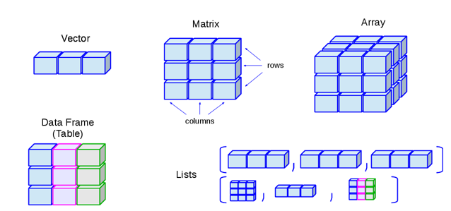
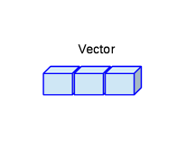
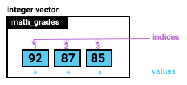
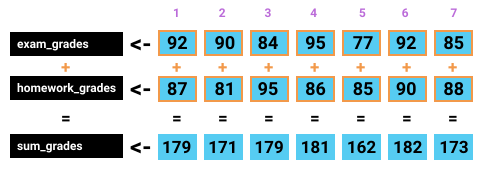
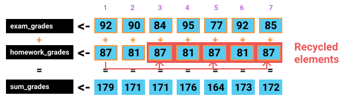
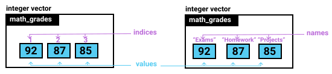
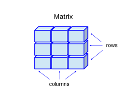
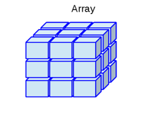
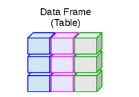
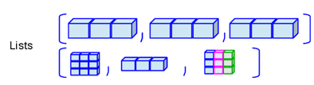

# Fundamentos del lenguaje R {#Fund}

<!-- https://www.youtube.com/watch?v=SWxoJqTqo08 -->

## Primeros pasos

1. **Importancia del case sensitive en R (mayúsculas vs minúsculas)**
2. **Operador de asignación = vs <- vs ->**

## Tipos de datos



### Vectores

Importancia de la función c()



```{r}
vector1 <- 1
vector2 <- c(1)
# vector3 <- 1, 2
vector4 <- 1:2
vector5 <- c(1,2)
```


Mi primer vector.

```{r}
# Mi primer vector con 5 elementos
c(1, 2, 3, 4, 5)

# Matriz con tres filas y cuatro columnas
matrix(1:12, nrow = 3, ncol = 4) 
```

#### _Tipos de vectores_

1. _**Lógicos**_


```{r, eval=FALSE}
# Mi primer vector Lógico
c(TRUE, FALSE, FALSE, TRUE)
```


2. _**Enteros**_

```{r, eval=FALSE}
# Mi primer vector entero
c(12L, 3L, 24L, 8L)
```


3. _**Reales**_

```{r, eval=FALSE}
# Mi primer vector real
c(12.10, 24.90, 4.99)
```


4. _**Cadena**_

```{r, eval=FALSE}
# Mi primer vector cadena
c("Lunes", "Martes", "Miércoles","Jueves", "Viernes", "Sábado","Domingo")
```

#### _Cómo crear vectores rápidamente_

Funciones (seq() y rep())

#### _Indexación de vectores_

Cómo extraer elementos de un vector - R es un lenguaje de programación indexado en 1; es decir, al primer elemento de un vector se le asigna la posición 1. Para extraer elementos de un vector usamos corchetes []



##### _Por posición_

```{r,  eval=FALSE}
Nombre_vector[3]
Nombre_vector[c(3)]
Nombre_vector[1:4]
Nombre_vector[c(1:4)]
Nombre_vector[c(1,3,7)]
Nombre_vector[-c(1,3,7)]
```

##### _Por vectores lógicos_

```{r,  eval=FALSE}
Nombre_vector[c(LOGICO)]
```

#### _Modificar, anexar, remover elementos de un vector_

1. _**Modificar elementos de un vector**_

```{r, eval=TRUE}
vector <- c(1L:5L)
vector[5] <- 6L
vector

vector1 <- c(1L:5L)
vector1[c(3:5)] <- 6L
vector1

vector2 <- c(1L:5L)
vector2[c(TRUE, FALSE, FALSE, FALSE, TRUE)] <- 6L
vector2
```

2. _**Adicionar elementos a un vector**_

```{r, eval=TRUE}
vector1 <- c(1:3)
vector2 <- c(4:5)
# nuevo vector
vector3_1 <-  c(vector1, vector2)
vector3_1
# mismo vector
vector1[c(4:5)] <- c(4:5)
vector1
```

3. _**Remover elementos de un vector**_

Indexando negativamente  (OJO, para data.frames y listas se puede usar la opción NULL)

```{r, eval=TRUE}
# Ejemplo1
vector <- c(1:10)
vector <- vector[-c(6:10)]
vector

# Ejemplo2
vector <- c(1:10)
vector <- vector[c(-6, -7, -8, -9, -10)]
vector

# Ejemplo3
vector <- c(1:10)
vector <- vector[vector<6]
vector
```

#### _Operaciones aritméticas con vectores_

1. _**Adición, multiplicación y división**_



```{r, eval=TRUE}
v1 <- c(1:5)
v2 <- c(5:1)
v3 <- c(1:5)
v4 <- c(5:1)
suma <- v1 + v2 + v3 + v4
promedio <- suma/3
promedio
```


2. _**Reciclaje en operaciones con vectores**_

_Aritmética con vectores de diferentes longitudes_



```{r, eval=TRUE, warning=FALSE}
v1 <- c(92, 90, 84, 95, 77, 92, 85)
v2 <- c(87, 81)
suma <- v1 + v2
suma
```


#### _Usando nombres en vectores_



### Matrices



### Arreglos



### Data frames



### Listas



## Operadores y selección

### Operadores lógicos
### Selección de elementos

## Programación con R


