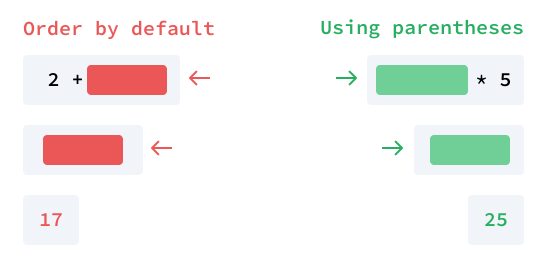
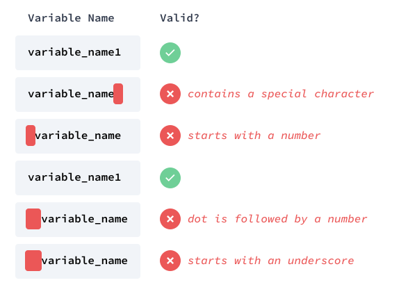
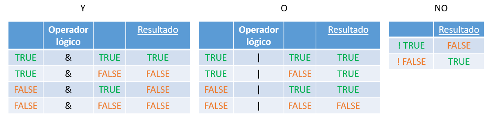

# (PART) Fundamentos {-} 

# Fundamentos del lenguaje R {#Fund}

En esta sección, se presentan los fundamentos del lenguaje de programación R. Estos están constituidos por los principales tipos de datos existentes en R, las operaciones aritméticas, la creación de variables, las expresiones lógicas, las estructuras de datos, la indexación o creación de subconjuntos de datos en R así como las principales rutinas de programación que hacen parte de este lenguaje.

## Primeros pasos {#introR}

R, como los demás lenguajes de programación, se ejecuta a través de un conjunto de instrucciones que se alojan dentro de un documento llamado programa, script o código conformado por líneas de código y comentarios. Para que un scrip o código pueda ser entendido por nuestras computadoras, estos imponenen algunas reglas básicas. A lo largo de este libro se presentarán, con títulos en color rojo, las reglas básicas del lenguaje de programación R; estas, como toda regla, nunca deben ser violadas ^[A lo largo de los capítulos que conforman este documento se presentarán algunos casos en los cuales estas reglas pueden ser obviadas o ajustadas. Las reglas que permiten estas acciones pueden ser consideradas como *reglas débiles*.].

La primera regla de R está relacionada con los comentarios. Es decir, la forma como se documenta un código o programa y que el contenido de estos no sean tenidos en cuenta a la hora de la ejecución/compilación de los mismos. Los comentarios son de suma importancia para entender/explicar el contenido o las acciones adelantadas dentro de un programa. Estos son de suma utilidad para nosotros mismos, al momento de olvidar  los porqués del contenido que construimos en un código en el pasado o, para otra u otras personas,  al momento de intendar comprender/entender el contenido de nuestros programas.

<br>
<blockquote>
<p><strong><p style="color:red;">Regla: Comentarios </p></strong><br>
En R, los comentarios; es decir, las partes que nos permiten documentar un código se anteceden de la letra numeral **#**. Los comentarios, en el momento de ejecutar un código, no son tenidos en cuenta por nuestras computadoras.
</p>
</blockquote>
<br>

A continuación, se presenta un ejemplo de un comentario en R.
```r
# Este es un comentario en R 
```

R, como se mencionó al inicio de esta sección, se ejecuta a través de un programa o script el cual está confomado por un conjunto de instrucciones y comentarios que nos permiten obtener los resultados deseados. A continuación, se presenta un ejemplo de un script, programa o código en R.^[En adelante, haremos uso de la palabra **programa ** para hacer referencia a un script o código de R.] 

<p style="color:#e6550d";><i>Ejemplo. Script, programa o código en R</i></p>

```r
# Ejemplo de un script, programa o código en R.
x <- 1  # Esta es una línea de código
y <- 2 
x + y # Esta es otra línea de código
```
El programa de R que se acaba de presentar está conformado por tres líneas de código: la primera, conformada por una variable x, a la que se le asigna el valor 1; la segunda, conformada por una variable y, a la que se le asigna el valor 2 y, finalmente, la tercera línea de código, arroja el resultado de sumar los valores contenidos en la variables x e y.

Cada una de las líneas de un programa, como se mencionó previamente se conoce como _línea de código_ y solo puede existir _una_ instrucción por línea de código. Esta condición deriva en la siguiente regla en R.

<br>
<blockquote>
<p><strong><p style="color:red;">Regla: Instrucciones por línea </p></strong><br>
R solo permite una instrucción por cada una de las líneas que conforman un código o script. En consecuencia, si se ingresan dos o más instrucciones en una misma línea de un código, este genera un error.
</p>
</blockquote>
<br>

A continuación, se presentan dos ejemplos de programas en R. El primero con una instrucción por línea de código (*programa correcto*) y el segundo con más de una instrucción po línea de código (*programa incorrecto*). Al ejecutar el programa incorrecto, el que viola la regla de más de una instrucción por línea de código (*el segundo*), el programa retornará un error.

<p style="color:#e6550d";><i>Ejemplos. Programas correctos e incorrectos en R</i></p>

```r
# Ejemplo 1. Código o script correcto (una instrucción por línea)
x <- 1  
y <- 2 
x + y 

# Ejemplo 2. Código o script incorrecto (más de una instrucción por línea)
x <- 1 y <- 2  
x + y 
```

El lenguaje de programación R, a diferencia de otros lenguajes, diferencia entre letras mayúsculas y minúsculas (*Case Sensitive*). Este hecho, implica la siguiente regla en este lenguaje.

<br>
<blockquote>
<p><strong><p style="color:red;">Regla: Mayúsculas y Minúsculas - (Case Sensitive)</p></strong><br>
R, a diferencia de otros lenguajes de programación, distingue/diferencia entre letras mayúsculas y minúsculas (Case Sensitive). Es decir, una letrá mayúscula es diferente a su contraparte en minúscula.
</p>
</blockquote>
<br>

<p style="color:#e6550d";><i>Ejemplos. Letras mayúsculas y minúsculas</i></p>

A continuación, se presentan cuatro ejemplos en el que se refleja la importancia de diferenciar las letras mayúsculas y minúsculas en R. En el primero de ellos, el mismo programa expuesto con anterioridad, se presenta un programa con el uso de letras minúsculas. El segundo, el mismo programa con el uso de letras mayúsculas. El tercero, el mismo programa con una combinación correcta de letras mayúsculas y minúsculas. Finalmente, el ejemplo cuatro, presenta el mismo programa con una combinación/uso inorrecto de letras mayúsculas y minúsculas que implica un error en el mismo. En este último ejemplo, el valor 1 se asigna a la letra mayúscula X, el valor 2 a la letra mayúscula Y pero, la suma de los mismos -**tercera línea de código**-, se representa mediante las letras minúsculas x e y cuando se espera que allí se ubiquen sus contrapartes mayúsculas.

```r
# Ejemplo 1. Script con letras minúsculas.
x <- 1  
y <- 2 
x + y 

# Ejemplo 2. Script con letras mayúsculas.
x <- 1  
Y <- 2 
x + Y 

# Ejemplo 3. Scrip con letras mayúsculas y minúsculas.
X <- 1  
y <- 2 
X + y 

# Ejemplo 4. Error. Mal uso de letras mayúsculas y minúsculas.
X <- 1  
Y <- 2 
x + y 
```

## Tipos de datos {#Tdatos}

Esta sección contiene los principales tipos de datos utilizados en R. Aunque existen otros tipos de datos los cuales no serán objeto del presente documento, estos se caracterizan por conformar la base del lenguaje.

### Tipos de datos en R {#Tdatos1}

En R existen 5 tipos de datos básicos: *lógicos*, *numéricos*, *numéricos - enteros*, *cadena/caracter* y *complejos*^[En este documento no haremos referencia a los números complejos. Estos, de amplio uso y estudio en el contexto de las matemáticas, se caracterízan por tener una parte entera y una imaginaria]. A continuación se presenta una breve descripción y se ejemplifican cada uno de estos tipos de datos.


1. _**Lógicos**_

Los tipos de datos *lógicos*, también conocidos como *booleanos*, representan en R _falso_ o _verdadero_ y se representan mediante las letras o palabras mayúsculas **F** o **FALSE** para el caso de _falso_ y __T__ o  __TRUE__ para el caso de _verdadero_. 

_**NOTA**: En los ejemplos que se presentan a continuación y en muchos de los que se presentarán en adelante, el contenido de los mismos tiene dos componentes: el texto del programa el cual está acompañado de colores en su texto y el resultado u output que arroja R al ejecutar/compilar el programa el cual, además de presentarse en letras de color negro, está precedido de un doble numeral (**##**)._

A continuación se ejemplifican los resultados de compilar tipos de datos lógicos o booleanos en R.

<p style="color:#e6550d";><i>Ejemplo. Datos lógicos</i></p>

```{r, eval=TRUE, warning=FALSE, message=FALSE}
# Opciones para verdadero (T o TRUE)
# Con T
T
# Con TRUE
TRUE

# Opciones para falso (F o FALSE)
# Con F
F
# Con FALSE
FALSE
```

Auque es correcto y más corto el uso de las letras T o F para representar las condiciones de falso o verdadero en R, se recomienda siempre usar las versiones TRUE o FALSE por ser estas más consistentes.

2. _**Numéricos **_

Los tipos de datos *numéricos*, también conocidos como numéros, datos _decimales_ o _dobles_, hacen referencia a aquellos números (positivos o negativos) que se caracterizan por estar conformados por una parte entera y una decimal.En R, el punto **(.)** es el encargado de separar la parte entera de la parte decimal de un número. Por ejemplo, 3.14, 30.48, 2.05, son representaciones de números en R.

Cuando un número es muy grande o muy pequeño, por defecto, el programa los representa mediante notación científica haciendo uso de la letra (**e**). Por ejemplo, _1e-11_ es la representación notación/científica^[El número de decimales a partir del cual R representa a los números reales en notación científica se da por defecto y el mismo, si se considera necesario, puede ser modificado] del número real _0.00000000001_.

A continuación, se presentan algunos ejemplos en R de datos numéricos o decimales.

<p style="color:#e6550d";><i>Ejemplo. Datos numéricos/decimales</i></p>

```{r}
# numéros reales convencionales
3
3.14
30.48
2.05
# numéros reales grandes - notación científica
1234567891011
# número reales pequeños - notación científica
0.00000000001
```

<br>
<blockquote>
<p><strong><p style="color:red;">Regla: Números por defecto en R </p></strong><br>
En R, a menos que se diga lo contrario, todo número, por defecto, es considerado numérico.
</p>
</blockquote>
<br>

3. _**Enteros - numéricos**_

Los tipos de datos enteros en R, también conocidos como números enteros, son aquellos que a diferencia de los numéricos, carecen de una parte decimal. Los número enteros en R están acompañados de la letra mayúscula __(L)__. Por ejemplo, 3L representa el número entero _3_ y -10L el número entero _-10_. 

<p style="color:#e6550d";><i>Ejemplo. Datos enteros</i></p>

A continuación, se presentan algunos ejemplos de números enteros en R.

```{r}
# Enteros positivos
5L
3L
# Enteros negativos
-20L
-1L
```

4. _**Cadena o caracter**_

En R, los datos de tipo *cadena* o *caracter* hacen referencia a aquellos datos que contienen texto en su contenido. Los tipos de dato *caracter* o de *texto* en R se representan/encierran mediante comillas dobles " o sencillas ' pero **núnca** a través de una mezcla o combinación entre los dos tipos de comillas. "Hola mundo", "Este es un dato de tipo texto", 'dato entre comillas sencillas', "dato entre comillas dobles" son algunos ejemplos de datos de tipo *cadena*, *texto* o *caracter* en R.

<p style="color:#e6550d";><i>Ejemplo. Datos cadena/caracter</i></p>

A continuación, se presentan algunos ejemplos de datos de tipo *cadena* o *caracter* en R. Así mismo, el segundo de los ejemplos, presenta dos ejemplos que combinan comillas dobles y simples hecho que, como ya se mencionó, conducen a un error en R.

```{r}
# Ejemplo 1
# Con comillas dobles
"Hola"
"Este es otro dato de tipo texto"
"TRUE"
# Con comillas sencillas
'dato entre comillas sencillas'
'FALSE'
'2.35'
```

```r
# Ejemplo 2
# Con comillas mezcladas (dobles y simples)

"Hola' 
'Hola mundo" 

# Las anteriores dos líneas de código producen errores en R
```

### Constantes integradas en R {#Constantes}

R, por defecto y de manera especial trae incluido un pequeño número de variables/palabras (5) que permiten la visualización de ciertos datos de tipo *numérico* o *caracter* de alto uso entre los usuarios, en especial, los de habla inglesa. A continuación, se presentan los cinco nombres especiales que trae incluido este software así como sus correspondientes significados. 

* **LETTERS**: las 26 letras mayúsculas del alfabeto romano
* **letters**: las 26 letras minúsculas del alfabeto romano
* **month.abb**: abreviaturas de tres letras para los nombres de los meses en inglés
* **month.name**: los nombres en inglés de los meses del año
* **pi**: la relación entre la circunferencia de un círculo y su diámetro. También conocido como número _pi_.

<p style="color:#e6550d";><i>Ejemplo. Constantes integradas en R</i></p>

A continuación, se presenta el resultado de las constantes o palabras integradas y utilizadas por R.

```{r}
# Letras del abecedario en mayúsculas.
LETTERS
# Letras del abecedario en minúsculas.
letters
# Primeras tres letras de los nombres de los meses - en inglés.
month.abb
# Nombre de los meses - en inglés.
month.name
# Número pi
pi
```

## Operaciones aritméticas {#Aritmet}

En esta sección se presentan las principales operaciones aritméticas empleadas en R. 

### Operaciones aritméticas en R

R, en sentido estricto, puede ser considerado como una calculadora avanzada. A través de él es posible implementar las operaciones simples de la aritmética (básicas y complementarias) así como algunas operaciones avanzadas que van desde la combinación de las operaciones simples (compuestas) hasta su uso para otro tipo de operaciones (funciones trigonométricas, operaciones logarítmicas, potenciación, uso de radicales, etc.). En este texto, dado su caracter introductorio, se presentan las operaciones aritméticas simples (básicas o complementarias) así como algunas operaciones compuestas derivadas de la aplicación/combinación de dos o más operaciones simples.

 1. **Operaciones aritméticas simples**: Las operaciones aritméticas básicas o simples empleadas por R son *la suma* (+), *la resta* (-), _la multiplicación_ (*) y _la división_ (/).

<p style="color:#e6550d";><i>Ejemplos. Operaciones aritméticas básicas</i></p>

A continuación, se presentan algunos ejemplos con las principales operaciones simples empleadas por R.

```{r}
# Suma
3.5 + 7.7 
3L + 10L 
1 + 8
```


```{r}
# Resta

7.7 - 3.7
3L - 10L
8 - pi
```

```{r}
# Multiplicación
7.71 * 3.73
-3L * 10L
1 * 8
```

```{r}
# División
7.7 / 3.7
12L / 4L
-1 / 4

```
 
2. **Operaciones aritméticas simples complementarias**: Las operaciones aritméticas simples y complementarias empleadas por R son los *exponentes* (^), *la división entera* (%/%) y *los módulos* (%%). A continuación, se presenta una breve descripción de estos tres subtipos de operaciones simples complementarias.
 
 * _Exponentes_: Consiste en elevar un número x a una potencia n. Es decir, multiplicar x por sí mismo tantas veces como se defina en n (ver siguiente fórmula).
 
 **\begin{equation}  x^n \end{equation}**
 
Por ejemplo, **\begin{equation}  2^3 \end{equation}** consiste en multiplicar el número 2 por sí mismo 3 veces; es decir, _2x2x2_ cuyo resultado es igual a 8.
 
 
 * _Divisón Entera_: La *división entera* de x%/%n devuelve el número máximo de veces que se encuentra un núemro *n* contenido dentro de un número *x*.
 
 * _Módulo_: El *módulo* de una división x%%n devuelve el *residuo* o *resto* de la división entera de un número x por un número n.
 
<p style="color:#e6550d";><i>Ejemplos. Operaciones aritméticas complementarias</i></p>

A continuación, se presentan algunos ejemplos de operaciones aritméticas simples y complementarias en R.
 
```{r}
# Exponenciales
2^3
3^2
5^3
```

```{r}
# Divisiones enteras
15%/%3
17%/%3
9%/%4
```

```{r}
# Módulos
15%%3
17%%3
9%%4
``` 
 
3. **Operaciones compuestas**

Una operación aritmética *compuesta* está conformada por la combinación de varias operaciones simples (sumas, restas, multiplicaciones, divisiones, exponentes, etc.).

<p style="color:#e6550d";><i>Ejemplos. Operaciones complejas</i></p>

A continuación, se presentan algunos ejemplos de operaciones aritméticas compuestas.
 
```{r}
2 + 2 + 3*2
2*5 - 6/2
6/2*10/2 + 3
6/2*(2+1 + 2^3)
```
 
Al observar detenidamente Los ejemplos de las operaciones aritméticas compuestas que se acaban de ilustrar, nos podemos dar cuenta que estas contienen sumas, restas, multiplicaciones y hacen uso de exponentes y paréntesis. Una pregunta que podría surgir de este hecho es ¿cuál es el orden en el que R calcula estas operaciones?. La respuesta a esta pregunta está contenida en una regla llamada de priorización o precedencia.

<br>
<blockquote>
<p><strong><p style="color:red;">Regla: Precedencia o priorización en operaciones aritméticas compuestas</p></strong><br>
En una operación aritmética compuesta de R, los paréntesis se calculan primero, luego los exponentes, luego la división y multiplicación y, finalmente, la suma y la resta. Esta regla se conoce popularmente como PEMDAS^[La sigla PEMDAS se derivada del inglés para Parentheses (Paréntesis), Exponents (Exponentes), Multiplication-Division (Multiplicación-División), Addition-Subtraction (Suma y resta).]
</p>
</blockquote>
<br> 
 
En la siguiente ilustración se presenta un ejemplo de la importancia del conocimiento de la regla de priorización o precedencia en R. En esta ilustración las dos operaciones están compuestas de los mismos números, no obstante, los resultados obtenidos son diferentes (17 y 25). En la operación de la parte izquierda (Order by default), la regla PEMDAS indica que primero debemos realizar la multiplicación y luego la suma; en contraste, en la operación de la parte derecha (Using parentheses), la regla de precedencia nos dice que primero dedemos realizar las operaciones contenidas dentro de los paréntesis -la suma- y luego la multiplicación. 


 
 En el siguiente ejemplo se presentan los resultados obtenidos en R al desarrollar las dos operaciones contenidas en la anterior ilustración.

<p style="color:#e6550d";><i>Ejemplo. Ilustración de aplicación de regla de precedencia o priorización en operaciones aritméticas compuestas</i></p>

```{r}
# por defecto
2 + 3*5

# usando paréntesis
(2 + 3)*5
```

El conocimiento y uso de la regla de priorización o precencia PEMDAS tiene importantes implicaciones prácticas y técnicas las cuales han generado debate en la comunidad científica y se han convertido en una de las principales fuentes de  error a la hora de enfrentarnos al desarrollo de operaciones artitméticas compuestas. 

El siguiente artículo, publicado en el diario el Espectador por el profesor Ignacio Mantilla, exrector de la Universidad Nacional de Colombia, muestra la importancia del tema el cual, como puede allí leerse, tiene implicaciones de alcance a nivel tecnológico. Invitamos al lector a explorar y analizar detenidamente el contenido de este artículo.

<br>

<iframe width="100%" height="500px" frameborder="0" mozallowfullscreen="true" webkitallowfullscreen="true" allowfullscreen="true" src="https://blogs.elespectador.com/actualidad/ecuaciones-de-opinion/una-polemica-aritmetica"></iframe>

Ver artículo directamente en: [Ecuaciones de opinión](https://blogs.elespectador.com/actualidad/ecuaciones-de-opinion/una-polemica-aritmetica)

<br>

4. **Tipos de datos de expresiones numéricas**

El resultado de una operación aritmética (simple o compuesta) es un número. No obstante, como se acaba de presentar, los tipos de datos numéricos en R pueden ser de dos tipos: numéricos -en sentido estricto- o enteros. En este orden de ideas, una pregunta que surge al desarrollar una operación aritmética es: ¿cuál es el tipo de dato que resulta al implementar una operación aritmética en R? La respuesta a esta inquietud se presenta en la siguiente regla de este lenguaje.

<br>
<blockquote>
<p><strong><p style="color:red;">Regla: Tipos de datos resultantes de operaciones aritméticas</p></strong><br>
En R, operaciones entre datos del mismo tipo, producen el mismo tipo de datos. En contraste, operaciones entre diferentes tipos de datos, producen el tipo de dato más elevado de acuerdo al siguiente ordenamiento (Numérico > Entero > Lógico)
</p>
</blockquote>
<br>

Al observar la segunda parte de la anterior regla llama la atención la inclusión de los tipos de datos lógicos o booleanos como un tipo de dato numérico en R. Pues bien, en este lenguaje de programación, el tipo de dato lógico FALSE es equivalente a 0 y el tipo de dato lógico TRUE es equivalente al valor 1. Este hecho, conlleva a la definición de la siguiente regla del lenguaje.

<br>
<blockquote>
<p><strong><p style="color:red;">Regla: Comportamiento numérico de los datos lógicos o booleanos </p></strong><br>
En R, los tipos de datos booleanos (FALSE y TRUE), además de representar las condiciones de falso y verdadero, en términos numéricos, presentan las siguiente equivalencias: TRUE = 1 y FALSE = 0
</p>
</blockquote>
<br>

Como consecuencia de la anterior regla, en R y aunque **no se recomienda su uso**, una operación aritmética (simple o compuesta), puede incluir datos de tipo booleano y el tipo de dato resultante sigue la regla del dato más elevado según el criterio antes presentado (Numérico > Entero > Lógico). A continuación, se presentan algunos ejemplos de operaciones aritméticas que involucran diversos tipos de datos. Invitamos al lector, de acuerdo a las dos reglas antes expuestas, a responder ¿cuál es el tipo de dato que resulta al desarrollar dichas operaciones?


<p style="color:#e6550d";><i>Ejemplo. Tipos de datos resultantes de expresiones numéricas</i></p>

```{r}
1L + 2L + 2L
3L + 2
3L + 3*3 + 5/2
FALSE + 4
TRUE + FALSE
FALSE + TRUE
FALSE + FALSE
TRUE + TRUE
```

## Variables {#Variables}

Una de las funcionalidades y de las partes más importantes en el aprendizaje de R es la creación de variables. Una variable en R es un espacio reservado en memoria el cual está compuesto por un nombre y un contenido definido o asignado a este nombre. A continuación, se presenta un ejemplo de una variable en R.

```{r, eval=FALSE}
# ejemplo de una variable en R
x <- 5L
```

En el ejemplo, hemos creado una variable llamada x y a esta se le ha asignado el valor/número entero 5. En R, el simbolo de asignación^[También pueden ser empleados, como símbolos de asignación, las expresiones = o ->. Para el último de estos casos las partes contenidas dentro de una variable deben ser invertidas (5 -> x). Aunque las tres formas de asignación (<- , = , ->) son válidas, se recomienda el uso de la primera (<-) para evitar confusiones, en el caso de la igualdad, cuando este sea usado en el contexto de las funciones y en, en el otro caso (->), por ser contraintuitivo al pensamiento humano] es **<-**. 


El uso de variables en R es altamente frecuente pues a través de estas podemos reservar contenidos de nuestros procesos que serán usados en fases posteriores de nuestros análisis. Para mostrar el contenido de una variable en R, además de definir la variable, se debe adicionar una nueva línea de código a nuestros programas con el nombre de la variable o las variables cuyo contenido deseamos conocer. Por ejemplo, si deseamos conocer el contenido de la variable x definida en el ejemplo anterior, debemos adicionar una nueva línea de código con dicho nombre como se presenta a continuación.

<p style="color:#e6550d";><i>Ejemplo. Visualización del contenido de una variable en R</i></p>

```{r}
# Visualización del contenido de una variable en R
x <- 5L
x
```
A continuación, se presentan otros ejemplos de visualización de variables en R.

<p style="color:#e6550d";><i>Ejemplo. Visualización del contenido de otras variables en R</i></p>

```r
# Visualización del contenido de variables en R
```

```{r}

# Ejemplo 1
y <- 5 + 3.2
y

# Ejemplo 2
y <- 1 + pi
y

# Ejemplo 3
z <- 5 + 3*(1 + 2^2)
z

# Ejemplo 4
x <- 3 + 5
y <- 4
x + y
```

### Nombre de variables {#NombreV}

Una vez que tenemos claro el objetivo con la creación de variables en R, el paso a seguir consiste en presentar algunas recomendaciones y restricciones a la hora de crear variables en R. Para ello, haremos uso de la siguiente regla en la que se presentan los criterios con las recomendaciones y las restricciones que deben ser tenidas en cuenta a la hora de crear nombres asociados a variables en R.

 <br>
<blockquote>
<p><strong><p style="color:red;">Regla: Nombres de variables en R (recomendaciones y restricciones)</p></strong><br>
En R, para nombrar una variable, existen 5 criterios o reglas que deben ser tenidas en cuenta:
<br><br>
<ol>
  <li> Los nombres de las variables consisten en letras (mayúsculas o minúsculas), números, un punto (.) o un guión bajo (_). </li>
  <li>Podemos comenzar un nombre de variable con una letra o un punto, pero los puntos no pueden ser seguidos por un número. </li>
  <li>No podemos comenzar un nombre de variable con un número.</li>
  <li>No se permiten caracteres especiales, por ejemplo, espacios, símbolos de operadores, paréntesis.</li>
  <li>No podemos usar una palabra clave ya utilizada e interpretada por R como un nombre de variable (Palabras Reservadas). Por ejemplo, if, else, for, while, break, next, repeat, NA, NULL y NaN</li>
</ol>  
</p>
</blockquote>
<br>

El contenido de los criterios presentados en la anterior regla se ilustra, con algunos ejemplos de nombres válidos y no válidos para variables en R, a través de la figura que se presenta a continuación.




Además de los criterios presentados en la regla para la asignación de nombres de variables en R, se recomienda que el nombre que se asigne a estas se corresponda con el contenido de las mismas. Por ejemplo, si en una variable se aloja la _edad_ de una persona, sería conveniente que esta variable se llame o nombre como _edad_. De la misma manera, aunque R permite que los nombres de las variable sean grandes (alta cantidad de caractéres), se recomienda que los mismos no sean demasiado largos. Finalmente, aunque no se recomienda, es normal encontrar en la práctica interesados en nombrar variables con nombres compuestos separados por espacios. Si este es el caso, los nombres compuestos de estas variables deben estar contenidos dentro de comillas a la izquierda. A continuación, se presentan tres ejemplos con nombres de variables compuestos.

```r
# Ejemplo 1
`Nombre variable` <- 4.5

# Ejemplo 2
`Nombre compuesto` <- 0

# Ejemplo 3
`Este es otro nombre para mi variable` <- -10L
```

### Tipos de variables 

El trabajo con variables en R, como ya se mencionó, es altamente frecuente hecho que conlleva a que en algunos casos olvidemos el tipo de elementos que estas contienen. Para ello, en R existe una función^[Esta es la primera vez que hacemos uso, dentro de este documento, de una función. R, en sentido estricto, es un lenguaje de tipo funcional; es decir, altamente/totalmente soportado en funciones. Más adelante se contará con una sección dedicada al uso y construcción de funciones en R] llamada `class()` que nos permite conocer la tipología de los elementos que hacen parte de una variable. A continuación, a modo de ejemplo, se definen 5 variables, se expone su contenido y se indaga, haciendo uso de la función `class`, por los tipos de datos que estas variables contienen. 

<p style="color:#e6550d";><i>Ejemplo. Tipos de variables en R</i></p>

```{r}
# Ejemplo 1
var_1 <- TRUE
var_1 
class(var_1)

# Ejemplo 2
var_2 <- 2L
var_2
class(var_2)

# Ejemplo 3
var_3 <- 0.14
var_3
class(var_3)

# Ejemplo 4
var_4 <- var_1 + var_2 + var_3
var_4
class(var_4)

# Ejemplo 4
var_5 <- LETTERS
var_5
class(var_5)
```

El tipo de dato contenido en la variable del ejemplo 1 (var_1) es de tipo lógico, el de la variable 2 (var_2) es de tipo entero, el de las variable 3 y 4 (var_3 y var_4) es de tipo numérico y, finalmente, el tipo de dato contenido en la variable del ejemplo 5 (var_5) es de tipo cadena o caracter.

## Expresiones lógicas {#Elogicas}

Una expresión lógica en R está compúesta por dos componentes mediados por operadores que pueden ser de dos tipos: relacionales o lógicos. A continuación, se presenta un ejemplo con una operación lógica en R. Esta, como se mencionó, está compuesto de dos partes (_izquierda y derecha_) y es mediada por un operador lógico (**>=**). En específico, la expresión lógica del siguiente ejemplo indaga si el número 5 (_parte izquierda_) es mayor o igual **>=** (operador relacional) que el número 4 (_parte derecha_). 

```r
# Ejemplo de una expresión lógica
5 >= 4
```

El resultado de una operación lógica es un dato de tipo booleano (TRUE o FALSE)^[En el ejemplo de la expresión lógica 5 >= 4, el resultado es igual a TRUE dado que 5 es mayor o igual que 4]. Este hecho, implica la siguiente regla aplicable a este lenguaje de programación.

<br>
<blockquote>
<p><strong><p style="color:red;">Regla: Resultado de expresiones lógicas </p></strong><br>
En R, el resultado de una operación lógica, es un dato o literal de tipo booleano (TRUE o FALSE)
</p>
</blockquote>
<br>

### Operadores Relacionales

Como se mencionó previamente, en R existen dos tipos de operadores asociados a las expresiones lógicas: relacionales y lógicos. Los _operadores relacionales_ disponibles en R son:

 * _**Menor que ( < )**_
 * _**Mayor que ( > )**_
 * _**Menor o igual que ( <= )**_
 * _**Mayor o igual que ( >= )**_
 * _**Igual a ( == )**_
 * _**No es igual a (diferente) ( != )**_

A continuación, se presentan algunos ejemplos de expresiones lógicas en R haciendo uso de operadores relacionales con sus respectivos resultados (TRUE o FALSE). 

<p style="color:#e6550d";><i>Ejemplo. Expresiones lógicas con operadores relacionales</i></p>

```{r}
# Ejemplo 1
1 < 3
# Ejemplo 2
3 > 3
# Ejemplo 3
4 <= 4
# Ejemplo 4
3 >= 2
# Ejemplo 5
3 == 3
# Ejemplo 6
TRUE == FALSE
# Ejemplo 7
TRUE == 1
# Ejemplo 8
FALSE == 0
# Ejemplo 9
3 != 3
# Ejemplo 10
FALSE != 0
# Ejemplo 11
"Uno" != "1"
# Ejemplo 12
"Uno" == "Uno"
```

1. **Operaciones lógicas con operaciones aritméticas**: 

Una expresión lógica, además de operadores relacionales, puede involucrar operaciones aritméticas simples, complementarias o compuestas. El ejemplo, que se presenta a continuación, ilustra una expresión lógica que involucra operaciones ariméticas compuestas.

<p style="color:#e6550d";><i>Ejemplo. Expresiones lógicas con operadores relacionales y operaciones ariméticas</i></p>

```{r}
12.10 - 10.50 < 24.90 * 21.15
```

Una pregunta que surge, al momento de disponer de una operación lógica que involucra operaciones arirméticas y lógicas es qué evalúa R primero, ¿la operación aritmética o la expresión lógica? La respuesta a esta inquietud conduce a la siguiente regla del lenguaje.

<br>
<blockquote>
<p><strong><p style="color:red;">Regla: Precedencia en expresiones lógicas</p></strong><br>
En R, al evaluar una expresión lógica que hace uso de operadores relacionales y operaciones aritméticas, primero se evalúan las expresiones aritméticas y luego las expresiones lógicas
</p>
</blockquote>
<br>

2. **Operaciones lógicas haciendo uso de variables**: 

El resultado de las operaciones aritméticas, así como de las expresiones lógicas, pueden ser almacenados a través del uso de variables. Es decir, en lugar de evaluar de manera directa una expresión lógica y sus componentes, estos pueden ser evaluados previamente a través del uso de variables. A continuación, se presentan 2 ejemplos de expresiones lógicas en las que se hace uso  de variables.

<p style="color:#e6550d";><i>Ejemplo. Expresiones lógicas con operadores relacionales y variables</i></p>

```{r}
# Ejemplo 1
Var_1 <- 12.10 - 10.50 
Var_2 <- 24.90 - 21.15

Var_1 < Var_2

# Ejemplo 2
Var_3 <- 12.10 * 12L
Var_4<- 4.99 * 24L
Var_5 <- Var_3 == Var_4
Var_5
```

En el ejemplo 1, se crean las variables Var_1 y Var_2 que contienen el resultado de aplicar dos operaciones aritméticas compuestas y, en la tercera línea del código (Var_1 < Var_2), se evalúa la expresión lógica propuesta entre estas dos variables (Var_1 < Var_2). En el ejemplo 2, las variables Var_3 y Var_4 contienen los resultados de dos operaciones aritméticas simples y la variable Var_5 el resultado de la operación lógica definida entre estas dos variables (Var_3 == Var_4). En este ejemplo, la  última línea del código (la 4) nos permite visualizar el resultado de la operación lógica implementada a través del uso de variables.

```{r}
12.10 * 12L == 4.99 * 24L
```

### Operadores Lógicos

Los _operadores lógicos_ en R permiten evaluar la condiciones de verdad o de falsedad^[Estos operadores hacen parte de lo que en lógica matemática se conoce como tablas de verdad. En R, en el contexto de los operadores se hace uso de las tablas de verdad asociadas a la conjunción (∧), la disyunción (∨) y la  negación (¬)]  al comparar los resultados entre  dos operaciones lógicas relacionales.

Los _operadores lógicos_ disponibles en R son:


 * _**Y lógico ( & )**_
 * _**O lógico ( | )**_
 * _**No lógico ( ! )**_
 

Los resultados obtenidos a la hora de la aplicación de los tres operadores lógicos disponibles en R se presentan en el gráfico que se dispone a continuación. El resultado de una operación lógica que involucra el operador lógico & (Y) solamente será cierta (TRUE) cuando las dos condiciones evaluadas sean ciertas. El resultado de una operación lógica que involucra el operador lógico | (O) solamente será falsa (FALSE) cuando las dos condiciones evaluadas sean falsas y, finalmente, el operador de negación (NO) cambia el resultado obtenido (TRUE por FALSE y viceversa).




A continuación, se presnetan los resultados en R de los operadores lógicos expuestos en la anterior imagen.

<p style="color:#e6550d";><i>Ejemplo. Resultados expresiones lógicas con operadores lógicos</i></p>

```{r}
# Con el operador lógico &
TRUE & TRUE
TRUE & FALSE
FALSE & TRUE
FALSE & FALSE
# Con el operador lógico |
TRUE | TRUE
TRUE | FALSE
FALSE | TRUE
FALSE | FALSE
# Con el operador lógico de negación
!TRUE
!FALSE
```

### Combinando operadores

En buena parte de esta sección hemos explorado las posibilidades que nos ofrece R para construir operaciones aritméticas simples o compuestas, disponer los resultados obtenidos dentro de variables así como crear expresiones de tipo lógico las cuales pueden estar asociadas a operadores relacionales o lógicos. Para finalizar esta sección, exploraremos la forma como R evalúa operaciones lógicas que hacen uso de los múltiples conceptos vistos hasta ahora. Para ello, se presenta a modo de ejemplo, la siguiente expresión lógica. 

```r
# Ejemplo de una expresión lógica compleja
(40/2^3) + 2 >= 7 | 5*5  - 5 < 20
```
Al explorar el contenido de la anterior expresión lógica podemos observar que esta contiene operaciones aritméticas compuestas conformadas por exponentes, sumas, restas, divisiones, multiplicaciones y paréntesis. Así mismo, el ejemplo hace uso de expresiones lógicas asociadas a operadores relacionales y lógicos. La pregunta que surje ahora es: ¿cuál es el resultado de esta operación y cómo R procede para su desarrollo o evaluación? Para dara respuesta a ello, se presenta la siguiente regla del lenguaje la cual puede ser considerada de alcance general ya que incluye otras reglas presentadas hasta ahora.

<br>
<blockquote>
<p><strong><p style="color:red;">Regla: Precedencia o priorización general en R </p></strong><br>
En R, teniendo en cuenta los operadores vistos hasta ahora y que conforman las operaciones aritméticas y las expresiones lógicas, la regla de priorización general que gobierna la evaluación de dichas expresiones es:
<br><br>
<ol>

<li>Paréntesis</li>
<li>Exponentes</li>
<li>División y multiplicación</li>
<li>Adición y sustracción</li>
<li>Operadores relacionales</li>
<li>Operadores logicos</li>

</ol>  
</p>
</blockquote>
<br>

Es decir, en el ejemplo expuesto anteriormente, en el proceso de evaluación/compilación, el lenguaje primero realiza las operaciones que están dentro de los paréntesis, paso seguido calcula las multiplicaciones, luego las sumas y las restas y, finalmente, evalúa las expresiones lógicas asociadas a operadores relacionales para culminar con la evaluación resultante que involucra a los operadores de tipo lógico. A continuación, se presenta el resultado en R al evaluar la expresión lógica de nuestro ejemplo así como un ejemplo complementario a este.

<p style="color:#e6550d";><i>Ejemplo. Resultados expresiones lógicas compuestas </i></p>

```{r}
# Ejemplo 1
(40/2^3) + 2 >= 7 | 5*5  - 5 < 20

# Ejemplo 2
(40/2^3) + 2 >= 7 & 5*5  - 5 < 20

```

### Coerción en expresiones lógicas

El último componente que abordaremos a la hora de interactuar con expresiones lógicas en R es el principio de coerción que este lenguaje implementa a la hora de evaluar este tipo de expresiones. Para explicar este principio, nos valdremos del siguiente ejemplo.

<p style="color:#e6550d";><i>Ejemplo. Filosofía de la coerción en expresiones lógicas </i></p>

```{r, eval=FALSE}
# Ejemplo. Coerción en expresiones lógicas
"1" == 1
```
La expresión lógica del ejemplo, que hace uso del operador relacional ___Igual a:___, indaga si el dato de tipo caracter ___"1"___ es igual al dato de tipo numérico ___1___. De manera ligera, es natural pensar que un dato de tipo caracter o textual es diferente a un dato de tipo numérico y que R, para el caso de la igualdad evaluada en el ejemplo, debería retornar como respuesta FALSE. No obstante, la respuesta que retorna el lenguaje al evaluar la operación lógica del ejemplo es TRUE y la pregunta que surge es, ¿por qué? La repuesta a esta inquietud, radica en la siguiente regla que implementa el lenguaje a la hora de evaluar expresiones lógicas conocida como regla de coerción.

<br>
<br>
<blockquote>
<p><strong><p style="color:red;">Regla:Coerción en expresiones lógicas</p></strong>
Para que una expresión lógica pueda ser evaluada en R, los componentes de la expresión (_partes izquierda y derecha_) deben de ser del **mismo tipo** y para ello hace uso de la siguiente **jerarquía** según los tipos de datos involucrados en estas.

<p><strong><p style="color:black;">caracter > numérico > entero > lógico</p></strong>
</blockquote>
<br>
<br>

Es decir, en la igualdad del ejemplo propuesto `"1" == 1` R, al detectar que los tipos de datos involucrados en la igualdad son de diferentes tipologías, lo primero que hace es igualarlos según la jereraquía propuesta. Según la regla, un dato de tipo textual o caracter tiene mayor jerarquía que un dato de tipo numérico (_caracter > numérico_) hecho que conduce a R a convertir el dato de tipo numérico **1** en un dato de tipo textual **"1"** para garantizar que los tipos de datos involucrados en la expresión lógica sean del mismo tipo. En conclusión, al evaluar la operación lógica `"1" == 1` en R, por la regla de coherción, lo que el lenguaje efectivamente evaluará es la operación `"1" == "1"` cuyo resultado es TRUE. A continuación, se presentan otros ejemplos en lo que se invita al lector a reflexionar sobre la forma como R está aplicando en ellos la regla de coerción.

<p style="color:#e6550d";><i>Ejemplo. Coerción en expresiones lógicas </i></p>

```{r}
# Ejemplo 1. Coerción entre datos de tipo numérico y lógico
TRUE == 1
# Ejemplo 2. Coerción entre datos de tipo entero y lógico
1L == TRUE
# Ejemplo 3. Coerción entre datos de tipo numérico y entero
1 >= 1L
# Ejemplo 4. Coerción entre datos de tipo caracter y entero
"1" != 1L
# Ejemplo 5. Coerción entre datos de tipo caracter y lógico
"0" == FALSE
```

## Estructuras de datos {#Edatos}

En las secciones anteriores se presentaron, principalmente, los tipos de datos de mayor uso en R; la posibilidad de implementar en este expresiones aritméticas a través del uso de operaciones simples y compuestas; la creación y el nombramiento de variables así como la implementación de expresiones lógicas haciendo uso de operadores relacionales y de tipo lógico. En esta sección del documento, nos concentraremos en el estudio de las principales estructuras de datos existentes en R.

Una estructura de datos en R, es un _**artefacto**_ conformado o no por datos del mismo tipo. En este lenguaje, existen 5 estructuras de datos, principalmente: _vectores_, _matrices_, _arreglos_, _marcos de datos o data frame_ y _listas_^[Al final de esta sección, se presenta una "estructura" especial de datos la cual,en sentido estricto, no presenta las mismas características que las demás estructuras presentadas en este documento]. 

A continuación, el diagrama, presenta una representación/esquematización gráfica de la arquitectura que hace parte de cada una de las estructuras de datos que serán presentadas en este apartado.


### Vectores {#Vectores}

La primera estructura de datos empleda por R son los _**vectores**_. Estos, como se ilustra en la siguiente imagen, están conformados por "filas/columnas" de tipo unidimensional en cuyo interior existen datos de una misma tipología. 


A continuación, se presenta la regla general para la construcción de vectores en R.

<br>
<blockquote>
<p><strong><p style="color:red;">Regla: Construcción de vectores en R</p></strong><br>
En R, los vectores se construyen haciendo uso de paréntesis precedidos de la letra  minuscula _c_ `c()`. Así mismo, los elementos o tipos de datos que conforman un vector están separados por **comas** y estos deben ser en su totalidad de la **misma tipología**.
</p>
</blockquote>
<br>

A continuación, se presentan y evalúan dos ejemplos de vectores en R. El primero, está conformado por los números del 1 al 5 (datos de tipo numérico) y el segundo, está conformado por los números enteros del 6 al 10 cuyo resultado es almacenado a través de la conformación/definición de una variable llamada y.

<p style="color:#e6550d";><i>Ejemplo. Vectores en R </i></p>

```{r}
# Ejemplo 1. Ilustración de un vector en R
c(1, 2, 3, 4, 5)
# Ejemplo 2. Ilustración de un vector en R dentro de una variable
y <- c(6L, 7L, 8L, 9L, 10L)
y
```
En R, a diferencia de lo que pasa en otros lenguajes de programación, no existe una estructura de datos que haga referencia a los escalares^[Un número escalar hace referencia a una estructura conformada por un único número. Por ejemplo, 3, 4 -5 o 7, son ejemplos de escalares en otros lenguajes de programación]. Los escalares en R son entendidos como vectores de longitud 1. Este hecho, implica la siguiente regla del lenguaje.

<br>
<blockquote>
<p><strong><p style="color:red;">Regla: Escalares en R</p></strong><br>
En R, a diferencia de otros lenguajes de programación, no existen datos de tipo escalar. Estos son considerados vectores de longitud 1.
</p>
</blockquote>
<br>

A continuación, se presentan algunos ejemplos en donde se ilustra el uso de los escalares en R como vectores de longitud 1.

<p style="color:#e6550d";><i>Ejemplo. Escalares como vectores en R </i></p>

```{r}
# Ejemplo 1. Escalares en R
1L
2.23
# Ejemplo 2. Escalares como vectores en R
c(1L)
c(2.23)
# Ejemplo 3. Variables y escalares en R
Var_1 <- 1L
Var_1
var_2 <- c(1L)
var_2
```

#### _Tipos de vectores_ {#Tvectores}

Los elementos que conforman un vector en R, como se mencionó en la regla anterior, deben ser del mismo tipo. Este hecho implica que, en este lenguaje podemos construir vectores los cuales, dependiendo del tipo de datos que contienen, pueden ser clasificados en una de cuatro categorías: _lógicos_, _enteros_, _numéricos_ y de _cadena o caracter_. A continuación, se presenta una breve descripción así como algunos ejemplos de los diferentes tipos de vectores existentes en R.  

1. _**Lógicos**_

Los vectores _**lógicos**_ en R, como su nombre lo indica, están conformados por elementos de tipo lógico (TRUE o FALSE). A continuación, se presentan algunos ejemplos de vectores de tipo lógico en R.

<p style="color:#e6550d";><i>Ejemplo. Vectores lógicos en R </i></p>
```{r}
# Ejemplo 1. Mi primer vector Lógico
c(TRUE, FALSE, FALSE, TRUE)
# Ejemplo 2. Otro vector lógico en R
c(TRUE, FALSE)
# Ejemplo 3. Un vector lógico dentro de una variable en R
x <- c(TRUE, FALSE, FALSE)
x
```

2. _**Enteros**_

Los vectores de tipo _**entero**_ en R, como su nombre lo indica, están conformados por elementos de que se corresponden con los número enteros. A continuación, se presentan algunos ejemplos de vectores de tipo entero en R.

<p style="color:#e6550d";><i>Ejemplo. Vectores enteros en R </i></p>
```{r}
# Ejemplo 1. Mi primer vector entero
c(12L, 3L, 24L, 8L)
# Ejemplo 2. Otro vector entero en R
c(1L, 2L)
# Ejemplo 3. Un vector entero dentro de una variable en R
y <- c(1L, -3L, 5L)
y
```

3. _**Numéricos**_

Los vectores de tipo _**numérico**_ en R, como su nombre lo indica, están conformados por elementos de que se corresponden con los números reales. A continuación, se presentan algunos ejemplos de vectores de tipo numérico en R.

<p style="color:#e6550d";><i>Ejemplo. Vectores numéricos en R </i></p>
```{r}
# Ejemplo 1. Mi primer vector numérico (real)
c(12.10, 24.90, 4.99)
# Ejemplo 2. Otro vector numérico en R
c(1, 2.5, pi)
# Ejemplo 3. Un vector mumérico dentro de una variable en R
z <- c(2.3, -2.5, 7, 4)
z
```

4. _**Cadena o caracter**_

Los vectores de tipo _**cadena**_ o _**caracter**_ en R, como su nombre lo indica, están conformados por elementos en cuyo interior encontramos textos. A continuación, se presentan algunos ejemplos de vectores de tipo caracter en R.

<p style="color:#e6550d";><i>Ejemplo. Vectores cadena o caracter en R </i></p>
```{r}
# Ejemplo 1. Mi primer vector de tipo caracter
c("Lunes", "Martes", "Miércoles","Jueves", "Viernes", "Sábado","Domingo")
# Ejemplo 2. Otro vector de tipo caracter
c("a", "b", "c")
# Ejemplo 3. Un vector de tipo carcater dentro de una variable en R
w <- letters
w
```

#### _Coerción en vectores_

Los vectores en R, como se ha mencionado, deben contener elementos del mismo tipo. Para que esta condición se cumpla, el lenguaje aplica la siguiente regla al momento de disponer de vectores en cuyo interior conviven elementos de diversas tipologías^[En R, la presencia de vectores en cuyo interior se presentan elementos de diversas tipologías se debe, principalmente, a la presencia de probables errores en la creación/inserción de estos que, por ejemplo, a una característica recurrente y propia del análisis de datos.].

<br>
<br>
<blockquote>
<p><strong><p style="color:red;">Regla:Coerción de vectores en R</p></strong>
R, al detectar la presencia de un vector con elementos de diversos tipos, convierte/coerciona la totalidad de los elementos del vector en una única tipología siguendo la siguiente jerarquía. 
<p><strong><p style="color:black;">caracter > numérico > entero > lógico</p></strong>
</blockquote>
<br>
<br>

Es decir, en R, si existe un vector con elementos de tipo lógico y de tipo entero, el resultado es un vector con la totalidad de elementos de tipo entero (*entero > lógico*). Si existe un vector con elementos de tipo lógico, entero y numérico, el resultado es un vector con la totalidad de elementos de tipo numérico o real (*numérico > entero > lógico*). Finalmente, si existe un vector con elementos de tipo lógico, entero, numérico y caracter o cadena, el resultado es un vector con la totalidad de elementos de tipo caracter (*caracter > numérico > entero > lógico*).

A continuación, se presentan algunos ejemplos de aplicación de la regla de **coerción** de elementos de un vector en R.

<p style="color:#e6550d";><i>Ejemplo. Coerción de elementos de un vector en R </i></p>

```{r}
# Ejemplo 1. Vector con elementos enteros y lógicos
c(TRUE, FALSE, 2L, -10L)
# Ejemplo 2. Vector con elementos lógicos, enteros y numéricos
c(FALSE, 5L, 10.2)
# Ejemplo 3. Vector con elementos lógicos, enteros, numéricos y de tipo caracter
c(TRUE, -2L, 3.1415, "Lunes")
# Ejemplo 4. Vector con elementos lógicos y de tipo caracter dentro de una variable
m <- c(TRUE, FALSE, "Junio")
m
```

#### _¿Cómo crear vectores rápidamente?_

Uno de las actividades más frecuentes a la hora de trabajar con R implica el uso, la creación y la manipulación de vectores. Por esta razón, este lenguaje ofrece algunas alternativas para la creación de vectores de una manera rápida. Entre las alternativas existentes, sobresalen las siguientes tres funciones útiles para la creación de diversos tipos de vectores en R.


1. _**Función :**_

La función `:`, permite la creación de una secuencia numérica que inicia en el número de la parte izquierda, se incrementa de uno en uno y finaliza en el valor de la parte derecha. Por ejemplo, la secuencia `1:20`, inicia en el valor 1 y se incrementa de uno en uno hasta alcanzar el valor 20; de igual manera, la secuencia `10:15`, inicia en el valor 10 y se incrementa de uno en uno hasta alcanzar el valor 15. A continuación, se presentan algunos ejemplos del uso de la función `:` en la creación de vectores en R. 

<p style="color:#e6550d";><i>Ejemplo. Creación de vectores haciendo uso de la función `:` </i></p>


```{r}
# Ejemplo 1. Secuencia ascendente
c(1:20)
# Ejemplo 2. Secuencia ascendente
c(10:15)
# Ejemplo 3. Secuencia descendente
c(10:1)
# Ejemplo 4. Secuencias dentro de variables
n <- c(1:5)
n
```

2. _**Función seq()**_

La función `seq()`, permite la creación de un vector con una secuencia de datos. No obstante, esta función, a diferencia de la función `:`, permite que el usuario defina el incremento o múltiplo que será tenido en cuenta dentro de la secuencia. Por ejemplo, la instrucción `seq(from = 0, to = 30, by = 2)`, permite la creación de una secuencia de números que inicia en 1 (_from_), va hasta 30 (_to_) y se incrementa de dos en dos (_by_).

En la función `seq(from = 0, to = 30, by = 2)`, las palabras _from_, _to_ y _by_, se conocen con el nombre de *parámetros* de la función `seq()`. Los parámetros de una función en R, como se verá en la sección de funciones, pueden ser o no incluidos^[hasta tanto el usuario no disponga de experiencia y conocimiento sobre ciertas funciones de R, se recomienta que al invocar estas siempre se coloque el nombre de cada uno de los parámetros utilizados] al momento de invocar una función dependiendo del orden en el que estos fueron definidos por dicha función. Por el momento, como se corrobora en los ejemplos que se presentan a continuación, la instrucción `seq(from = 0, to = 30, by = 2)` es equivalente en R a la instrucción `seq(0, 30, 2)`, sin el nombre de los parámetros.  


<p style="color:#e6550d";><i>Ejemplo. Creación de vectores haciendo uso de la función `seq()`</i></p>

```{r}
# Ejemplo 1. Secuencia ascendente
seq(from = 0, to = 30, by = 2)
seq(0, 30, 2)
# Ejemplo 2. Secuencia descendente
seq(from = 20, to = 0, by = -5)
seq(20, 0, -5)
# Ejemplo 3. Secuencias dentro de variables
p <- seq(1, 10, 2)
p
```

3. _**Función rep()**_

La función `rep()`, permite la creación de un vector cuyos elementos se repiten un número determinado de veces. Por ejemplo, la instrucción `rep(1, times = 5)`, crea un vector con el número 1 repetido 5 veces (_times_). De igual modo, la instrucción `rep(1:3, times = 2)`, crea un vector con la secuencia de números del 1 al 3 repetida dos veces. 

La función`rep()`, además de permitir la creación de vectores cuyos elementos se repiten un número determinado de veces _times_, dispone de un parámetro llamado _each_ a través del cual es posible definir cuántas veces deseamos que un elemento dentro de un vector se repita por sí mismo. Por ejemplo, la instrucción `rep(1:2, times = 2, each = 4)`, construye un vector en donde los números definidos en la secuencia `1:2` se repite cada uno cuatro veces `each = 4` y luego, el bloque con los elementos resultantes, se duplica `times = 2`. 

A continuación, se presentan algunos ejemplos de creación de vectores haciendo uso de la función `rep()`.

<p style="color:#e6550d";><i>Ejemplo. Creación de vectores haciendo uso de la función `rep()`</i></p>


```{r}
# Ejemplo 1. Repeticiones simples (con times)
rep(1, times = 5)
rep(1, 5)
rep(1:3, times = 2)
rep(1:3, 2)
# Ejemplo 2. Repeticiones simples (con each)
rep(1, each = 5)
rep(c(1:3), each = 2)
# Ejemplo 3. Repeticiones compuestas con times y each
rep(1, times = 2, each = 4)
rep(1:2, times = 2, each = 4)
# Ejemplo 4. Repeticiones compuestas con times y each
rep(c('a', 'b', 'c'), times = 3, each = 2)
# Ejemplo 5. Repeticiones compuestas con times y each
rep(c(TRUE, FALSE), times = 2, each = 3)
# Ejemplo 6. Repeticiones dentro de variables
s <- rep(10, 5)
s
```
#### _Operaciones con vectores_

En R, es posible implementar operaciones entre vectores las cuales, al igual que el escenario de tipos de datos presentados en las secciones [2.3](#Aritmet) y [2.5](#Elogicas), pueden ser de dos clases: _**aritméticas**_ y _**lógicas**_.

##### _Operaciones aritméticas con vectores_

1. _**Adición, sustracción, multiplicación y división**_

Al inicio de este capítulo, en la sección de [operaciones aritméticas](#Aritmet), se presentó la capacidad que tiene R para la evaluación de operaciones entre las que se destacan, desde luego, las basadas en los operadores aritméticos simples (`+`, `-`, `*`, `/`). En R, es posible implementar estas y otras operaciones entre vectores y para ello, este lenguaje, se vale de la siguiente regla.   

<br>
<blockquote>
<p><strong><p style="color:red;">Regla: Operaciones aritméticas simples entre vectores</p></strong><br>
En R, es posible implementar operaciones simples entre vectores; es decir, la suma, la resta, la multiplicación y la división. Al implementar estas operaciones, el lenguaje exige que los vectores involucrados tengan igual longitud -misma cantidad de elementos- y que estos sean del mismo tipo.
</p>
</blockquote>
<br>

En la figura de abajo, se ilustra una suma entre vectores asociados a dos variables *exam_grades y homework_grades* cuyo resultado es almacenado en una variable llamada *sum_grades*. Al observar la conformación de los vectores involucrados en la suma observamos que estos, además de tener elementos de una misma tipología, tienen igual longitud; es decir, cumplen con los requisitos exigidos para el desarrollo de esta operación.


A continuación, se evalúa en R la operación entre vectores propuesta en la anterior imagen. Así mismo, en el ejemplo 2, se evalúa una operación entre vectores^[Invitamos al lector a imaginar y entender lo que el lenguaje está haciendo al momento de evaluar las operaciones entre vectores existentes en este ejemplo] la cual incluye tres de los operadores aritméticos simples (`+`, `-` y `/`).

<p style="color:#e6550d";><i>Ejemplo. Ilustración de operaciones entre vectores en R</i></p>

```{r}
# Ejemplo 1. Suma de vectores en R haciendo uso de variables
exam_grades <- c(92, 90, 84, 95, 77, 92, 85)
homework_grades <- c(87, 81, 95, 86, 85, 90, 88)
sum_grades <- exam_grades + homework_grades
sum_grades 
```

```{r, eval=TRUE}
# Ejemplo 2. Operaciones entre vectores (suma, resta y división)
v1 <- c(1:5)
v2 <- seq(from = 5, to = 1, by = -1)
v3 <- rep(1, times = 5)
v4 <- c(6, 6, 6, 6, 6)
v5 <- rep(2, 5)
v6 <- v4 / v5
total <- v1 + v2 + v3 - v6
promedio <- total / 4
promedio
```

2. _**Reciclaje de elementos en operaciones aritméticas con vectores**_

Las operaciones entre vectores, como se presentó en la anterior regla, exige que  estos tengan igual longitud^[La longitud de un vector en R puede ser explorada/conocida a través de la función `length()`. Por ejemplo, al implementar la siguiente instrucción en R `length(c(1:5))`, el resultado será 5 que es equivalente a la cantidad de elementos que contienen el vector dado]; es decir, la misma cantidad de elementos. En este sentido, al observar el siguiente ejemplo que contiene una suma entre vectores de diferentes longitudes, la pregunta que surge es ¿qué hace R ante este escenario? y la respuesta es que este no genera un error; es decir, el lenguaje genera un resultado ante este escenario y para ello se vale de una regla conocida con el nombre de **reciclaje de elementos**.

<br>
<blockquote>
<p><strong><p style="color:red;">Regla: Reciclaje de elementos en operaciones entre vectores en R</p></strong><br>
En una operación aritmética entre vectores de diferentes longitudes, R iguala las longitudes de los vectores con longitud menor. Para ello, recicla/rellena las posiciones faltantes partiendo del primer elemento que conforma cada uno de los vectores -las veces que sea necesario-, hasta el elemento que permita igualar la cantidad de elementos que contiene el vector de mayor longitud involucrado en la operación.
</p>
</blockquote>
<br>

Al aplicar la regla de reciclaje de elementos al ejemplo antes expuesto, como se ilustra en la siguiente imagen y se evalúa en la parte baja, el vector de menor longitud (*variable homework_grades con dos elementos*) recicla los elementos disponibles partiendo del primero (87) y así sucesivamente hasta alcanzar la misma cantidad del vector de mayor longitud involucrado dentro de la suma de vectores propuesta (*variable exam_grades*).


<p style="color:#e6550d";><i>Ejemplo. Aplicación de la regla de reciclaje a operaciones entre vectores - caso suma</i></p>

```{r, eval=TRUE, warning=TRUE}
# Ejemplo. Reciclaje en operaciones entre vectores - caso suma
v1 <- c(92, 90, 84, 95, 77, 92, 85)
v2 <- c(87, 81)
suma <- v1 + v2
suma
```

Dado que la regla de reciclaje puede inducir a importantes errores para aquellos usuarios que desconozcan la forma como este lenguaje implementa operaciones entre vectores con diferentes longitudes, R, como se observa en los resultados del ejemplo anterior, genera un mensaje de alerta en la que se advierte sobre la presencia de vectores con longitudes disímiles en la operación evaluada. 

##### _Operaciones lógicas con vectores_

En R, como se presenta en la siguiente regla, es posible implementar operaciones de tipo lógico las cuales hacen uso de operadores de tipo relacional o lógico y cuyo resultado en un vector conformado por elementos de tipo lógico (TRUE o FALSE). 

<br>
<blockquote>
<p><strong><p style="color:red;">Regla: Operaciones lógicas entre vectores</p></strong><br>
En R, es posible implementar operaciones lógicas entre vectores de igual longitud haciendo uso de los operadores relacionales o de una combinación entre estos y los operadores lógicos. El resultado de una operación lógica entre vectores es un vector de tipo lógico.
</p>
</blockquote>
<br>

1. _**Operaciones lógicas con vectores - operadores relacionales**_

Las operaciones lógicas entre vectores, como se acaba de definir, pueden hacer uso de los operadores de tipo relacional `<`, `>`, `<=`, `>=`, `==` y `!=`. Por ejemplo, si deseamos conocer las posiciones en las que se ubican números negativos en el  vector `Vect_1 <- c(-2:4, 1, 2)`, implicaría en R la creación de la siguiente línea de código `Vect_1 < 0`; de la misma manera, si deseamos conocer las posiciones en las que se ubica el número 1, basta con implementar dentro de este lenguaje la instrucción `Vect_1 == 1`.

A continuación, en el ejemplo 1, se evalúan en R las operaciones lógicas discutidas en el párrafo anterior. Así mismo, en el ejemplo 2, se presentan otros ejemplos de operaciones lógicas con vectores haciendo uso de operadores relacionales. 

<p style="color:#e6550d";><i>Ejemplo. Operaciones lógicas con vectores haciendo uso de operadores relacionales</i></p>

```{r}
# Ejemplo 1. Operaciones lógicas con vectores haciendo uso de operadores relacionales
# Creación y evaluación del vector
Vect_1 <- c(-2:4, 1, 2)
Vect_1 
# Números negativos
Vect_1 < 0
# Posiciones en las que se ubica el número 1
Vect_1 == 1
```

```{r, eval=TRUE}
# Ejemplo 2. Operaciones lógicas con vectores haciendo uso de operadores relacionales
# Creación y evaluación del vector
Vect_2 <- c(10, 20, 15, 15, 20, 25, 30)
Vect_2 
# Posiciones en las que no se ubica el número 15
Vect_2 != 15
# Posiciones con números mayores o iguales a 20
Vect_2 >= 20
# Posiciones con números mayores a 20
Vect_2 > 20
# Posiciones con números menores a 10
Vect_2 < 10
```

2. _**Operaciones lógicas con vectores - operadores lógicos**_

En R, además de implementar operaciones lógicas con vectores haciendo uso de operadores relacionales, es posible implementar operaciones que involucran a estos tipos de operadores y a los tres de naturaleza lógica (`&`, `|` y `!`) que fueron discutidos en la sección [2.5](#Elogicas). La implementación de operaciones lógicas entre vectores en donde se involucra tanto los operadores de tipo relacional como los de tipo lógico, implica a su vez el uso de dos o más vectores.

Por ejemplo, si contamos con los vectores `x <- c(-3, 4, -5, 0, 1)` e `y <- c(-10, 2, 0, 1, 1)` y deseamos conocer las posiciones en las que ambos vectores disponen de números negativos, implica en R la construcción de la instrucción `x < 0 & y < 0 `^[Al implementar operaciones lógicas entre vectores que combinan operadores relacionales y lógicos, aplica la regla de precedencia o priorización para este tipo de operadores y que fue presentada en la sección [2.5](#Elogicas). Primero se evaluan las operaciones con vectores que implican operadores relacionales y luego las que implican operadores lógicos]. 

A continuación, en el ejemplo 1, se evalúan en R las operación lógica discutida en el párrafo anterior. Así mismo, en el ejemplo 2, se presentan otros ejemplos de operaciones lógicas con vectores haciendo uso de operadores relacionales y lógicos.

<p style="color:#e6550d";><i>Ejemplo. Operaciones lógicas con vectores haciendo uso de operadores relacionales y lógicos</i></p>

```{r}
# Ejemplo 1. Operaciones lógicas con vectores haciendo uso de operadores relacionales y lógicos
# Creación y evaluación de los vectores
x <- c(-3, 4, -5, 0, 1)
x 
y <- c(-10, 2, 0, 1, 1)
y
# Posiciones negativas en los dos vectores
x < 0 & y < 0
```

```{r}
# Ejemplo 2. Operaciones lógicas con vectores haciendo uso de operadores relacionales y lógicos
# Creación y evaluación de los vectores
m <- c(-3, 4, -5, 0, 1)
m
n <- c(-10, 2, 0, 1, 1)
n
# Posiciones positivas en los dos vectores
x > 0 & y > 0
# Al menos una posición positiva en los dos vectores
x > 0 | y > 0
# Al menos una posición negativa o cero en los dos vectores
!(x > 0 & y > 0)
```

En la regla sobre operaciones lógicas entre vectores se aludió a la necesiad de que los vectores involucrados en estas operaciones tengan la misma longitud; es decir, igual cantidad de elementos. Pero, que pasa si por ejemplo, nos enfrentamos a operaciones en donde esta condición no se cumpla. La respuesta del lenguaje R ante este escenario es la aplicación de la regla de reciclaje de elementos resultantes en los vectores lógicos de menor longitud con el fin de igualar su contenido al de mayor longitud y poder implementar la operación deseada. Esta característica del lenguaje, se presenta en la siguiente regla.


<br>
<blockquote>
<p><strong><p style="color:red;">Regla: Reciclaje de elementos en operaciones lógicas entre vectores en R</p></strong><br>
En una operación lógica entre vectores de diferente longitud R iguala, las longitudes de los vectores de menor tamaño^[El tamaño de un vector hace referencia a la cantidad de elementos que este contiene. Por ejemplo, el tamaño o longitud del vector `c(1, 3, 4, 5)` es igual a 4 (cantidad de elementos)], con la longitud del vector de mayor tamaño involucrado en la operación. 
</p>
</blockquote>
<br>

A continuación, se presenta un ejemplo de la aplicación de la regla de reciclaje de elementos en R en operaciones lógicas entre vectores.

<p style="color:#e6550d";><i>Ejemplo. Aplicación regla de reciclaje de elementos en operaciones lógicas entre vectores</i></p>

```{r}
# Ejemplo. Operaciones lógicas con vectores haciendo uso de operadores relacionales y lógicos
# Creación y evaluación vector de longitud 5
x <- c(-3, 4, -5, 0, 1)
x 
# Creación y evaluación vector de longitud 3
y <- c(-10, 2, 0)
y
# Operación lógica con operador relacional vector x
x < 0
# Operación lógica con operador relacional vector y
y < 0
# Operación lógica con operadores relacionales y lógicos 
# vectores x e y de diferente longitud 
# aplicación de la regla de reciclaje
x > 0 & y > 0
```

Dado que la regla de reciclaje puede inducir a importantes errores para aquellos usuarios que desconozcan la forma como este lenguaje implementa operaciones lógicas entre vectores con diferentes longitudes, R, como se observa en los resultados del ejemplo anterior, genera un mensaje de alerta (Warning) en el que se advierte sobre la presencia de vectores con longitudes disímiles en la operación evaluada.

#### _Indexación/subconjuntos de vectores_ {#Indexa}

Una de las acciones más frecuentes a la hora de trabajar con vectores o cualquier otra estructura de datos en R, como veremos en adelante, es la orientada a la extracción o indexación de un subconjunto de sus elementos. Para ello, hay que tener en cuenta que R es un lenguaje de programación **indexado en 1**; es decir, para el caso del trabajo con vectores, al primer elemento se le asigna la posición 1. 

Para extraer elementos de un vector, como se muestra en la figura de abajo, hay que comprender que cada uno de los elementos que conforman un vector tiene asociada una posición conocida como indíce. En el vector ilustrado en la figura, al número 92 le corresponde la posición 1, al 87 la posición 2 y al 85 la posición 3. 


Para extraer elementos o subconjuntos de un vector debemos tener en cuenta la siguiente regla asociada a este lenguaje.

<br>
<blockquote>
<p><strong><p style="color:red;">Regla: Subconjuntos de vectores en R</p></strong><br>
Para extraer elementos de un vector en R se usan corchetes **[ ]**
</p>
</blockquote>
<br>

Por ejemplo, si deseamos extraer el elemento 85 contenido en el vector ilustrado en la figura anterior bastaría con indicar, entre corchetes, la posición dentro del vector en la cual se encuentra ubicado dicho elemento; es decir, la tercera o 3. Una vez identificada la posición de dicho elemento, se procede a generar la instrucción dentro de R que nos permita extraer el o los elementos deseados la cual, para el caso de nuestro ejemplo, es `c(92, 87, 85)[3]`.

En R, no es común que la indexación o creación de subconjuntos de elementos de un vector o de otra estructura de datos se haga directamente sobre el vector -como se acaba de presentar-; lo común, es que esta se dé sobre el mombre de una variable que contiene los elementos de dicho vector. A continuación, se extrae el elemento 85 del vector de nuestro ejemplo haciendo uso de variables cuyo resultado, como se mostrará, es equivalente al haber aplicado la extracción sobre el vector puro u original.

<p style="color:#e6550d";><i>Ejemplo. Extracción de elementos de un vector</i></p>

```{r}
# Ejemplo 1. Extracción directa - no recomendada.
c(92, 87, 85)[3]
# Ejemplo 2. Extracción haciendo uso de nombres de vectores (variables) - recomendada
vector_1 <- c(92, 87, 85)
vector_1[3]
```

En R y en los entornos de análisis de datos, más que extraer un elemento de un vector, como se acaba de ilustrar en el ejemplo propuesto, el objetivo es obtener un subconjunto de elementos contenidos en ciertas posiciones que cumplen algunas características requeridas por los usuarios. Para ello, se acude al uso de vectores que contienen las posiciones que se  requieren extraer. Este hecho, implica la siguiente regla asociada a las posibilidades existentes en este lenguaje para  extraer elementos de un vector a partir de las posiciones contenidas en otro vector.

<br>
<blockquote>
<p><strong><p style="color:red;">Regla: Subconjuntos de vectores en R</p></strong><br>
En R, existen seis (6) posibilidades para extraer elementos de un vector: _vectores con enteros positivos_, _vectores con enteros negativos_, _vectores lógicos_, _vectores de tipo caracter_, _ninguno (nothing)_ y _cero (zero)_^[En este documento, dado su alcance, nos concentraremos en las primeras cuatro posibilidades; es decir, no serán tenidas en cuenta las opciones _ninguno (nothing)_ y _cero (zero)_, de poca utilidad o uso en el análisis de datos]. 
</p>
</blockquote>
<br>

A continuación, se presenta con mayor detalle, ***tres*** de las cuatro opciones que serán tenidas en cuenta en este documento para la extracción de elementos de un vector^[La cuarta opción, basada en _**vectores de tipo caracter**_, será presentada en la sección siguiente].

1. _**Vectores con enteros positivos**_

La extracción de elementos a partir de vectores conformados por _enteros positivos_ retorna los elementos disponibles en las **posiciones especificadas**. Por ejemplo, si se desea obtener los valores contenidos en las posiciones 1, 3 y 5 del vector `Vect_1 <- c(15, 17, 12, 45, 13, 18)` haciendo uso de enteros positivos, la instrucción en R sería `Vect_1[c(1, 3, 5)]`. A continuación, en el ejemplo 1, se presenta la implementación de esta instrucción en R; así mismo, en el ejemplo 2, se presentan otros subconjuntos de un vector en R haciendo uso de vectores conformados por enteros positivos. Invitamos al lector a analizar y entender la filosofía existente atrás de estos ejemplos.

<p style="color:#e6550d";><i>Ejemplo. Extracción de elementos de un vector con entero positivos</i></p>

```{r}
# Ejemplo 1. Selección de elementos de un vector en R haciendo uso de enteros positivos
Vect_1 <- c(15, 17, 12, 45, 13, 18)
Vect_1[c(1,3,5)]
```

```{r}
# Ejemplo 2. Selección de elementos de un vector en R haciendo uso de enteros positivos 
```
```{r}
#Creación y visualización del vector Vect_2 con las 26 letras mayúsculas del alfabeto romano
Vect_2 <- LETTERS
Vect_2 
# Selecionar las primeras 5 letras mayúsculas del alfabeto romano- alternativa 1
Vect_2[c(1, 2, 3, 4, 5)]
# Selecionar las primeras 5 letras mayúsculas del alfabeto romano- alternativa 2
Vect_2[c(1:5)]
# Selecionar las primeras 5 letras mayúsculas del alfabeto romano- alternativa 3
Vect_2[1:5]
# Selecionr las primeras 5 letras mayúsculas del alfabeto romano- alternativa 4
Vect_2[seq(from = 1, to = 5, by = 1)]
# Selecionar la primera y la última letra del alfabeto romano
Vect_2[c(1, 26)]
# Selecionar la vocales del alfabeto romano
Vect_2[c(1L, 5L, 9L, 15L, 21L)]
# Selecionar la letra c del alfabeto romano 5 veces
Vect_2[rep(3, times = 5)]
# Seleccionar las letras del alfabero romano ubicadas en las posiciones 1, 4, 7, 1, ... (de tres en tres)
Vect_2[seq(1, 26, 3)]
# Seleccionar últimas tres letras del alfabero romano y guardar el resultado en una variable (Vect_3)
Vect_3 <- Vect_2[c(24:26)]
Vect_3
```

2. _**Vectores con enteros negativos**_

La extracción de elementos de un vector a partir de vectores conformados por _enteros negativos_ **excluye** los elementos en las posiciones especificadas. Por ejemplo, si se desea obtener un vector que excluya las posiciones 1, 3 y 5 del vector `Vect_4 <- c(15, 17, 12, 45, 13, 18)` haciendo uso de enteros negativos, la instrucción en R sería `Vect_4[c(-1, -3, -5)]`. A continuación, en el ejemplo 1, se presenta la implementación de esta instrucción en R; así mismo, en el ejemplo 2, se presentan otros subconjuntos de un vector en R haciendo uso de vectores conformados por enteros negativos. Invitamos al lector a analizar y entender la filosofía existente atrás de estos ejemplos.

<p style="color:#e6550d";><i>Ejemplo. Extracción de elementos de un vector con enteros negativos</i></p>

```{r}
# Ejemplo 1. Selección de elementos de un vector en R haciendo uso de enteros negativos
Vect_4 <- c(15, 17, 12, 45, 13, 18)
Vect_4[c(-1, -3, -5)]
```

```{r}
# Ejemplo 2. Selección de elementos de un vector en R haciendo uso de enteros negativos0/
```

```{r}
# Crear  un vector de tipo numérico - primeros 10 números primos
Vect_5 <- c(2, 3, 5, 7, 11, 13, 17, 19, 23, 29)
# Excluir los primeros cinco números primos - alternativa 1
Vect_5[c(-1, -2, -3, -4, -5)]
# Excluir los primeros cinco números primos - alternativa 2
Vect_5[c(-1:-5)]
# Excluir los primeros cinco números primos - alternativa 3
Vect_5[-c(1:5)]
# Excluir los primeros cinco números primos - alternativa 4
Vect_5[seq(from = -1, to = -5, by = -1)]
# Excluir el primer número primo
Vect_5[c(-1)]
# Excluir el octavo, el noveno y el décimo número primo
Vect_5[c(-8L:-10L)]
# Excluir los primeros siete números primos y guardar el resultado en una variable (Vec_6)
Vect_6 <- Vect_5[-c(1:7)]
Vect_6
```

3. _**Vectores lógicos**_

La extracción de elementos de un vector a partir de vectores conformados por _elementos lógicos_ permite la selección de los elementos donde el valor lógico correspondiente es **verdadero** (TRUE). Esta es probablemente la alternativa más útil para seleccionar subconjuntos de vectores en R en razón a que, como veremos a continuación, permite el uso de expresiones lógicas.

La extracción de elementos de un vector a partir del uso de vectores conformados por _elementos lógicos_, puede implementarse de manera directa -haciendo uso del vector lógico requerido- o a través de un vector lógico derivado de la evaluación de una operación lógica. Filosóficamente, la extracción de elmentos de un vector haciendo uso d evectores de tipo lógico, presentan la siguiente estructura.

`Nombre_vector[c(LOGICO)]`

En la estructura anterior, el `Nombre_vector` hace referencia al vector del cual deseamos extraer algunos elementos; el operador `[ ]`, como se definió previamente, nos permite extraer elementos de un vector en R y, finalmente, el `c(LOGICO)` contiene un vector lógico en donde se definen las posiciones que contienen los elementos que serán extraidos.

3.1 _**Vectores lógicos - manera directa**_

La extracción de elementos de un vector a través del uso de vectores lógicos generados de manera directa exige que el usuario construya de manera manual, el vector lógico en cuyo interior se define, a través de datos de tipo TRUE, las posiciones que se desean extraer. Por ejemplo, si deseamos extraer la primera y la última posición del vector `Vect_1 <- c(1:5)` haciendo uso de un vector lógico construido de manera directa, debemos implementar en R la instrucción `Vect_1[c(TRUE, FALSE, FALSE, FALSE, TRUE)]`. A continuación, en el ejemplo 1, se presenta la implementación de esta instrucción en R; así mismo, en el ejemplo 2, se presentan otros subconjuntos de elementos de un vector en R haciendo uso de vectores conformados por datos de tipo lógico. 

<p style="color:#e6550d";><i>Ejemplo. Extracción de elementos de un vector con vectores lógicos</i></p>

```{r}
# Ejemplo 1. Extracción de elementos con vectores lógicos directos
# Creación y evaluación del vector
Vect_1 <- c(1:5)
Vect_1 
# Extracción del primero y del último elemento
Vect_1[c(TRUE, FALSE, FALSE, FALSE, TRUE)]
```

```{r, eval=TRUE}
# Ejemplo 2. Extracción de elementos con vectores lógicos directos
# Creación y evaluación del vector
Vect_2 <- seq(0, 6, 2)
Vect_2
# Extracción de los primeros dos elementos
Vect_2[c(TRUE, TRUE, FALSE, FALSE)]
# Extracción del último elemento
Vect_2[c(FALSE, FALSE, FALSE, TRUE)]
```

La extracción de elementos de un vector en R haciendo uso de vectores de tipo lógico construidos de manera manual, implica que el vector lógico debe tener la misma cantidad de elementos que el vector de donde se desean extraer los elementos de interés. En el caso de la presencia de un vector lógico de menor longitud, este **recicla** sus elementos con el fin de garantizarla igualdad de elementos entre los vectores involucrados en la selección^[Esta característica resulta útil al momento de extraer elementos de un vector con una gran cantidad de elementos siempre y cuando los elementos a ser seleccionados presenten una sucesión/ciclo útil en la práctica]. Por ejemplo, si deseamos extraer los números impares contenidos en el vector `Vect_2 <- c(1:50)` haciendo uso de un vector lógico construido de manera manual, resulta muy engorroso el proceso de construcción del vector lógico que nos garantice esta selección en razón a que este está compuesto por 50 elementos. En esta situación, resulta útil la construcción de un vector lógico de menor longitud y obligar al lenguaje a que aplique la regla de reciclaje al mismo para obtener el resultado deseado.

A continuación, se presenta el desarrollo del ejemplo contenido en el párrafo anterior así como otros ejemplos en donde resulta útil la construcción de vectores lógicos de menor tamaño para extraer elementos de vectores conformados por una alta cantidad de elementos. 

<p style="color:#e6550d";><i>Ejemplo. Extracción de elementos con vectores lógicos - regla de reciclaje</i></p>

```{r, eval=TRUE}
# Aplicación regla de reciclaje para extracción de elementos con vectores lógicos
# Creación y evaluación del vector
Vect_2 <- c(1:50)
Vect_2
# Ejemplo 1. Extracción de los números impares
Vect_2[c(TRUE, FALSE)]
# Ejemplo 2. Extracción de los números pares
Vect_2[c(FALSE, TRUE)]
# Ejemplo 2. Extracción de los múltiplos de 5
Vect_2[c(FALSE, FALSE, FALSE, FALSE, TRUE)]
```

3.2 _**Vectores lógicos - operaciones lógicas**_

La extración de elementos de un vector haciendo uso de vectores lógicos directos o contruidos de manera manual, es una actividad poco frecuente a la hora de gestionar vectores en R. En este lenguaje, el uso de vectores lógicos para la extracción de elementos es ampliamente usado cuando estos se disponen o construyen a partir del resultado de una operación lógica en la que se involucran operadores relacionales (`<`, `>`, `<=`, `>=`, `==` y `!=`), operadores lógicos (`&`, `|` y `!`) o una combinación de ambos. 

Por ejemplo, si deseamos extraer los números negativos del vector `Vect_3 <- c(-5, 10)`, bastaría implementar en R la instrucción `Vect_3[Vect_3 < 0]`. En la instrucción anterior, la operación aritmética contenida dentro de los corchetes `Vect_3 < 0`, arroja un vector lógico con valores TRUE para las posiciones (*index*) del vector `Vect_3` en donde existen números negativos y FALSE en donde existen ceros o números positivos; paso seguido, el software procede a extraer los elementos de interés del vector en cuestión haciendo uso del vector lógico resultante de la operación lógica. 

A continuación, se presenta en R el resultado del ejercicio ilustrado en el párrafo anterior así como otros ejemplos en donde se hace uso de operaciones lógicas con operadores relacionales y lógicos para la extracción de los elementos contenidos dentro de un vector. Invitamos al lector a  analizar y reflexionar sobre los pasos que implementa R al momento de extraer elementos de un vector a partir de operaciones lógicas y, en especial, a través de aquellas que combinan operadores relacionales y lógicos (*ver ejemplos 4, 5 y 6*).

<p style="color:#e6550d";><i>Ejemplo. Extracción de elementos con vectores lógicos derivados de operaciones lógicas</i></p>

```{r, eval=TRUE}
# Extracción de elementos con vectores lógicos derivados de operaciones lógicas
# Creación y evaluación del vector
Vect_3 <- c(-5:10)
Vect_3
# Ejemplo 1. Extracción de los números negativos - operadores relacionales
Vect_3[Vect_3 < 0]
# Ejemplo 2. Extracción de los números positivos - operadores relacionales
Vect_3[Vect_3 > 0]
# Ejemplo 3. Extracción de los ceros - operadores relacionales
Vect_3[Vect_3 == 0]
# Ejemplo 4. Extracción de los números negativos o de los mayores o iguales a 5
# operadores relacionales y lógicos
Vect_3[Vect_3 < 0 | Vect_3 >= 5]
# Ejemplo 5. Extracción de los números en el intervalo [0, 5)
# Alternativa 1
Vect_3[!(Vect_3 < 0 | Vect_3 >= 5)]
# Ejemplo 6. Extracción de los números en el intervalo [0, 5)
# Alternativa 2
# Guardar y evaluar resultados a partir de una variable
Vect_4 <- Vect_3[Vect_3 < 5 & Vect_3 >= 0]
Vect_4
```

#### _Nombres de elementos en vectores_

Los vectores en R, además de ser construidos a partir del comando `c()`, están compuestos por elementos los cuales, como se presentó en la sección de [tipos de vectores](#Tvectores), definen la tipolología que los representa: _lógicos_, _enteros_, _numéricos_ y _cadena o caracter_. Los vectores, además de las características antes ilustradas, pueden contener nombres que identifiquen a cada uno de sus elementos. Es decir, además de contar con un número indice que los identifica, estos pueden contener nombres asociados a dichos indíces. En la figura que se presenta a continuación, se ilustra la filosofía a la hora de asignar nombres a los elementos que conforman un vector.


En R, existen 2 formas de asignar nombres a vectores: al momento de crear vectores o cuando estos están creados. A continuación, se presentan en detalle estas dos formas de asignación de nombres.  

1. _**Asignación de nombres a vectores - al crear el vector**_

La asignación de nombres a los elementos de un vector en el momento en el que estos son creados se da a través del operador `=`. Este operador, inermedia entre el nombre y el valor que acompaña a cada uno de los elementos de un vector. Por ejemplo, el vector `c(a = 5, b = 6, c = 7)` está conformado por tres elementos en donde el nombre que representa al elemento 1 es la **a**, el que representa el elemento 2 es la **b** y el que representa al elemento 3  es la **c**. A continuación, se presenta este y otros ejemplos de asignación directa de nombres a los elementos de vectores en R.

<p style="color:#e6550d";><i>Ejemplo. Asignación a nombres de elementos de vectores en R - al crear vectores</i></p>

```{r, eval=TRUE, warning=FALSE}
# Ejemplo 1. Nombres de elementos en vectores 
c(a = 5, b = 6, c = 7)
# Ejemplo 2. Nombres de elementos en vectores 
c(x = TRUE, y = FALSE, z = TRUE, w = TRUE)
# Ejemplo 3. Nombres de elementos en vectores haciendo uso de variables
Var_2 <- c(Nombre1 = 'a', Nombre2 = 'b', Nombre3 = 'c')
Var_2
```

2. _**Asignación de nombres a vectores - cuando el vector está creado**_

La asignación de nombres a elementos de vectores en R en su momento de creación, en la excepción y no la regla. Lo norma, en este lenguaje, es que la asignación de nombres se dé una vez estos se han creado. Para ello, debemos acudir a una combinación entre una función disponible en R conocida como `names()` y un vector de tipo caracter con los nombres que serán asignados a los elementos de un vector dado. A continuación, se presentan dos ejemplos con la asignación de nombres de manera indirecta en R; es decir, cuando el vector ya se encuentra creado.

```{r, eval=TRUE, warning=FALSE}
# Ejemplo 1. Nombres de elementos en vectores
vector1 <- c(1:5)
Nombres1 <- c('a', 'b', 'c', 'd', 'e') 
names(vector1) <- Nombres1
vector1
# Ejemplo 2. Nombres de elementos en vectores
vector2 <- seq(from = 1, to = 10, by = 1)
Nombres2 <- letters[c(1:10)] 
names(vector2) <- Nombres2
vector2
```

En el primero de los ejemplos, en su primera línea de código, se crea un vector numérico `c(1:5)` y su contenido es almacenado en una variable llamada `vector1`. En la segunda línea de código, se crea un vector de tipo caracter `c('a', 'b', 'c', 'd', 'e')` con los nombres que tendrán los elementos del vector previamente creado y su contenido se guarda dentro de la variable `Nombres1`. En la tercera línea de código del ejemplo 1, se hace uso de la función `names()` para indicarle que a los elementos del `vector1` se le asignen los nombres contenidos en el vector caracter `Nombres1`. Por último, en la línea cuatro del código, verificamos que el vector 1 cuenta con los nombres asignados a cada uno de sus elementos. Invitamos al lector a analizar y estudiar lo que hace R en el proceso de creación del nombre de los elementos del vector que hace parte del ejemplo 2.

Finalmente, si deseamos conocer en R los nombres de los elementos de un vector, podemos hacerlo a través de la misma función empleada para su asignación; es decir, `names()`. Por ejemplo, si aplicamos la instrucción `names(vector1)` al vector resultantes del desarrollo del ejemplo 1, el lenguaje nos retorna los nombres de los elementos que hacen parte de este vector.

3. _**Indexación de vectores a partir de nombres de elementos**_

En la sección de [Indexación/subconjuntos de vectores](#Indexa), se definió que en R existen 6 posibilidades para extraer elementos de un vector. De estas, se anunció que en este documento se ilustrarían 4 de estas posibilidades y se avanzó en tres de ellas: extracción de elementos a partir de _vectores con enteros positivos_, _vectores con enteros negativos_ y _vectores lógicos_. A continuación, se presenta la cuarta y última alternativa para la selección de elementos de un vector la cual, como se verá, implica el uso de vectores de tipo cadena o caracter conformados por los nombres de los elementos de un vector. 

La extracción de elementos a partir de vectores conformados por _vectores de tipo cadena o caracter_ retorna los elementos disponibles en las posiciones de un vector según sus nombres. Por ejemplo, si deseamos extraer la primera y la última posición del vector `Var_1 <- c(a = 1, b = 2, c = 3, d = 4, e = 5)` a partir de los nombres de estos elementos, basta con implementar en R la línea de comando `Var_1[c('a', 'e')]`. En esta línea de comando, el operador (corchete) `[]` indica que estamos interesados en extraer un subconjunto de elementos contenidos en el vector `Var_1` y el vector `c('a', 'e')` indica que los elementos que deseamos extraer son aquellos cuyos nombres son `a` y `e`; es decir, los ubicados en la primera y la última posición del vector `Var_1`. A continuación, en el ejemplo, se presenta el desarrollo de la anterior instrucción y de otros subconjuntos de vectores en R extraídos a partir de vectores de tipo caracter con los nombres de sus elementos.

```{r}
# Ejemplo 1. Extracción del primero y del último elemento
Var_1 <- c(a = 1, b = 2, c = 3, d = 4, e = 5)
Var_1[c('a', 'e')]
# Ejemplo 2. Extracción de los elementos 2 y 3
Var_1[c('b', 'c')]
# Ejemplo 3. Extracción de los últimos dos elementos y guardar el resultado en una variable
Var_2 <- Var_1[c('d', 'e')]
Var_2
# Ejemplo 4. Extracción del primer elemento 5 veces
Var_1[rep('a', 5)]
```

### Matrices {#Matrices}

La segunda estructura de datos empleda por R son las matrices. Estas, como se ilustra en la siguiente imagen, son estructuras de tipo bidimensional conformadas por filas (_rows_) y columnas (_columns_) las cuales, al igual que los vectores, están conformadas por datos de una **misma tipología** (lógicos, enteros, numéricos o doble y caracter o cadena).


A continuación, se presenta la regla general para la construcción de matrices^[Esta no es la única forma que ofrece el lenguaje para la construcción de matrices. No obstante, es la forma convencional que ofrece R para la construcción de este tipo de estructuras] en R.


<br>
<blockquote>
<p><strong><p style="color:red;">Regla: Construcción de matrices en R</p></strong><br>
En R, las matrices se construyen haciendo uso de la función `matrix()`. Los tipos de datos que conforman una matrix deben ser en su totalidad de la **misma tipología**.
</p>
</blockquote>
<br>

La función `matrix()` está compuesta por parámetros o argumentos entre los cuales se destacan: un conjunto de datos `data` que generalmente es un vector`c()`, la cantidad de filas de la matriz `nrow`, la cantidad de columnas de la matriz `ncol`, un dato lógico con la forma como se conformarán los elementos dentro de la matriz `byrow` (por filas o columnas) y, finalmente, el argumento `dimnames` conformado por una lista^[Más adelante se presentarán de manera formal lo que es una lista en R. Por el momento, aceptaremos que estas estructura de datos -las listas- nos permiten alojar más de un vector de datos] en donde se define, si se considera necesario y a través de vectores de tipo caracter, los nombres de las filas y de las columnas de la matriz de datos. A Continuación, se presenta un ejemplo de creación de una matriz en R.

```{r, eval=FALSE}
matrix(data = c(1:9), nrow= 3, ncol = 3, byrow = TRUE, 
                      dimnames = list(c('F1', 'F2', 'F3'), 
                                      c('C1', 'C2', 'C3')))
```

En el ejemplo anterior, el argumento `data = c(1:9)` nos dice que vamos a conformar una matriz con los números del 1 al 9 contenidos dentro del vector `c(1:9)`. Los argumentos `nrow = 3` y ` ncol = 3` nos dicen que vamos a conformar una matriz de tres filas y tres columnas (_3x3_). El argumento `byrow = TRUE` nos dice que los números del 1 al 9 serán ingresados a la matriz a través de filas -primero la fila 1, luego la 2 y por último, la fila 3-. Finalmente, el argumento `dimnames`contiene  una lista con dos vectores que conforman los nombres de las filas `c('F1', 'F2', 'F3')` así como los nombres de las columnas `c('C1', 'C2', 'C3')` de la matriz del presente ejemplo. Al evaluar esta matriz en R, obtendremos el siguiente resultado.


```{r, eval=TRUE, echo=FALSE}
matrix(data = c(1:9), nrow= 3, ncol = 3, byrow = TRUE, 
                      dimnames = list(c('F1', 'F2', 'F3'), 
                                      c('C1', 'C2', 'C3')))
```

Si, por ejemplo, en la matriz anterior, estamos interesados en cambiar el ingreso de los elementos que conforman la matriz de datos (de filas a columnas), basta con cambiar el argumento `byrow` de `TRUE` a `FALSE`. A continuación, se presenta la matriz de datos resultante al cambiar este argumento.

```{r, eval=TRUE}
matrix(data = c(1:9), nrow= 3, ncol = 3, byrow = FALSE, 
                      dimnames = list(c('F1', 'F2', 'F3'), 
                                      c('C1', 'C2', 'C3')))
```

En R, a menos que se diga lo contrario, el ingreso de los datos a una matriz se da por columnas (por defecto `byrow = FALSE`); así mismo, este puede omitir tanto el nombre de las filas o columnas de la matriz como el número de filas, siempre y cuando, se diga el número de columnas o viceversa. A continuación, se presenta el mismo ejemplo de la matriz anterior en donde se evalúa(imprime) únicamente dos de sus argumentos.

```{r, eval=TRUE}
matrix(data = c(1:9), nrow= 3)
```

En la matriz anterior, el lenguaje entiende que estamos interesados en obtener una matriz con tres filas conformada por los números del 1 al 9. Por defecto, R entiende/asume que `byrow = FALSE`; es decir, los datos se ingresarán por columnas y que no estamos interesados en definir los nombres de las filas y las columnas de dicha matriz. En este caso, le hemos indicado a R que conforme una matriz de tres filas y que cree tantas columnas como sea necesario para que en dicha matriz existan los elementos con los números del 1 al 9; desde luego, 3 es la cantidad de columnas requeridas^[En el caso de que la cantidad de columnas requeridas multiplicada por la cantidad de filas, sea mayor a la cantidad de elementos disponibles, R, al igual que en el caso de vectores, recicla los elementos del vector de datos disponible hasta completar la matriz requerida] para conformar una matriz de tres filas con los elementos del 1 al 9. 

A continuación, se presentan 10 ejemplos de diversas matrices creadas en R. Invitamos al lector a explorar y analizar la forma como el lenguaje evalúa/procesa cada una de estas matrices.

<p style="color:#e6550d";><i>Ejemplo. Creación de matrices en R</i></p>


```{r, eval=TRUE, warning=FALSE}
# Ejemplo 1 - Por defecto - columnas
matrix(c(1:5))
# Ejemplo 2 - Indicando filas y columnas
matrix(1L:12L, nrow = 4, ncol = 3)
# Ejemplo 3 - Por filas
matrix(1:12, nrow = 4, ncol = 3, byrow = TRUE)
# Ejemplo 4 - Sin definir columnas
matrix(1:12, nrow = 4)
# Ejemplo 5 - Sin definir filas
matrix(1:12, ncol = 4)
# Ejemplo 6 - Con secuencias y creación de variables
M <- matrix(seq(from = 2, to = 8, by = 2), nrow = 2, ncol = 2)
M
# Ejemplo 7 - Con repeticiones
matrix(rep(1,4), nrow = 2, ncol = 2)
# Ejemplo 8 - Con elementos lógicos
matrix(c(TRUE, FALSE, FALSE, TRUE), nrow = 2, ncol = 2)
# Ejemplo 9 - Con elementos tipo caractér - cadena
matrix(c('Lunes', 'Martes', 'Miércoles', 'Jueves', 'Viernes', 'Sábado'), nrow = 3, ncol = 2)
# Ejemplo 10 - Reciclando elementos
matrix(1:7, ncol = 3)
```

#### _Indexación/subconjuntos de matrices _ {#Imatrices}

En R, al igual que en el caso de los vectores, una de las actividades de mayor uso en la gestión de matrices es la selección de elementos o subconjuntos de elementos de estas. La selección de elementos de una matriz en R se soporta en la siguiente regla.

<br>
<blockquote>
<p><strong><p style="color:red;">Regla. Subconjuntos de matrices en R</p></strong><br>
Para extraer elementos de una matriz en R se hace uso de corchetes **[ , ]**. La coma, entre los corchetes, nos permite separar, **haciendo uso de vectores**, los elementos o subconjuntos de elementos de interés según su ubicación tanto en filas como en columnas.  
</p>
</blockquote>
<br>

Si disponemos, por ejemplo, de una matriz `M` conformada por la matriz `matrix(c(1:16), nrow = 4)`, cuyo resultado se presenta a continuación. 

```{r, eval=TRUE, echo=FALSE}
M <- matrix(c(1:16), nrow = 4)
M
```

Y si, por ejemplo, estamos interesados en extraer el elemento de la matriz `M` ubicado en la fila 2 y la columna 3; es decir, el número 10, basta con implementar en R la línea de código `M[2, 3]`^[Este resultado es equivalente a haber implementado la línea de código `M[c(2), c(3)]` en razón a que en este lenguaje, como se mencionó en la segunda regla del capítulo de [vectores](#Vectores), no existen escalares sino vectores de longitud 1]. De igual manera, si deseamos obtener la totalidad  de elementos que conforman la fila 4 de la matriz `M`, basta con implementar la línea de comando `M[4, ]`^[Si lo que se hubiese requerido es la selección de los elementos de la columna 4, la línea de código requerida es `M[ , 4]`]. Finalmente, si estamos interesados en obtener los elementos -subconjunto o submatriz- ubicados entre las filas 3 y 4 y las columnas 1 y 2 de la matriz `M`, se deberá implementar la siguiente línea de comando en R `M[c(3,4), c(1,2)]`. A continuación, se presenta el desarrollo en R de los anteriores subconjuntos de elementos de la matriz `M`.

```{r, eval = TRUE}
# Construcción y visualización de la matriz M
M <- matrix(c(1:16), nrow = 4)
M
# Selección del elemento ubicado en la fila 2 y la columna 3 - opción 1
M[2, 3]
# Selección del elemento ubicado en la fila 2 y la columna 3 - opción 2
M[c(2), c(3)]
# Selección de la totalidad de elementos ubicados en la fila 4.
M[4, ]
# Selección de la totalidad de elementos ubicados en la columna 4
M[ , 4]
# selección de los elementos ubicados en las filas 3 y 4 y en las columnas 1 y 2 (submatriz).
M[c(3,4), c(1,2)]
```

De manera general, la selección de elementos o subconjuntos de elementos de una matriz en R, al igual que en caso de vectores, se puede realizar a través del uso de 6 tipos de opciones de las cuales se presentan, en este documento, ejemplos para 4 de ellas: _vectores con enteros positivos_, _vectores con enteros negativos_, _vectores lógicos_ y _vectores de tipo caracter_^[La selección de elementos de una matriz haciendo uso de vectores de tipo caracter, requiere que las filas y las columnas de la matriz hayan sido nombradas (tengan nombres)]. A continuación, se presentan algunos ejemplos de extracción de elementos de una matriz en R haciendo uso de los cuatro tipos de vectores previamente anunciados.


<p style="color:#e6550d";><i>Ejemplo. Extracción de elementos de matrices en R según tipos de vectores</i></p>

```{r, eval=TRUE}
# Creación y evaluación/visualización de una matriz en R
N <- matrix(data = c(1:9), nrow= 3, ncol = 3, byrow = FALSE, 
                      dimnames = list(c('F1', 'F2', 'F3'), 
                                      c('C1', 'C2', 'C3')))
N
# Ejemplo 1. Extracción de elementos haciendo uso de enteros positivos
# selección de filas 1 y 2 y columnas 2 y 3
# Esta línea de código es equivalente a: N[c(1L, 2L), c(2L, 3L)]
N[c(1, 2), c(2, 3)]
# Ejemplo 2. Extracción de elementos haciendo uso de enteros negativos
# selección de elementos ubicados en una posición diferente de la fila 1 y la columna 2
# Esta línea de código es equivalente a: N[c(-1), c(-2)] o N[-c(1), -c(2)] 
N[-1, -2]
# Ejemplo 3. Extracción de elementos haciendo uso de elementos lógicos
# selección de elementos ubicados en las filas 1 y 3 y las columnas 1 y 3
# Esta línea de código es equivalente a: N[c(TRUE, FALSE), c(TRUE, FALSE)], por qué?
N[c(TRUE, FALSE, TRUE), c(TRUE, FALSE, TRUE)]
# Ejemplo 4. Extracción de elementos haciendo uso de elementos de tipo caracter
# selección de elementos ubicados en las filas 1 y 2 y las columnas 2 y 3
N[c('F1', 'F2'), c('C2', 'C3')]
```

#### _Funciones útiles para la gestión de matrices_ {#Fmatrices}

Hasta ahora, en este documento, poco se ha hablado sobre las funciones y su importancia en este lenguaje de programación. En sentido estricto, R es un lenguaje funcional; es decir, altamente soportado en el uso de funciones. Las funciones en R, como veremos más adelante, se encuentran contenidas principalmente dentro de paquetes o librerías^[En R, como se presentará más adelante, es posible y común, construir funciones por parte de los usuarios para propósitos particulares.]. Los paquetes o librerías que contienen funciones hacen parte de dos grandes subconjuntos de librerías: las que ofrece el lenguaje por defecto al momento de su instalación y aquellas construidas por la comunidad para diversos propósitos asociados a la gestión y el análisis de datos. Por el momento, iniciaremos con el abordaje de algunas funciones de interés que hacen parte del conjunto de librerías instaladas por defecto en R; es decir, que no requieren ser invocadas/instaladas previamente para ser usadas. A medida que se avance en el desarrollo de este documento, se irá incursionando con mayor frecuencia en el acceso, entendimiento y uso de las funciones en R.

Para el caso de la gestión de matrices en R, a continuación, se presentan y se describe el uso de diez^[En R, existen cientos de funciones para la gestión de matrices las cuales exigen del usuario, además de una correcta gestión de las mismas, conocer cuáles de ellas resultan útiles para los propósitos deseados.] funciones útiles para la gestión de matrices y que hacen parte de las librerías incuídas por defecto en este lenguaje^[Una función en R puede ser útil para más de una estructura de datos. Por ejemplo, la función `class()` que se usa para determinar el tipo de estructura que contiene un conjunto de datos puede usarse en vectores, matrices o cualquier otro tipo de objeto en R].

* _**class()**_: Verifica si el tipo de objeto o estructura de datos es una matriz.
* _**nrow()**_: Retorna el número de filas de una matriz.
* _**ncol()**_: Retorna el número de columnas de una matriz.
* _**dim()**_: Retorna las dimensiones de una matriz; es decir, cuántas filas y cuántas columnas tiene.
* _**rowSums()**_: Retorna un vector con la suma de los elementos que conforman las filas de una matriz.
* _**colSums()**_: Retorna un vector con la suma de los elementos que conforman las columnas de una matriz.
* _**rbind()**_: Permite adicionar filas a una matriz.
* _**cbind()**_: Permite adicionar columnas a una matriz.
* _**rownames()**_: Permite ingresar los nombres de las filas de una matriz. 
* _**colnames()**_: Permite ingresar los nombres de las columnas de una matriz.


A continuación, a través de una matriz de ejemplo, se presenta el uso de las anteriores funciones en el contexto de la gestión de matrices en R. Se invita al lector a explorar y analizar la forma como operan en R cada una de estas funciones.

<p style="color:#e6550d";><i>Ejemplo. Uso de funciones para la gestión de matrices en R</i></p>

```{r, eval=TRUE}
# Crea una matriz en R, almacenar su resultado en una variable M y visualizar su contenido.
M <- matrix(data = c(1:6), ncol = 2, byrow = TRUE)
M
# Determinar la clase de la estructura de datos M - función class()
class(M)
# Determinar el número de filas de la matriz M - función nrow()
nrow(M)
# Determinar el número de columnas de la matriz M - función ncol()
ncol(M)
# Determinar las dimensiones de la matriz M - función dim()
dim(M)
# Calcular un vector con las suma de las filas de la matriz M - función rowSums()
rowSums(M)
# Calcular un vector con las suma de las columnas de la matriz M - función colSums()
colSums(M)
# Adicionar una fila a la Matriz M - función rbind()
# ¿Qué tiene de especial la función rbind() en comparación con las anteriores funciones?
M <- rbind(M, c(7, 8))
M
# Adicionar una columna a la matriz M - función cbind()
# ¿Por qué se adiciona un vector con cuatro elementos y no uno con tres?
M <- cbind(M, c(1, 2, 3, 4))
M
# Adicionar los nombres de las filas de la matriz M - función rownames()
# Qué tiene de especial esta función en comparación con las anteriores?
rownames(M) <- c('Fil_1', 'Fil_2', 'Fil_3', 'Fil_4')
M
# Adicionar los nombres de las columnas de la matriz M - función colnames()
# La variable con la que iniciamos tenía 2 columnas
# ¿Por qué en esta línea de código la matriz M tiene 3 columnas?
colnames(M) <- c('Col_1', 'Col_2', 'Col_3')
M
```

### Data.frames {#DataFrames}


La cuarta estructura de datos empleada por R son los data.frames o marcos de datos. Estas estructuras de datos, como se ilustra en la siguiente imagen, son estructuras de tipo bidimensional conformadas por filas (_individuos_) y columnas (_variables_). Los data.frames, a diferencia de los vectores, matrices y arreglos, no exigen un mismo tipo de dato en su conformación; estos pueden estar conformados por datos de **diferente tipología** entre columnas. No obstante, estas estructuras de datos exigen la **misma tipología** de datos al interior de cada una de sus columnas.


Los marcos de datos (_data.frame_) es la estructura de datos más empleada para almacenar la información requerida en el análisis de datos en R al permitir almacenar/disponer la información proveniente de poblaciones o muestras conformadas por **individuos** para los cuales se dispone información de interés contenida en **variables**. Es decir, en un data.frame una fila representa/contiene la información de un individuo bajo estudio y una columna la información de una variable disponible para la totalidad de los individuos. A continuación, se presenta la regla general para la construcción de data.frames en R.


<br>
<blockquote>
<p><strong><p style="color:red;">Regla: Construcción de data.frame en R</p></strong><br>
En R, los  **marcos de datos** o **data.frame** se construyen haciendo uso de la función `data.frame()`. Dentro de la función `data.frame()`, la información de las variables está contenida en vectores con elementos de la misma tipología.
</p>
</blockquote>
<br>

#### _¿Cómo crear data.frames?_ {#CreaDF}

En R, existen principalmente dos manera de crear marcos de datos o data.frames. En primer lugar, a través de un proceso de importación de datos por parte del usuario haciendo uso de un conjunto de funciones disponibles para este propósito o ingresando los mismos a través de líneas de comando haciendo uso de la función `data.frame()`. Aunque el mecanismo convencional de creación/diposición de data.frames se da como resultado de procesos de importación de datos desde fuentes externas^[En el componente de transformación de datos se explicará con mayor detalle el proceso de importación de datos en R desde fuentes externas y la conformación de data.frames como resultados de este proceso.], en esta sección nos concentraremos en la creación de `data.frames` por parte del usuario con el fin de comprender la filosofía de estas estructuras de datos en R.

Por ejemplo, supongamos que disponemos de la información del sexo, la edad, la presencia de discapacidades (Sí o No) y la calificación obtenida en un examen por un grupo de 6 estudiantes y que deseamos que la misma sea almacenada/contenida en un marco de datos o data.frame llamado `Curso` en R. La edad de los estudiantes está contenida en el vector entero `Edad <- c(17L, 26L, 19L, 20L, 15L, 22L)`, el sexo en un vector caracter o textual `Sexo <- c('Mujer', 'Hombre', 'Hombre', 'Mujer', 'Hombre', 'Mujer')`, la presencia de discapacidades en un vector lógico `Discapacidad <- c(TRUE, FALSE, FALSE, TRUE, FALSE, FALSE)` y la nota en un vector numérico `Nota <- c(4.3, 1.5, 3.0, 3.7, 4.0, 3.5)`. Para crear de manera manual el marco de datos en R con la información de los estudiantes del ejemplo, existen dos posibilidades: ingresando la información contenida en los vectores `Edad`, `Sexo`, `Discapacidad` y `Nota` de manera directa dentro de la función `data.frame()` o creando/almacenando la información en variables y luego llamando/invocando estas dentro de la función`data.frame()`. A continuación, se crean en R los marcos de datos con la información de los estudiantes del presente ejemplo. 

<p style="color:#e6550d";><i>Ejemplo. Creación de marcos de datos (data.frame) en R de manera manual</i></p>

```{r, eval=TRUE}
# Alternativa 1 - Creación de data.frame de manera directa
Curso_A1 <- data.frame(Edad = c(17L, 26L, 19L, 20L, 15L, 22L),
                       Sexo = c('Mujer', 'Hombre', 'Hombre', 'Mujer', 'Hombre','Mujer'),
                       Discapacidad = c(TRUE, FALSE, FALSE, TRUE, FALSE, FALSE),
                       Nota = c(4.3, 1.5, 3.0, 3.7, 4.0, 3.5)
                       )
Curso_A1
# Alternativa 2 - Creación de data.frame a través de variables
# Definiendo las variables
Edad <- c(17L, 26L, 19L, 20L, 15L, 22L)
Sexo <- c("Mujer", "Hombre", "Hombre", "Mujer", "Hombre", "Mujer")
Discapacidad <- c(TRUE, FALSE, FALSE, TRUE, FALSE, FALSE)
Nota <- c(4.3, 1.5, 3.0, 3.7, 4.0, 3.5)
# Creando el data.frame
Curso_A2 <- data.frame(Edad, Sexo, Discapacidad, Nota)
Curso_A2
```
#### _Indexación/subconjuntos en data.frames_ {#IndexaDF}

Al igual que el caso de vectores y de matrices, una de las actividades que más se usa a la hora gestionar marcos de datos en R con propósitos analíticos es la indexación o extracción de subconjuntos de variables o de individuos que cumplen alguna condición deseada. La actividad de extracción de subconjuntos de elementos en un `data.frame`, tiene tres propósitos: extraer subconjuntos de variables, extraer subconjuntos de invividios o extraer subconjuntos tanto de variables como de individuos.

En R, existen tres operadores o formas (`[]`, `[[]]` y `$`) para la selección de variables e/o individuos que hacen parte de `data.frames`. A continuación, se presenta la regla del lenguaje asociada a la indexación de `data.frame` en R.

<br>
<blockquote>
<p><strong><p style="color:red;">Regla. Subconjuntos de variables e/o individuos en data.frame</p></strong><br>
Para extraer variables e/o individuos de un marco de datos (data.frame) en R se puede hacer uso de tres operadores **`[]`**, **`[[]]`** o **`$`**.
</p>
</blockquote>
<br>

Para presentar, a través de ejemplos, los propósitos buscados con la creación de subconjuntos de variables o de elementos a partir de marcos de datos en R, en esta sección del documento haremos uso de un conjunto de datos `data.frame()` llamado `iris` el cual viene incluido por defecto^[Este marco de datos hace parte de una librería llamada `datasets` la cual, además de hacer parte de las librerías instaladas por defecto en el lenguaje, contiene un número importante de conjuntos de datos `data.frame` útiles para ser usados como ejemplos en en el proceso de aprendizaje o experimentación con este lenguaje. Si se desea conocer los conjuntos de datos disponibles dentro de esta librería, basta con invocar y compilar en la consola o en el editor de Rstudio la funcion `data()`.] en el software estadístico R. El conjunto de datos `data.frame` iris contiene la información de 150 flores y 5 variables de interés. A continuación, haciendo uso de algunas funciones útiles para la gestión de marcos de datos en R y que se presentarán con más detalle en la parte final de este apartado, se presenta una descripción rápida del contenido y las características del conjunto de datos `iris`.

<p style="color:#e6550d";><i>Descripción del marco de datos (data.frame) iris </i></p>

```{r, eval = TRUE}
# Evaluar la tipología del conjunto de datos iris
class(iris)
# Dimensiones del conjunto de datos iris (150 registros y 5 variables)
dim(iris)
# Nombres de las variables del conjunto de datos iris
names(iris)
# Primeros 5 registros/individuos del conjunto de datos iris
head(iris)
# Últimos 5 registros/individuos del conjunto de datos iris
tail(iris)
```


##### Subconjuntos de variables en data.frame

La actividad de extracción de subconjuntos de variables en `data.frame` en R tiene el objetivo de seleccionar aquellas **variables** que hacen parte de un conjunto de datos disponible y que resultan de interés para ciertos propósitos analíticos. En R, la selección de variables de un marco de datos puede a su vez subdividerse en dos grandes propósitos: selección de una variable o selección de más de una variable.

###### Selección de una variable en un data.frame

La selección de una variable de un conjunto de datos (`data.frame`) en R se puede dar a través de tres formas: haciendo uso de los operadores `[]`, `[[]]` y `$`. A continuación, se presenta el desarrollo de cada una de estas formas de selección.

+ _Selección de un variable haciendo uso del operador `[]`_

La selección de una variable contenida en un marco de datos haciendo uso del operador `[]` puede realizarse a través de dos vías: definiendo, dentro del operador, la posición de la variable de interés o haciendo uso del nombre de la variable. Así mismo, la posición o el nombre de la variable de interés, puede o no estar antecedida por una coma hecho que conlleva a que el resultado conserve o no la misma estructura del conjunto de datos fuente. A continuación, se presentan algunos ejemplos haciendo uso del conjunto de datos `iris`, para la selección de una única variable en R haciendo uso del operador `[]`.

<p style="color:#e6550d";><i>Ejemplo. Alternativas de selección de una variable de un data.frame haciendo uso del operador []</i></p>

```{r, eval=TRUE}
# Ejemplo 1
# Selección de la variable ubicada en la posición 1 - 
# Se conserva la estructura del conjunto de datos original (data.frame)

iris[1]

# Ejemplo 2
# Selección de la variable ubicada en la posición 1 
# No se conserva la estructura original (se cambia a vector).

iris[, 1]

# Ejemplo 3
# Selección de la variable con nombre Petal.Length y creación de una variable
# Sin conservar la estructura de datos del conjunto fuente
 
Petal_Length <- iris[, "Petal.Length"]
Petal_Length
# Revisar la clase de la estructura resultante haciendo uso de la función class()
class(Petal_Length)

# Ejemplo 4
# Selección de la variable con el nombre Sepal.Width y creación de una variable
# Conservando la estructura de datos del conjunto fuente (data.frame)
# Este resultado es equivalente a: iris["Sepal.Width"]  ¿por qué?
# Presentar/imprimir sólo los primeros 5 elementos de la variable seleccionada

Sepal_Width <- iris[c("Sepal.Width")]
head(Sepal_Width)
```

+ _Selección de un variable haciendo uso del operador `[[ ]]`_

La selección de una variable contenida en un marco de datos haciendo uso del operador `[[ ]]` puede realizarse a través de dos vías: definiendo, dentro del operador, la posición de la variable de interés o haciendo uso del nombre de la variable. No obstante, a diferencia del operador `[]`, este operador no permite la inclusión de comas en su interior y la salida siempre será un vector de datos; es decir, por defecto, no conserva la estructura de datos fuente (`data.frame()`)

A continuación, se presentan algunos ejemplos de selección de una única variable de un `data.frame` en R haciendo uso del operador `[[ ]]`. Para ello, al igual que los ejemplos anteriores, se acudirá al uso del conjunto de datos `iris`.

<p style="color:#e6550d";><i>Ejemplo. Alternativas de selección de una variable de un data.frame haciendo uso del operador [[]]</i></p>

```{r, eval=TRUE}
# Ejemplo 1
# Selección de la primera variable del conjunto de datos iris - por posición
iris[[1]]

# Ejemplo 2
# Selección de la primera variable del conjunto de datos iris - por posición
# Resultado equivalente al del ejemplo anterior.
iris[[c(1)]]

# Ejemplo 3
# Selección de la primera variable del conjunto de datos iris - por nombre de la variable
iris[['Sepal.Length']]

# Ejemplo 4
# Selección de la cuarta variable del conjunto de datos iris - por posición
# Almacenar el resultado dentro de una variable 
Petal_Width <- iris[[4]]
# Evaluación/impresión de la variable
Petal_Width
# Verificar la clase de la variable Petal_Width
class(Petal_Width)
```

+ _Selección de un variable haciendo uso del operador `$`_


La selección de una variable contenida en un marco de datos haciendo uso del operador `$` exige, como única alternativa y a diferencia de la selección haciendo uso del operador `[[ ]]`, la existencia del nombre de la variable que será seleccionada; es decir, para hacer uso de este operador, la única alternativa disponible es el conocimiento del nombre de la variable que estamos interesados en seleccionar. Este operador `$`, al igual que el operador `[[]]`, elimina la estructura de datos fuente `data.frame()` y la convierte en un `vector`.

A continuación, se presentan algunos ejemplos de selección de una única variable de un `data.frame` en R haciendo uso del operador `$`. Para ello, al igual que los ejemplos anteriores, se acudirá al uso del conjunto de datos `iris`.

<p style="color:#e6550d";><i>Ejemplo. Alternativas de selección de una variable de un data.frame haciendo uso del operador $</i></p>

```{r, eval=TRUE}
# Ejemplo 1
# Selección de la variable llamada Sepal.Width
iris$Sepal.Width

# Ejemplo 2
# Selección de la variable llamada Species
iris$Species

# Ejemplo 3
# Selección de la variable Petal.Length y almacenamiento del resultado en una variable llamada Petal_Length
Petal_Length <- iris$Petal.Length
Petal_Length
# Evaluación de la estructura de datos contenida en la variable previamente creada (Petal_Length)
class(Petal_Length)
```

###### Selección de más de una variable en un data.frame

La selección de más de una variable contenida en un marco de datos en R, se hace únicamente a través del uso del operador`[]` y dentro de este, acudiendo a vectores cuyos elementos pueden ser _enteros positivos_, _enteros negativos_, _lógicos_ o de tipo _caracter_. El operador `[]` puede estar acompañado de una coma `[ , ]` y su resultado ser equivalente al uso del mismo sin la presencia de esta^[Auque ambas formas conducen al mismo resultado, se recomienda usar la forma que contiene a su interior la coma pues esta da la idea de separación entre los individuos de un `data.frame` y sus variables -a la izquierda de la coma del operador se ubican los individuos `[Individuos , ]` que se desea seleccionar y a la derecha las variables- `[ , Variables]`.]. A continuación, se presentan las cuatro alternativas existentes en R para la selección de variables haciendo uso de los cuatro tipos de vectores previamente mencionados.

+ _Selección de más de una variable haciendo uso de vectores con enteros positivos_

La selección de más de una variable de un marco de datos `data.frame()` en R haciendo uso de vectores con enteros positivos permite seleccionar aquellas variables según su ubicación: la primera variable se ubica en la posición 1 del marco de datos `data.frame()`, la segunda variable en la posición 2 y así, sucesivamente. A continuación , haciendo uso del conjunto de datos `iris`, se presentan algunos ejemplos de selección de variables haciendo uso de vectores con _enteros positivos_. 

Dado que el conjunto de datos `iris` contiene 150 individuos y que la impresión en el documento de los resultados de los ejemplos de este y los siguiente componentes implica un alto uso de espacio, en la salida de cada uno de ellos se presentará, haciendo uso de la función `head()`, la información correspondiente a los primeros 6 individuos.

<p style="color:#e6550d";><i>Ejemplo. Selección de más de una variable de un data.frame haciendo uso de vectores con enteros positivos</i></p>

```{r, eval = TRUE}
# Imprimir los primeros 6 elementos del conjunto de datos iris
head(iris)
# Ejemplo 1
# Selección de las primeras dos variables (posiciones 1 y 2)
# Sin hacer uso de la coma
head(iris[c(1,2)])

# Ejemplo 2
# Selección de las primeras dos variables (posiciones 1 y 2)
# Haciendo uso de la coma
head(iris[ , c(1,2)])

# Ejemplo 3
# Selección de las variables ubicadas en las posiciones 3, 4 y 5
# Haciendo uso de la coma
head(iris[ , c(3:5)])
```

+ _Selección de más de una variable haciendo uso de vectores con enteros negativos_

La selección de más de una variable de un marco de datos `data.frame()` en R haciendo uso de vectores con enteros negativos permite seleccionar aquellas variables que no se encuentran contenidas dentro de las posiciones definidas en el vector con enteros negativos. A continuación , haciendo uso del conjunto de datos `iris`, se presentan algunos ejemplos de selección de variables haciendo uso de vectores con _enteros negativos_. 

<p style="color:#e6550d";><i>Ejemplo. Selección de más de una variable de un data.frame haciendo uso de vectores con enteros negativos</i></p>

```{r, eval = TRUE}
# Imprimir los primeros 6 elementos del conjunto de datos iris
head(iris)

# Ejemplo 1
# Selección de todas las primeras variables, excepto la última.
# Sin hacer uso de la coma
head(iris[c(-5)])

# Ejemplo 2
# Selección de las primeras dos variables (posiciones 1 y 2)
# Haciendo uso de la coma
head(iris[ , c(-3,-4, -5)])

# Ejemplo 3
# Selección de las primeras dos variables (posiciones 1 y 2)
# Haciendo uso de la coma
# El mismo resultado del ejemplo 2
head(iris[ , -c(3, 4, 5)])

# Ejemplo 4
# Selección de las últimas dos variables (posiciones 4 y 5)
# Almacenar los resultados en una variable
Var_final <- iris[ , -c(1:3)]
head(Var_final)
```

+ _Selección de más de una variable haciendo uso de vectores con elementos lógicos_

La selección de más de una variable de un marco de datos `data.frame()` en R haciendo uso de vectores con elementos lógicos permite seleccionar aquellas variables en donde los elementos del vector lógico son iguales a TRUE y excluir aquellas en donde sus elementos son iguales a FALSE. El uso de vectores con elementos de tipo lógico para la selección de variables en R aplica la regla de reciclaje; es decir, si el vector lógico tiene una longitud inferior que la cantidad de variables existente en el marco de datos, este recicla sus elementos -partiendo del primero- hasta igualar la cantidad de variables existentes en el `data.frame`. A continuación , haciendo uso del conjunto de datos `iris`, se presentan algunos ejemplos de selección de variables haciendo uso de vectores con _elementos lógicos_. 

<p style="color:#e6550d";><i>Ejemplo. Selección de más de una variable de un data.frame haciendo uso de vectores lógicos</i></p>

```{r, eval = TRUE}
# Imprimir los primeros 6 elementos del conjunto de datos iris
head(iris)

# Ejemplo 1
# Selección de la variable ubicada en las posición 3
# Sin hacer uso de la coma
head(iris[c(FALSE, FALSE, TRUE, FALSE, FALSE)])

# Ejemplo 2
# Selección de la primera y la última variables (posiciones 1 y 5)
# Haciendo uso de la coma
head(iris[ , c(TRUE, FALSE, FALSE, FALSE, TRUE)])

# Ejemplo 3
# Selección de las variables ubicadas en las posiciones 1, 3, 5
# Aplicando la regla de reciclaje 
head(iris[ , c(TRUE, FALSE)])
```

+ _Selección de más de una variable haciendo uso de vectores con elementos de tipo caracter o textual_

La selección de más de una variable de un marco de datos `data.frame()` en R haciendo uso de vectores con elementos  de tipo caracter o textual permite seleccionar aquellas variables de interés de acuerdo a sus nombres. A continuación , haciendo uso del conjunto de datos `iris`, se presentan algunos ejemplos de selección de variables haciendo uso de vectores con datos de tipo _caracter o textuales_.

<p style="color:#e6550d";><i>Ejemplo. Selección de más de una variable de un data.frame haciendo uso de vectores de tipo caracter (textuales)</i></p>

```{r, eval = TRUE}
# Imprimir los primeros 6 elementos del conjunto de datos iris
head(iris)

# Ejemplo 1
# Selección de la variables llamadas Sepal.Length y Petal.Width
# Sin hacer uso de la coma y con comillas dobles
head(iris[c("Sepal.Length", "Petal.Width")])

# Ejemplo 2
# Selección de las variables llamadas Sepal.Length, Petal.Length y Species
# Haciendo uso de comillas sencillas
head(iris[ , c('Sepal.Length', 'Petal.Length', 'Species')])

# Ejemplo 3
# Selección de la variable llamada Species
# Almacenar el resultado en una variable llamada Tipo_flor 
# Sin conservar la estructura del conjunto de datos iris (data.frame)
Tipo_flor <- iris[ , c('Species')]
# Imprimir los primeros 15 elementos. ¿Qué tiene de especial la función head() de este ejemplo?
head(Tipo_flor, 15)

# Ejemplo 4
# Selección de la variable llamada Species
# Almacenar el resultado en una variable llamada Tipo_flor 
# Conservando la estructura del conjunto de datos iris (data.frame)
Tipo_flor <- iris[c('Species')]
head(Tipo_flor)
```

##### Subconjuntos de individuos en data.frame

La actividad de extracción de subconjuntos de individuos en `data.frame` en R tiene el objetivo de seleccionar aquellos **individuos** que hacen parte de un marco de datos disponible y que son de interés para ciertos propósitos analíticos. En R, la selección de individuos de un marco de datos puede realizarse a través de tres alternativas, principalmente: haciendo uso de vectores, aplicando el operador `%in%` o haciendo uso de expresiones lógicas. A continuación, se presentan en detalle estas tres formas de seleccionar individuos contenidos en un marco de datos `data.frame`. 

+ Selección de individuos de un data.frame haciendo uso de **vectores**

La selección de individuos de un `data.frame` haciendo uso de vectores puede implementarse a través de la aplicación de vectores cuyos elementos pueden ser _enteros positivos_, _enteros negativos_ o _lógicos_^[En R existe una alternativa para la selección de individuos de un data.frame haciendo uso de vectores de tipo cadena o caracter (textuales). No obstante, dado el alcance de este documento, no se presentará esta alternativa pues ella implica tener claro cómo el lenguaje nombra/identifica a cada uno de los individuos que conforman un marco de datos.]. En la selección de individuos de un `data.frame` haciendo uso de vectores con enteros positivos, cada uno de los elementos (enteros) del vector corresponde a las posiciones de los individuos dentro del `data.frame` que se **desean seleccionar**. En la selección de individuos de un `data.frame` haciendo uso de vectores con enteros negativos, cada uno de los elementos (enteros) del vector corresponde a la posiciones de los individuos dentro del `data.frame` que **no deseamos seleccionar**. Finalmente, en la selección de individuos de un `data.frame` haciendo uso de vectores con elementos lógicos, se seleccionarán aquellos individuos cuyos elementos se correspondan con los elementos tipo TRUE dentro del vector lógico. A continuación, haciendo uso del conjunto de datos `iris`, se presentan algunos ejemplos de selección de individuos de un marco de datos `data.frame` haciendo uso de vectores.

<p style="color:#e6550d";><i>Ejemplo. Selección de individuos de un data.frame haciendo uso de vectores</i></p>

```{r, eval = TRUE}
# Ejemplo 1
# Haciendo uso de enteros positivos
# Selección de los individuos (flores) ubicad@s en las posiciones 1, 50, 100 y 150

iris[c(1, 50, 100, 150), ]

# Ejemplo 2
# Haciendo uso de enteros positivos
# Selección de los individuos ubicados en las posiciones 5, 10, 15, ....

iris[seq(from = 5, to = 150, by = 5), ]

# Ejemplo 3
# Haciendo uso de enteros negativos
# Selección de los últimos 10 individuos

iris[-c(1:140), ]

# Ejemplo 4
# Haciendo uso de enteros negativos
# Selección de los primeros 20 individuos
# Guardar los resultados en una variable llamada First_20
First_20 <- iris[-c(21:150), ]
First_20

# Ejemplo 5
# Haciendo uso de vectores lógicos
# Selección de los individuos ubicados en las posiciones 5, 10, 15, ....
# Aplicando la regla de reciclaje
iris[c(FALSE, FALSE, FALSE, FALSE, TRUE), ]

# Ejemplo 6
# Haciendo uso de vectores lógicos
# Selección de los individuos ubicados en las posiciones 20, 40, 60, ...
# Aplicando la regla de reciclaje
# Analizar detenidamente la forma de construcción del vector lógico
iris[c(rep(FALSE, 19), c(TRUE)), ]
```

+ Selección de individuos de un data.frame haciendo uso del operador **`%in%`**

Uno de los principales tipos de variables usadas en el ámbito de la investigación en general y de las ciencias sociales y humanas en particular son las llamadas variables categóricas o cualitativas. Estas variables permiten identificar/clasificar a los individuos según una cualidad existente en estos; información del sexo, del estado civil, del país de residencia, del estrato social, etc., son algunos ejemplos de variables de tipo categórico. Para la selección de individuos de una población que cumplen una característica (modalidad) deseada de una variable cualitativa en particular o para la selección de individuos que no cumplen un patrón particular en variables de tipo cuantitativo, resulta de gran utilidad el uso del operador `%in%`. 


La selección de individuos de un marco de datos `data.frame` haciendo uso del operador `%in%` exige el acompañamiento del nombre de la variable _(categórica o numérica)_ que contienen los atributos de interés así como el uso del operador `$` previo al nombre de la variable y posterior al nombre del marco de datos `data.frame` que contiene dichas variables. Por ejemplo, si se desean seleccionar las flores del conjunto de datos `iris` cuya especie (variable Species) es igual a `versicolor` se tendrá que, en primer lugar, anunciar al leguaje en qué variable se ubica la especie de las flores antecedida del nombre del conjunto de datos bajo estudio -en nuestro caso `iris`- y separado por el operador `$`; es decir `iris$Species`. En segundo lugar, una vez definida la variable en donde se encuentra el o los atributo(s)/modalidad(es) de interés -en nuestro caso el tipo de flor cuya especie es `versicolor`-, se procede a incluir estas dentro de un vector de tipo cadena o caracter y a separarlo haciendo uso del operador `%in%`; es decir `iris$Species %in% c('versicolor')`. Finalmente, una vez definida la variable y los atributos de interés, se procede a la selección de los elementos de interés haciendo uso del operador de selección `[ , ]` precedido del nombre del marco de datos que contiene los elementos de interes -en nuestro caso `iris`-; es decir, `iris[iris$Species %in% c('versicolor'), ]`.

A continuación, haciendo uso del conjunto de datos `iris`, se presenta el desarrollo del ejemplo del párrafo anterior así como otros ejemplos de selección de individuos haciendo uso del operador `%in%`.

<p style="color:#e6550d";><i>Ejemplo. Selección de individuos de un data.frame haciendo uso del operador %in%</i></p>

```{r, eval=TRUE}
# Ejemplo 1 - ejercicio párrafo anterior
# Selección de los individuos (flores) cuya especie (Species) es igual a versicolor
iris[iris$Species %in% c('versicolor'), ]

# Ejemplo 2
# Selección de los individuos cuyo valor en la variable Sepal.Width es igual a 2, 4.4 o 3.5


iris[iris$Sepal.Width %in% c(2, 4.4, 3.5), ]

# Ejemplo 3
# Selección de los individuos (flores) cuya especie (Species) es igual a setosa
# Se presentan los primeros 6 individuos de la selcción haciendo uso de la función head()
head(iris[iris$Species %in% c('setosa'), ])

# Ejemplo 4
# Selección de los individuos (flores) cuya especie (Species) es igual a setosa o virginica
# Guardar los resultados en una variable llamada Especie

Especie <- iris[iris$Species %in% c('virginica', 'setosa'), ]
# Visualizar los primeros 10 individuos (flores) haciendo uso de la función head
head(Especie, n = 10)
# Visualizar los últimos 6 individuos (flores) haciendo uso de la función tail
tail(Especie)
# Cantidad de individuos en el marco de datos llamado Especie - función nrow()
nrow(Especie)
```

+ Selección de individuos de un data.frame haciendo uso de **expresiones lógicas**

Una de las formas más útiles y populares para la selección de los individuos que presentan ciertas características en un marco de datos `data.frame()` en R es el uso de expresiones lógicas. A través de estas, es posible selccionar aquellos individuos que cumplen una o más características de interés de acuerdo al comportamiento observado en las distintas variables. Por ejemplo, si acudimos nuevamente al marco de datos `iris` y si deseamos seleccionar aquellas flores cuya longitud del sépalo (Sepal.Length) es mayor o igual a 7.3, basta con hacer uso del operador relacional `>=` e implementar en R la siguiente línea de código `iris[iris$Sepal.Length >= 7.3, ]`. Así mismo, si además de conocer las flores cuyo longitud del sépalo es mayor o igual a 7.3, deseamos saber cuáles de ellas son de la especie `versicolor`, basta con implementar en R la siguiente línea de código en donde se acude al uso de una operación lógica combinada^[Ninguna flor de la especie `versicolor`del conjunto de datos `iris` tiene una longitud del sépalo igual o superior a 7.3] para obtener las flores con las condiciones deseadas (uso de operadores relacionales y lógicos) `iris[iris$Sepal.Length >= 7.3 & iris$Species == 'versicolor', ]`. 

A continuación, haciendo uso del conjunto de datos `iris`, se presenta el desarrollo de los ejemplos del párrafo anterior así como otros ejemplos de selección de individuos haciendo uso de expresiones lógicas.

<p style="color:#e6550d";><i>Ejemplo. Selección de individuos de un data.frame haciendo uso del expresiones lógicas</i></p>

```{r, eval = TRUE}
# Ejemplo 1
# Flores cuya longitud del sépalo es mayor o igual a 7.3
iris[iris$Sepal.Length >= 7.3, ]

# Ejemplo 2
# Flores cuya longitud del sépalo es mayor o igual a 7.3 y pertenecen a la especie versicolor
# Ninguna flor cumple la condición deseada
iris[iris$Sepal.Length >= 7.3 & iris$Species == 'versicolor', ]

# Ejemplo 3
# Flores con ancho del pétalo menor o igual a 0.1
iris[iris$Petal.Width <= 0.1, ]

# Ejemplo 4
# Flores con ancho del sépalo >= 3.9 o ancho del pétalo >= 2.4
iris[iris$Sepal.Width >= 3.9 | iris$Petal.Width >= 2.4, ]

# Ejemplo 5
# Flores de la especie setosa con un ancho de pétalo menor que 1.4
iris[iris$Species == 'setosa' & iris$Petal.Length < 1.4, ]

# Ejemplo 6
# Flores de las especies setosa o virginica
# Almacenar los resultados en una variable llamada Flor
Flor <- iris[iris$Species == 'setosa' | iris$Species == 'virginica', ]
# Revisar las primeras y las últimas 6 flores del data.frame Flor
# Haciendo uso de las funciones head() y tail()
head(Flor)
tail(Flor)
# Número de individuos/flores que conforman el marco de datos Flor
nrow(Flor)
```

##### Subconjuntos de variables e individuos en data.frame

La actividad de selección de elementos de un marco de datos `data.frame()` en R en general implica la selección de un subconjunto de individuos con ciertas variables de interés; es decir, selección de estos tanto por individuos como por variables. A continuación, teniendo en cuenta lo abordado en este componente del documento, se presentan algunos ejemplos de selección de elementos de un marco de datos `data.frame` que involucra tanto a sus individuos como sus variables. Para ello, acudiremos nuevamente al uso del conjunto de datos `iris`.

<p style="color:#e6550d";><i>Ejemplo. Selección de individuos y variables de un data.frame</i></p>

```{r, eval=TRUE}
# Nombres de las variables del conjunto de datos (data.frame) iris
# Hacer uso de la función names()
names(iris)

# Ejemplo 1
# Seleccionar las flores ubicadas en las posiciones 20, 70 y 120 
# Retener la variable Sepal.Width
iris[c(20, 70, 120), c("Sepal.Width")]

# Ejemplo 2
# Seleccionar los últimos 5 individuos (flores) del data.frame iris
# Seleccionar las variables ubicadas en las posiciones 1 y 2
iris[-c(1:145), c(1,2)]

# Ejemplo 3
# Selecionar las flores con ancho del sépalo (Sepal.Width) mayor o igual a 3.9
# Retener las variables ubicadas en posiciones diferentes a la 3, 4 y 5.
iris[iris$Sepal.Width>= 3.9, -c(3, 4, 5)]

# Ejemplo 4
# Seleccionar las flores con ancho del sépalo >= a 3.9 o ancho del pétalo >= 2.4
# Retener las variables ubicadas en las posicones 1, 3, 5, ...
# Recordar aplicación de la regla de reciclaje
iris[iris$Sepal.Width >= 3.9 | iris$Petal.Width >= 2.4, c(TRUE, FALSE)]

# Ejemplo 5
# Seleccionar las flores de la especie setosa con una longitud del pétalo menor a 1.4
# Retener, para estas flores, las variables llamadas Sepal.Length y Species
iris[iris$Species == 'setosa' & iris$Petal.Length < 1.4, c("Sepal.Length", "Species")]

# Ejemplo 6
# Selección de las flores pertenecientes a las especies setosa y versicolor
# Selección de las variables ubicadas en las posiciones 4 y 5 ¿por qué?
# Almacenar los resultados en una variable llamada Final
Final <- iris[iris$Species %in% c('setosa', 'versicolor'), c(-1:-3)]

# Visualizar las primeras 10 y las últimas 6 flores del data.frame Final
head(Final, 10)
tail(Final)

# Visualizar la cantidad de flores/individuos existentes en el data.frame Final
# Hacer uso de la función nrow()
nrow(Final)
```

#### _Mofificar y eliminar variables o individuos en data.frames_{#EliminaDF}

El proceso de gestión y análisis de datos en R haciendo uso de marcos de datos `data.frame` implica, en muchos casos, la necesidad de modificar y/o eliminar algunas de sus caracteristicas. A continuación, se presenta la forma como R permite en un `data.frame` modificar los nombres de las variables, eliminar y adicionar variables,  modificar sus elementos y, finalmente, la forma como en este lenguaje se  adicionan o eliminan individuos contenidos en un marco de datos. Para ello, acudiremos nuevamente al marco de datos `data.frame` definido al inicio de este apartado el cual contiene la información de 6 estudiantes y cuatro variables de interés(Edad, Sexo, Discapacidad y Nota). A continuación, se presenta el contenido de este conjunto de datos `data.frame` el cual, como se mencionó previamente, se conoce con el nombre de `Curso`.


<p style="color:#e6550d";><i>Contenido marco de datos (data.frame) llamado Curso</i></p>

```{r, eval = TRUE, echo=FALSE}
Curso <- data.frame(Edad = c(17L, 26L, 19L, 20L, 15L, 22L),
                       Sexo = c('Mujer', 'Hombre', 'Hombre', 'Mujer', 'Hombre','Mujer'),
                       Discapacidad = c(TRUE, FALSE, FALSE, TRUE, FALSE, FALSE),
                       Nota = c(4.3, 1.5, 3.0, 3.7, 4.0, 3.5)
                       )
Curso
```

##### Modificar nombres de variables en data.frame

La primera característica que exploraremos al momento de interactuar con marcos de datos `data.frame` en R es la forma como este lenguaje permite cambiar los nombres definidos en las variables. Para modificar el nombre de una o más variables de un `data.frame` en R, se debe hacer uso de la función `names()`, de los operadores `[ ]` y `<-`, de un vector de `enteros positivos` con las posiciones de las variables a modificar y finalmente, un vector de `tipo caracter` con los nombres de las variables a modificar. Por ejemplo, si deseamos cambiar el nombre de la variable `Nota` por el de `Nota_Final` en el conjunto de datos `data.frame` que contiene la información de los  estudiantes contenidos en el conjunto de datos `Curso`, debemos definir un vector `c(4)`con la posición 4 que es donde se ubica la variable `Nota` y uno de tipo caracter con el nuevo nombre de la variable `c(Nota_Final)`. Una vez definidos los vectores de posiciones y de nuevos nombres para las variables, se procede al uso de las función `names()` y los operadores `[ ]` y `<-` con el fin de consolidar la línea de código requerida para cambiar el nombre de la variable `Nota` por el de `Nota_Final` en el marco de datos `Curso`; esta línea de código es `names(Curso)[c(4)] <- c('Nota_Final')`.

A continuación, se presenta el desarrollo de este ejemplo y de otros en el contexto de la modificación de nombres de variables en `data.frame` haciendo uso, para ello, del conjunto de datos `Curso`.

<p style="color:#e6550d";><i>Ejemplo. Cambio de nombres de variables en marcos de datos (data.frame)</i></p>

```{r, eval=TRUE}
# Creación del conjunto de datos (data.frame) Curso
Curso <- data.frame(Edad = c(17L, 26L, 19L, 20L, 15L, 22L),
                       Sexo = c('Mujer', 'Hombre', 'Hombre', 'Mujer', 'Hombre','Mujer'),
                       Discapacidad = c(TRUE, FALSE, FALSE, TRUE, FALSE, FALSE),
                       Nota = c(4.3, 1.5, 3.0, 3.7, 4.0, 3.5))

# Visualización del marco de datos Curso
Curso

# Ejemplo 1
# Cambio del nombre de la variable Nota por el de Nota_Final
names(Curso)[c(4)] <- c('Nota_Final')
# Visualización del data.frame Curso con el nombre de la variable Nota ajustado
Curso

# Ejemplo 2
# Cambiar el nombre de la variable Edad por Edad_F
names(Curso)[c(1)] <- c('Edad_F')
# Visualización del data.frame Curso con el nombre de la variable Edad ajustado
Curso

# Ejemplo 3
# Cambiar el nombre de las variables Sexo y Discapacidad por Sexo_F y Discapacidad_F
names(Curso)[c(2, 3)] <- c('Sexo_F', 'Discapacidad_F')
# Visualización del data.frame Curso con el nombre de las variables ajusatadas
Curso
```

##### Eliminar variables en data.frame

La segunda característica que exploraremos al momento de interactuar con marcos de datos `data.frame` en R es la forma como este lenguaje permite eliminar variables. Para eliminar una o más variables de un `data.frame` en R, existen dos posibilidades: haciendo uso de vectores o haciendo uso del tipo de dato `NULL`. A continuación, se presenta en detalle cada una de estas dos formas de eliminación de variables en `data.frame` en R.

+ Eliminación de variables de `data.frame` haciendo uso de `vectores`

El proceso de eliminación de variables en marcos de datos `data.frame` en R haciendo uso de vectores es equivalente al proceso de indexación o selección de subconjuntos de variables cuyo contenido se presentó en el apartado de [indexacción](#IndexaDF) de este documento. Eliminar una o más variables de un `data.frame` es equivalente a retener/selccionar aquellas variables que no hacen parte del proceso de eliminación. Por ejemplo, si deseamos eliminar la variable `Nota` del conjunto de datos `Curso`, basta con implementar en R una instrucción que nos permita retener el conjunto de  variables diferentes a la variable `Nota` y para ello, desde luego, podemos acudir a un proceso de indexación de variables en R haciendo uso de vectores los cuales pueden estar conformados por _enteros positivos_, _enteros negativos_, _elementos lógicos_ o _elementos de tipo caracter_. A continuación, haciendo uso del conjunto de datos `Curso`, se presentan algunos ejemplos de eliminación de variables de un `data.frame` en R haciendo uso de vectores


<p style="color:#e6550d";><i>Ejemplo. Eliminación de variables en marcos de datos (data.frame) haciendo uso de vectores</i></p>

```{r, eval=TRUE}
# Creación del conjunto de datos (data.frame) Curso
Curso <- data.frame(Edad = c(17L, 26L, 19L, 20L, 15L, 22L),
                       Sexo = c('Mujer', 'Hombre', 'Hombre', 'Mujer', 'Hombre','Mujer'),
                       Discapacidad = c(TRUE, FALSE, FALSE, TRUE, FALSE, FALSE),
                       Nota = c(4.3, 1.5, 3.0, 3.7, 4.0, 3.5))

# Visualización del marco de datos Curso
Curso

# Ejemplo 1
# Eliminación de la variable Nota
# Indexación - haciendo uso de enteros negativos
# Almacenar los resultados en un data.frame llamado Curso_1
Curso_1 <- Curso[ , -c(4)]
Curso_1

# Ejemplo 2
# Eliminación de la variable Nota
# Indexación - haciendo uso de enteros positivos
# Almacenar los resultados en un data.frame llamado Curso_2
Curso_2 <- Curso[ , c(1:3)]
Curso_2

# Ejemplo 3
# Eliminación de la variable Nota
# Indexación - haciendo uso de vectores lógicos
# Almacenar los resultados en un data.frame llamado Curso_3
Curso_3 <- Curso[ , c(TRUE, TRUE, TRUE, FALSE)]
Curso_3

# Ejemplo 4
# Eliminación de las variable Edad y Discapacidad
# Indexación - haciendo uso de vectores con elementos textuales
# Almacenar los resultados en un data.frame llamado Curso_4
Curso_4 <- Curso[ , c('Sexo','Nota')]
Curso_4
```

+ Eliminación de variables de `data.frame` haciendo uso de `NULL`

El proceso de eliminación de variables en marcos de datos `data.frame` en R haciendo uso del tipo de dato `NULL` implica la selección e inclusión dentro de un vector^[Los elementos de estos vectores pueden estar conformados por _enteros positivos_, _enteros negativos_, _elementos lógicos_ o _elementos de tipo caracter_] de las variables a eliminar por nombres o posición y luego, haciendo uso de los operadores `[]` y `<-`, asignar el dato NULL. por Ejemplo, el proceso de eliminar la variable `Sexo` del conjunto de datos `Curso`, implica implementar en R la siguiente línea de código `Curso[ , c(2)] <- NULL`.  A continuación, se presenta el desarrollo de este ejemplo y de otros haciendo uso del conjunto de datos `Curso` y del dato `NULL` para la eliminación de variables contenidas en `data.frame`.

<p style="color:#e6550d";><i>Ejemplo. Eliminación de variables en marcos de datos (data.frame) haciendo uso del tipo de dato NULL</i></p>


```{r, eval=TRUE}
# Creación del conjunto de datos (data.frame) Curso
Curso <- data.frame(Edad = c(17L, 26L, 19L, 20L, 15L, 22L),
                       Sexo = c('Mujer', 'Hombre', 'Hombre', 'Mujer', 'Hombre','Mujer'),
                       Discapacidad = c(TRUE, FALSE, FALSE, TRUE, FALSE, FALSE),
                       Nota = c(4.3, 1.5, 3.0, 3.7, 4.0, 3.5))

# Visualización del marco de datos Curso
Curso

# Ejemplo 1
# Eliminación de la variable Sexo
# Haciendo uso de enteros positivos
Curso[ , c(2)] <- NULL
# Visualización del marco de datos Curso sin la variable Sexo
Curso

# Ejemplo 2
# Eliminar, del data.frame resultante del ejemplo 1, las variables Edad y Nota
# Haciendo uso de vectores de tipo caracter o textual

Curso[ , c('Edad', 'Nota')] <- NULL
# Visualización del marco de datos Curso sin las variables Sexo, Edad y Nota
Curso
```

##### Modificar elementos en data.frame

La tercera característica que será explorada al momento de interactuar con marcos de datos `data.frame` en R es la forma como este lenguaje permite modificar algunos de sus elementos; es decir, la información de uno o más individuos para ciertas variables. Para ello, el lenguaje exige la identificación y asignación dentro de un vector de las posiciones de los elementos a modificar en el `data.frame` y en un `vector` o `lista` independiente, mediado por el operador `<-`, el o los valores a modificar para cada una de las variables de interés. Por ejemplo, modificar la nota de 3.5 a 5.0 del estudiante ubicado en la posición 1 del marco de datos `Curso` (primera fila), implica en R implementar la línea de código `Curso[c(1), c('Nota')] <- c(5.0)`. En este ejemplo, se le está ordenando al programa que seleccione, del conjunto de datos `Curso`, el dato/nota del estudiante ubicado en la primera posición `c(1)` y que cambie su nota `c(Nota)` por el valor 5 `c(5.0)`. 

A continuación, haciendo uso del conjunto de datos `Curso`, se presenta el desarrollo de este ejemplo y de otros^[En el caso de modificación de elementos ubicados en diferentes variables, como se muestra en uno de los ejemplos, se debe acudir al uso de `listas` en R. Las características y la conformación de estas estructuras de datos se presenta en la sección de [Listas](#Listas) de este documento.] sobre modificación de elementos en R contenidos en `data.frame`. 

<p style="color:#e6550d";><i>Ejemplo. Modificación de elementos en marcos de datos (data.frame).</i></p>

```{r, eval = TRUE}

# Creación del conjunto de datos (data.frame) Curso
Curso <- data.frame(Edad = c(17L, 26L, 19L, 20L, 15L, 22L),
                       Sexo = c('Mujer', 'Hombre', 'Hombre', 'Mujer', 'Hombre','Mujer'),
                       Discapacidad = c(TRUE, FALSE, FALSE, TRUE, FALSE, FALSE),
                       Nota = c(4.3, 1.5, 3.0, 3.7, 4.0, 3.5))

# Visualización del marco de datos Curso
Curso

# Ejemplo 1
# Cambiar la nota del estudiante ubicado en la posición 1 (de 3.5 a 5.0)
Curso[c(1), c('Nota')] <- c(5.0)
# Mostrar el data.frame con el cambio requerido
Curso

# Ejemplo 2
# Cambiar a 5.0 las notas de los estudiante ubicados en la posiciones 1, 4 y 6.
# Resultado equivalente a Curso[c(1, 4, 6), c('Nota')] <- c(5.0, 5.0, 5.0)
Curso[c(1, 4, 6), c('Nota')] <- c(5.0)
Curso

# Ejemplo 3
# Cambiar a 5.0 las notas de los estudiante ubicados en la posiciones 1, 4 y 6.
# Cambiar el Sexo a hombres de los estudiante ubicados en la posiciones 1, 4 y 6.
# Hacer uso de una lista (list) para contener los vectores con los nuevos valores.

Curso[c(1, 4, 6), c('Sexo', 'Nota')] <- list(c('Hombre', 'Hombre', "Hombre"), c(5.0, 5.0, 5.0))

Curso
```


##### Eliminar individuos en data.frame

La cuarta característica que será explorada al momento de interactuar con marcos de datos `data.frame` en R es la forma como este lenguaje permite eliminar individuos (filas); es decir, la información de uno o más individuos según ciertos criterios de interés. Para ello, el lenguaje ofrece dos alternativas: haciendo uso de vectores o a través de expresiones lógicas. 

+ Eliminación de individuos en `data.frame` haciendo uso de vectores 

La eliminación de individuos de un marco de datos haciendo uso de vectores es equivalente (igual) al proceso de indexación o extracción de subconjuntos de individuos presentado previamente en la sección de [Indexación](#IndexaDF) de `data.frame`. Eliminar individuos de un marco de datos `data.frame` haciendo uso de vectores^[Los elementos de estos vectores pueden ser _enteros positivos_, _enteros negativos_ o _lógicos_] es equivalente a seleccionar aquellos individuos que no pertenecen a dicho subconjunto -los que no se desean eliminar- o que son iguales a dicho subconjunto de individuos -los que se desean eliminar-. A continuación, haciendo uso del conjunto de datos `Curso`, se presentan algunos ejemplos de eliminación de individuos en un `data.frame` haciendo uso de vectores.


<p style="color:#e6550d";><i>Ejemplo. Eliminación de individuos de un marco de datos (data.frame) haciendo uso de vectores.</i></p>

```{r, eval=TRUE}
# Creación del conjunto de datos (data.frame) Curso
Curso <- data.frame(Edad = c(17L, 26L, 19L, 20L, 15L, 22L),
                       Sexo = c('Mujer', 'Hombre', 'Hombre', 'Mujer', 'Hombre','Mujer'),
                       Discapacidad = c(TRUE, FALSE, FALSE, TRUE, FALSE, FALSE),
                       Nota = c(4.3, 1.5, 3.0, 3.7, 4.0, 3.5))

# Visualización del marco de datos Curso
Curso

# Ejemplo 1
# Eliminar el primero y el último individuo del data.frame Curso
# Guardar los resultado en una variable llamada Curso_1
# Hacer uso de un vector con enteros positivos - los que no se desean eliminar-
Curso_1 <- Curso[c(2:5), ]
Curso_1

# Ejemplo 2
# Eliminar el primero y el último individuo del data.frame Curso
# Guardar los resultado en una variable llamada Curso_2
# Hacer uso de un vector con enteros negativos - los que se desean eliminar-
Curso_2 <- Curso[-c(1, 6), ]
Curso_2

# Ejemplo 3
# Eliminar los individuos 1, 3 y 5 del data.frame Curso
# Guardar los resultado en una variable llamada Curso_3
# Hacer uso de un vector con elementos lógicos 
Curso_3 <- Curso[c(FALSE, TRUE, FALSE, TRUE, FALSE, TRUE), ]
Curso_3

# Ejemplo 4
# Eliminar los individuos 2, 4 y 6 del data.frame Curso
# Guardar los resultado en una variable llamada Curso_4
# Hacer uso de un vector con elementos lógicos 
# Aplicando la regla de reciclaje de elementos
Curso_4 <- Curso[c(TRUE, FALSE), ]
Curso_4
```

+ Eliminación de individuos en `data.frame` haciendo uso de expresiones lógicas

La eliminación de individuos de un marco de datos haciendo uso de expresiones lógicas es equivalente (igual) al uso de estas estructuras para la indexación o extracción de subconjuntos de individuos presentado en la sección de [Indexación](#IndexaDF) de `data.frame`. Por ejemplo, si deseamos eliminar los estudiantes del marco de datos `Curso` que obtuvieron una nota igual o superior a 4, debemos implementar en R la siguiente línea de comando haciendo uso de expresioens lógicas `Curso[Curso$Nota < 4, ]` la cual es equivalente a extraer, a través de un proceso de indexación, el subconjunto de estudiantes con una nota inferior a 4. A continuación, haciendo uso del marco de datos `Curso`, se presenta el desarrollo de este y de otros ejemplos orientados a la eliminación de individuos de un `data.frame` haciendo uso de expresiones lógicas.


<p style="color:#e6550d";><i>Ejemplo. Eliminación de individuos de un marco de datos (data.frame) haciendo uso de expresiones lógicas.</i></p>

```{r, eval=TRUE}
# Creación del conjunto de datos (data.frame) Curso
Curso <- data.frame(Edad = c(17L, 26L, 19L, 20L, 15L, 22L),
                       Sexo = c('Mujer', 'Hombre', 'Hombre', 'Mujer', 'Hombre','Mujer'),
                       Discapacidad = c(TRUE, FALSE, FALSE, TRUE, FALSE, FALSE),
                       Nota = c(4.3, 1.5, 3.0, 3.7, 4.0, 3.5))

# Visualización del marco de datos Curso
Curso

# Ejemplo 1
# Eliminar los estudiantes con una nota igual o superior a 4 
# Guardar los resultado en una variable llamada Curso_1
# Haciendo uso del operador relacional < (opción 1)
Curso_1 <- Curso[Curso$Nota < 4, ]
Curso_1

# Ejemplo 2
# Eliminar los estudiantes con una nota igual o superior a 4 
# Guardar los resultado en una variable llamada Curso_2
# Haciendo uso del operador relacional >= y del signo ! (opción 2)
# Analizar y recordar el papel del operador lógico !
Curso_2 <- Curso[!(Curso$Nota >= 4), ]
Curso_2

# Ejemplo 3
# Eliminar los hombres del data.frame Curso
# Guardar los resultado en una variable llamada Curso_3
# ¿Por qué se usa la opción Mujer despues del operador relacional ==?
# ¿Qué ajuste debemos hacer al código si deseamos utilizar la opción Hombre después del operador relacional ==?
Curso_3 <- Curso[Curso$Sexo == 'Mujer', ]
Curso_3

# Ejemplo 4
# Eliminar las mujeres con una nota igual o superior a 4
# Guardar los resultado en una variable llamada Curso_4
# Analizar y entender el contenido de esta instrucción
Curso_4 <- Curso[!(Curso$Sexo == 'Mujer' & Curso$Nota >= 4), ]
Curso_4
```

#### _Adicionar variables e individuos en data.frames_ {#AdicionaDF}

Además de modificar nombres de variables, eliminar variables, modificar elementos y eliminar individuos contenidos en un marco de datos `data.frame`, R ofrece la posibilidad de adicionar variables o individuos a estos. A continuación, se presenta la forma como este lenguaje permite adicionar variables o individuos en un marco de datos o `data.frame`.

##### Adicionar variables a un data.frame

La quinta característica que será explorada al momento de interactuar con marcos de datos `data.frame` en R es la forma como este lenguaje permite adicionar nuevas variables (columnas) a estas estructuras de datos. Para ello, el lenguaje ofrece varias alternativas las cuales pueden ser reducidas a dos ámbitos: adición de una variable o adición de más de una variable en un marco de datos `data.frame`. A continuación, se presenta la forma como R adiciona variables en cada uno de estos ámbitos.

+ Adición de una variable en un `data.frame`

La adición de una variable en un marco de datos `data.frame` puede realizarse a través de dos alternativas las cuales se corresponden con los operadores `$` y `[[ ]]` del lenguaje presentados en la sección de [indexación](#IndexaDF) de subconjuntos de variables en R. Por ejemplo, si deseamos adicionar una nueva variable llamada `Nueva1` al conjunto de datos `Curso` que hemos trabajado a lo largo de este documento, podemos usar dos alternativas de código  `Curso$Nueva1 <- c(1:6)` o `Curso[['Nueva1']] <- c(6:1)`. En la primera de las líneas de código, la que hace uso del operador `$`, le estamos indicando al lenguaje que cree una nueva variable dentro del marco de datos `Curso` y que le asigne el nombre de `Nueva1`; es decir, `Curso$Nueva1`. Luego, haciendo uso del operador de asignación `<-`, le estamos indicando al lenguaje que la variable `Nueva1` contenga la información del vector `c(6:1)`. El mismo, raciocinio puede emplearse en el caso de la línea de código que contiene el operador `[[ ]]`.

A continuación, haciendo uso del marco de datos `Curso`, se presenta el desarrollo de los anteriores dos ejemplos orientados a la creación de una nueva variable dentro de un `data.frame` en R.


<p style="color:#e6550d";><i>Ejemplo. Alternativas de creación de una nueva variable en un marco de datos (data.frame).</i></p>

```{r, eval=TRUE}
# Creación del conjunto de datos (data.frame) Curso
Curso <- data.frame(Edad = c(17L, 26L, 19L, 20L, 15L, 22L),
                       Sexo = c('Mujer', 'Hombre', 'Hombre', 'Mujer', 'Hombre', 'Mujer'),
                       Discapacidad = c(TRUE, FALSE, FALSE, TRUE, FALSE, FALSE),
                       Nota = c(4.3, 1.5, 3.0, 3.7, 4.0, 3.5))

# Visualización del marco de datos Curso
Curso

# Ejemplo 1
# Creación de la variable Nueva1 haciendo uso del operador $
Curso$Nueva1 <- c(1:6)
Curso

#Ejemplo 2
# Adicionar, al data.frame resultante del ejemplo 1, una nueva variable llamada Nueva2
# Haciendo uso del operador [[]]
Curso[['Nueva2']] <- c(6:1)
Curso
```

+ Adición de más de una variable en un `data.frame`

La adición de más de una variable en un marco de datos `data.frame` puede realizarse, al igual que en el caso de una variable, a través de dos alternativas las cuales se corresponden con las funciones `cbind()` y `list()`. A continuación, haciendo uso del marco de datos `Curso`, se presentan algunos ejemplos de creación de más de una variable en un `data.frame` haciendo uso de la función `cbind()` y de la función `list()` la cual sirve de base para la creación de una estructura de datos llamada listas y que hará parte de la [siguiente](#Listas) sección del presente documento.

<p style="color:#e6550d";><i>Ejemplo. Alternativas de creación de más de una variable en un marco de datos (data.frame).</i></p>

```{r, eval=TRUE}
# Creación del conjunto de datos (data.frame) Curso
Curso <- data.frame(Edad = c(17L, 26L, 19L, 20L, 15L, 22L),
                       Sexo = c('Mujer', 'Hombre', 'Hombre', 'Mujer', 'Hombre','Mujer'),
                       Discapacidad = c(TRUE, FALSE, FALSE, TRUE, FALSE, FALSE),
                       Nota = c(4.3, 1.5, 3.0, 3.7, 4.0, 3.5))

# Visualización del marco de datos Curso
Curso

# Ejemplo 1
# Haciendo uso de la función cbind()
# Crear dos variables. 
# Nueva1 con el contenido del vector rep(5, 6) 
# Nueva2 con la información del vector rep(1, 6)
# Almacenar los resultados del nuevo data.frame en un variable llamada Curso_Ajustado
Curso_Ajustado <- cbind(Curso, data.frame(Nueva1 = rep(5, 6), Nueva2 = rep(1, 6)))
Curso_Ajustado

# Ejemplo 2
# Haciendo uso de la función list()
# Crear la variable llamada Nueva3 con 6 números aleatorios de una distrinución normal N(0, 1)
# Requiere definir un vector con la posisión en donde se almacenará la nueva variable c(5)
# recordar que el conjunto de datos Curso está conformado por cuatro variables
Curso[, c(5)] <- list(Nueva3 = rnorm(6))
Curso

# Ejemplo 3
# Haciendo uso de la función list()
# Adicionar, al marco de datos del ejemplo 2, dos nuevas variables (Nueva4 y Nueva5)
# Almacenar la información de la variable Nueva4 en una variable previa llamada Normal
# Analizar la forma como R procesa este ejemplo
Normal <- rnorm(6)
Curso[, c(6, 7)] <- list(Nueva4 = Normal, Nueva5 = rep(1, 6))
Curso
```

##### Adicionar individuos a un data.frame


La sexta y última característica que será explorada en este documento al momento de interactuar con marcos de datos `data.frame` en R es la forma como este lenguaje permite adicionar nuevos individuos. Para ello, el lenguaje requiere la definición de las posiciones que ocuparán los nuevos individuos y el uso de la función `list()` la cual, como se mencionó previamente, nos servirá de base para el desarrollo de la siguiente sección de trabajo en donde se abordarán las estructuras de datos conocidas como [listas](#Listas). Por ejemplo, si deseamos adicionar un nuevo estudiante (posición/fila 7) al conjunto de datos `Curso` que tiene 26 años de edad, que es hombre, que no presenta discapacidades y que obtuvo una nota de 2.0, debemos imprementar en R la siguiente instrucción `Curso[c(7), ] <- list(Edad = c(26), Sexo = c('Hombre'), Discapacidad = c(FALSE), Nota = c(2.0))`.  A continuación, haciendo uso del marco de datos `Curso`, se presenta el desarrollo de este ejemplo y de otros asociados a la adición de individuos en un `data.frame`. 

<p style="color:#e6550d";><i>Ejemplo. Adición de individuos en un marco de datos (data.frame).</i></p>

```{r, eval=TRUE}
# Creación del conjunto de datos (data.frame) Curso
Curso <- data.frame(Edad = c(17L, 26L, 19L, 20L, 15L, 22L),
                       Sexo = c('Mujer', 'Hombre', 'Hombre', 'Mujer', 'Hombre','Mujer'),
                       Discapacidad = c(TRUE, FALSE, FALSE, TRUE, FALSE, FALSE),
                       Nota = c(4.3, 1.5, 3.0, 3.7, 4.0, 3.5))

# Visualización del marco de datos Curso
Curso

# Ejemplo 1
# Adicionar un nuevo estudiante con la siguiente información
# Edad = 26, Sexo = Hombre, sin discapacidades y con una nota de 2.0
Curso[c(7), ] <- list(Edad = c(26), Sexo = c('Hombre'), Discapacidad = c(FALSE), Nota = c(2.0))
# Visualizar el data.frame con el nuevo individuo
Curso

# Ejemplo 2
# Adicionar dos nuevos estudiante al data.frame resultante del ejemplo 1
# ¿Por qué usamos las posiciones 8 y 9?
Curso[c(8, 9), ] <- list(Edad = c(20, 13), 
                         Sexo = c('Hombre', 'Mujer'),
                         Discapacidad = c(FALSE, TRUE), 
                         Nota = c(2.0, 3.9))
# Visualizar el data.frame resultante con los nuevos individuos
Curso

# Ejemplo 3
# Adicionar tres nuevos estudiantes al data.frame Curso
# Almacenar el data.frame resultante en una variable llamada Curso_AF
# Ingresar la información de los nuevos individuos en variables 
# ¿Por qué usamos, en este ejemplo, las posiciones 7, 8 y 9?
# Reflexionar sobre la forma como R compila este ejemplo
Edad_3 <-  c(23, 19, 29)
Sexo_3 <- c('Hombre', 'Mujer', 'Mujer')
Discapacidad_3 <- c(FALSE, TRUE, FALSE)
Nota_3 <- c(3.3, 4.9, 4.5)
Curso_AF <- Curso[c(7:9), ] <- list(Edad = Edad_3, 
                                    Sexo = Sexo_3,
                                    Discapacidad = Discapacidad_3, 
                                    Nota = Nota_3)
# Visualizar el data.frame resultante con los nuevos individuos
Curso
```

#### _Funciones útiles para la gestión de data.frame_ {#FunDF}

En la sección sobre [matrices](#Matrices) de este documento se abordó un listado de [funciones](#Fmatrices) útiles para la gestión de dichas estructuras de datos. En R, de igual manera, existe un número importante de funciones contenidas por defecto en el software^[Estas funciones, como se mencionó en la sección de matrices, hacen parte de los paquetes instalados por defecto en el lenguaje. Es decir, no requieren invocar o instalar nuevas librerías pues ellas se cargaron al momento de instalar por primera vez R en nuestras computadoras.] que resultan de gran utilidad para explorar y gestionar marcos de datos `data.frame`.  A continuación, se presentan y describen 10 funciones aplicables a la gestión de marcos de datos en R.

* _**class()**_: Verifica si el tipo de objeto o estructura de datos es un `data.frame`.
* _**names()**_: Retorna un vector de tipo caracter o textual con los nombres de las variables de un `data.frame`.
* _**dim()**_: Retorna las dimensiones de un `data.frame`; es decir, cuántos individuos y cuántas variables tiene.
* _**length()**_: Retorna la cantidad (número) de variables de un `data.frame`.
* _**ncol()**_: Retorna el número de variables de un `data.frame`. Arroja los mismo resultados que la función `length()`.
* _**nrow()**_: Retorna el número de individuos de un `data.frame`.
* _**head()**_: Retorna, por defecto, los primeros 6 individuos de un `data.frame`. El número de individuos a visualizar puede ser ajustado acudiendo a uno de los argumentos de esta función.
* _**tail()**_: Retorna, por defecto, los últimos 6 individuos de un `data.frame`. El número de individuos a visualizar puede ser ajustado acudiendo a uno de los argumentos de esta función.
* _**str()**_: Retorna un resumen descriptivo del contenido de un `data.frame`: total de variables e individuos, nombres de las variables, tipología de las variables y primeros elementos de cada una de las variables. 
* _**summary()**_: Retorna un resumen descriptivo de tipo estadístico de un `data.frame`. Para las variables de tipo continuo o numérico, retorna el valor mínimo, el primer cuartil, la mediana, la media, el tercer cuartil y el valor máximo; para las variables de tipo nominal o categórico, retorna las cantidad de individuos (frecuencias absolutas) por modalidad de respuesta.

A continuación, haciendo uso del marco de datos `iris`, se presenta la aplicación de las anteriores funciones en el contexto de la gestión de marcos de datos o `data.frame` en R. Se invita al lector a explorar y analizar la forma como operan en R cada una de estas funciones.


```{r, eval=TRUE}
# Verificar el tipo de estructura de datos del conjunto de datos iris
# Función class()
class(iris)

# Retornar el nombre de las variables contenidas en el conjunto de datos iris
# Función names()
names(iris)

# Retornar el total de individuos y de variables contenidas en el conjunto de datos iris
# Función dim()
dim(iris)

# Retornar la cantidad de variables que conforman el conjunto de datos iris - opción 1
# Función length()
length(iris)

# Retornar la cantidad de variables que conforman el conjunto de datos iris - opción 2
# Función ncol()
ncol(iris)

# Retornar la cantidad de individuos (flores) que conforman el conjunto de datos iris
# Función nrow()
nrow(iris)

# Imprimir la información de los primeros 6 individuos (flores) del conjunto de datos iris
# Función head()
head(iris)

# Imprimir la información de los últimos 6 individuos (flores) del conjunto de datos iris
# Función tail()
tail(iris)

# Presentar un resumen general de las características del conjunto de datos iris
# Función str()
str(iris)

# Retornar un resumen descriptivo estadístico de las variables del conjunto de datos iris
# Función summary
summary(iris)
```


### Listas {#Listas}

### Factores {#Factores}

