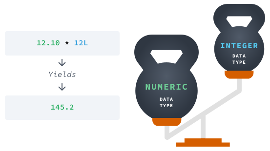
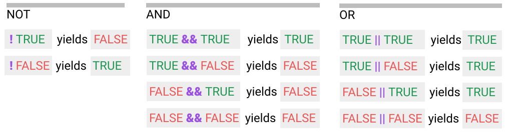
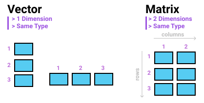
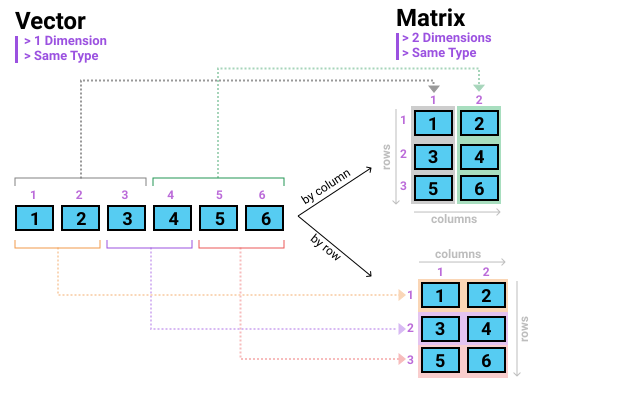
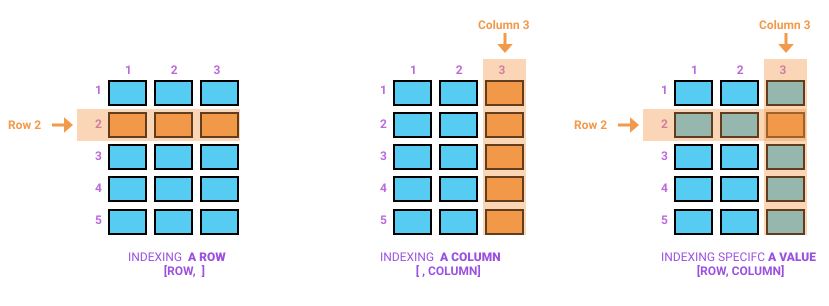
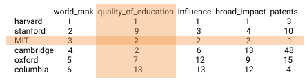
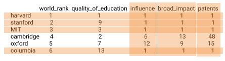
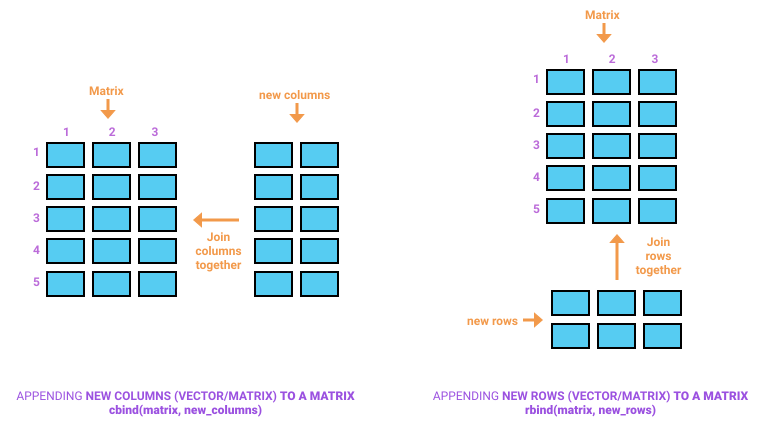
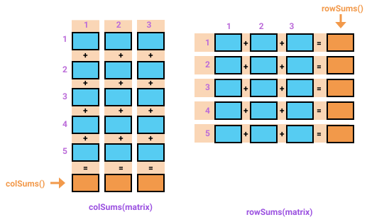

# (PART) Fundamentos {-} 

# Fundamentos del lenguaje R {#Fund}

<!-- https://www.youtube.com/watch?v=SWxoJqTqo08 -->

Ilustración ciclo de vida de la ciencia de los datos


## Primeros pasos en R {#introR}

R, como los demás lenguajes de programación, se ejecuta a través de un conjunto de instrucciones que se alojan dentro de un documento llamado programa, script o código conformado por líneas de código y comentarios. Para que un scrip o código pueda ser entendido por nuestras computadoras, estos imponenen algunas reglas básicas. A lo largo de este libro se presentarán, con títulos en color rojo, las reglas básicas del lenguaje de programación R; estas, como toda regla, nunca deben ser violadas ^[A lo largo de los capítulos que conforman este documento se presentarán algunos casos en los cuales estas reglas pueden ser obviadas o ajustadas. Las reglas que permiten estas acciones pueden ser consideradas como *reglas débiles*.].

La primera regla de R está relacionada con los comentarios. Es decir, la forma como se documenta un código o programa y que el contenido de estos no sean tenidos en cuenta a la hora de la ejecución/compilación de los mismos. Los comentarios son de suma importancia para entender/explicar el contenido o las acciones adelantadas dentro de un programa. Estos son de suma utilidad para nosotros mismos, al momento de olvidar  los porqués del contenido que construimos en un código en el pasado o, para otra u otras personas,  al momento de intendar comprender/entender el contenido de nuestros programas.

<br>
<blockquote>
<p><strong><p style="color:red;">Regla: Comentarios </p></strong><br>
En R, los comentarios; es decir, las partes que nos permiten documentar un código se anteceden de la letra numeral **#**. Los comentarios, en el momento de ejecutar un código, no son tenidos en cuenta por nuestras computadoras.
</p>
</blockquote>
<br>

A continuación, se presenta un ejemplo de un comentario en R.
```r
# Este es un comentario en R 
```

R, como se mencionó al inicio de esta sección, se ejecuta a través de un programa o script el cual está confomado por un conjunto de instrucciones y comentarios que nos permiten obtener los resultados deseados. A continuación, se presenta un ejemplo de un script, programa o código en R.^[En adelante, haremos uso de la palabra **programa ** para hacer referencia a un script o código de R.] 

<p style="color:#e6550d";><i>Ejemplo. Script, programa o código en R</i></p>

```r
# Ejemplo de un script, programa o código en R.
x <- 1  # Esta es una línea de código
y <- 2 
x + y # Esta es otra línea de código
```
El programa de R que se acaba de presentar está conformado por tres líneas de código: la primera, conformada por una variable x, a la que se le asigna el valor 1; la segunda, conformada por una variable y, a la que se le asigna el valor 2 y, finalmente, la tercera línea de código, arroja el resultado de sumar los valores contenidos en la variables x e y.

Cada una de las líneas de un programa, como se mencionó previamente se conoce como _línea de código_ y solo puede existir _una_ instrucción por línea de código. Esta condición deriva en la siguiente regla en R.

<br>
<blockquote>
<p><strong><p style="color:red;">Regla: Instrucciones por línea </p></strong><br>
R solo permite una instrucción por cada una de las líneas que conforman un código o script. En consecuencia, si se ingresan dos o más instrucciones en una misma línea de un código, este genera un error.
</p>
</blockquote>
<br>

A continuación, se presentan dos ejemplos de programas en R. El primero con una instrucción por línea de código (*programa correcto*) y el segundo con más de una instrucción po línea de código (*programa incorrecto*). Al ejecutar el programa incorrecto, el que viola la regla de más de una instrucción por línea de código (*el segundo*), el programa retornará un error.

<p style="color:#e6550d";><i>Ejemplos. Programas correctos e incorrectos en R</i></p>

```r
# Ejemplo 1. Código o script correcto (una instrucción por línea)
x <- 1  
y <- 2 
x + y 

# Ejemplo 2. Código o script incorrecto (más de una instrucción por línea)
x <- 1 y <- 2  
x + y 
```

El lenguaje de programación R, a diferencia de otros lenguajes, diferencia entre letras mayúsculas y minúsculas (*Case Sensitive*). Este hecho, implica la siguiente regla en este lenguaje.

<br>
<blockquote>
<p><strong><p style="color:red;">Regla: Mayúsculas y Minúsculas - (Case Sensitive)</p></strong><br>
R, a diferencia de otros lenguajes de programación, distingue/diferencia entre letras mayúsculas y minúsculas (Case Sensitive). Es decir, una letrá mayúscula es diferente a su contraparte en minúscula.
</p>
</blockquote>
<br>

<p style="color:#e6550d";><i>Ejemplos. Letras mayúsculas y minúsculas</i></p>

A continuación, se presentan cuatro ejemplos en el que se refleja la importancia de diferenciar las letras mayúsculas y minúsculas en R. En el primero de ellos, el mismo programa expuesto con anterioridad, se presenta un programa con el uso de letras minúsculas. El segundo, el mismo programa con el uso de letras mayúsculas. El tercero, el mismo programa con una combinación correcta de letras mayúsculas y minúsculas. Finalmente, el ejemplo cuatro, presenta el mismo programa con una combinación/uso inorrecto de letras mayúsculas y minúsculas que implica un error en el mismo. En este último ejemplo, el valor 1 se asigna a la letra mayúscula X, el valor 2 a la letra mayúscula Y pero, la suma de los mismos -**tercera línea de código**-, se representa mediante las letras minúsculas x e y cuando se espera que allí se ubiquen sus contrapartes mayúsculas.

```r
# Ejemplo 1. Script con letras minúsculas.
x <- 1  
y <- 2 
x + y 

# Ejemplo 2. Script con letras mayúsculas.
x <- 1  
Y <- 2 
x + Y 

# Ejemplo 3. Scrip con letras mayúsculas y minúsculas.
X <- 1  
y <- 2 
X + y 

# Ejemplo 4. Error. Mal uso de letras mayúsculas y minúsculas.
X <- 1  
Y <- 2 
x + y 
```

## Tipos de datos en R {#Tdatos}

Esta sección contiene los principales tipos de datos utilizados en R. Aunque existen otros tipos de datos los cuales no serán objeto del presente documento, estos se caracterizan por conformar la base del lenguaje.

### Tipos de datos en R {#Tdatos1}

En R existen 5 tipos de datos básicos: *lógicos*, *numéricos*, *numéricos - enteros*, *cadena/caracter* y *complejos*^[En este documento no haremos referencia a los números complejos. Estos, de amplio uso y estudio en el contexto de las matemáticas, se caracterízan por tener una parte entera y una imaginaria]. A continuación se presenta una breve descripción y se ejemplifican cada uno de estos tipos de datos.


1. _**Lógicos**_

Los tipos de datos *lógicos*, también conocidos como *booleanos*, representan en R _falso_ o _verdadero_ y se representan mediante las letras o palabras mayúsculas **F** o **FALSE** para el caso de _falso_ y __T__ o  __TRUE__ para el caso de _verdadero_. 

_**NOTA**: En los ejemplos que se presentan a continuación y en muchos de los que se presentarán en adelante, el contenido de los mismos tiene dos componentes: el texto del programa el cual está acompañado de colores en su texto y el resultado u output que arroja R al ejecutar/compilar el programa el cual, además de presentarse en letras de color negro, está precedido de un doble numeral (**##**)._

A continuación se ejemplifican los resultados de compilar tipos de datos lógicos o booleanos en R.

<p style="color:#e6550d";><i>Ejemplo. Datos lógicos</i></p>

```{r, eval=TRUE, warning=FALSE, message=FALSE}
# Opciones para verdadero (T o TRUE)
# Con T
T
# Con TRUE
TRUE

# Opciones para falso (F o FALSE)
# Con F
F
# Con FALSE
FALSE
```

Auque es correcto y más corto el uso de las letras T o F para representar las condiciones de falso o verdadero en R, se recomienda siempre usar las versiones TRUE o FALSE por ser estas más consistentes.

2. _**Numéricos **_

Los tipos de datos *numéricos*, también conocidos como numéros, datos _decimales_ o _dobles_, hacen referencia a aquellos números (positivos o negativos) que se caracterizan por estar conformados por una parte entera y una decimal.En R, el punto **(.)** es el encargado de separar la parte entera de la parte decimal de un número. Por ejemplo, 3.14, 30.48, 2.05, son representaciones de números en R.

Cuando un número es muy grande o muy pequeño, por defecto, el programa los representa mediante notación científica haciendo uso de la letra (**e**). Por ejemplo, _1e-11_ es la representación notación/científica^[El número de decimales a partir del cual R representa a los números reales en notación científica se da por defecto y el mismo, si se considera necesario, puede ser modificado] del número real _0.00000000001_.

A continuación, se presentan algunos ejemplos en R de datos numéricos o decimales.

<p style="color:#e6550d";><i>Ejemplo. Datos numéricos/decimales</i></p>

```{r}
# numéros reales convencionales
3
3.14
30.48
2.05
# numéros reales grandes - notación científica
1234567891011
# número reales pequeños - notación científica
0.00000000001
```

<br>
<blockquote>
<p><strong><p style="color:red;">Regla: Números por defecto en R </p></strong><br>
En R, a menos que se diga lo contrario, todo número, por defecto, es considerado numérico.
</p>
</blockquote>
<br>

3. _**Enteros - numéricos**_

Los tipos de datos enteros en R, también conocidos como números enteros, son aquellos que a diferencia de los numéricos, carecen de una parte decimal. Los número enteros en R están acompañados de la letra mayúscula __(L)__. Por ejemplo, 3L representa el número entero _3_ y -10L el número entero _-10_. 

<p style="color:#2ca25f";><i>Ejemplo. Datos enteros</i></p>

A continuación, se presentan algunos ejemplos de números enteros en R.

```{r}
# Enteros positivos
5L
3L
# Enteros negativos
-20L
-1L
```

4. _**Cadena o caracter**_

En R, los datos de tipo *cadena* o *caracter* hacen referencia a aquellos datos que contienen texto en su contenido. Los tipos de dato *caracter* o de *texto* en R se representan/encierran mediante comillas dobles " o sencillas ' pero **núnca** a través de una mezcla o combinación entre los dos tipos de comillas. "Hola mundo", "Este es un dato de tipo texto", 'dato entre comillas sencillas', "dato entre comillas dobles" son algunos ejemplos de datos de tipo *cadena*, *texto* o *caracter* en R.

<p style="color:#2ca25f";><i>Ejemplo. Datos cadena/caracter</i></p>

A continuación, se presentan algunos ejemplos de datos de tipo *cadena* o *caracter* en R. Así mismo, el segundo de los ejemplos, presenta dos ejemplos que combinan comillas dobles y simples hecho que, como ya se mencionó, conducen a un error en R.

```{r}
# Ejemplo 1
# Con comillas dobles
"Hola"
"Este es otro dato de tipo texto"
"TRUE"
# Con comillas sencillas
'dato entre comillas sencillas'
'FALSE'
'2.35'
```

```r
# Ejemplo 2
# Con comillas mezcladas (dobles y simples)

"Hola' 
'Hola mundo" 

# Las anteriores dos líneas de código producen errores en R
```

### Constantes integradas en R {#Constantes}

R, por defecto y de manera especial trae incluido un pequeño número de variables/palabras (5) que permiten la visualización de ciertos datos de tipo *numérico* o *caracter* de alto uso entre los usuarios, en especial, los de habla inglesa. A continuación, se presentan los cinco nombres especiales que trae incluido este software así como sus correspondientes significados. 

* **LETTERS**: las 26 letras mayúsculas del alfabeto romano
* **letters**: las 26 letras minúsculas del alfabeto romano
* **month.abb**: abreviaturas de tres letras para los nombres de los meses en inglés
* **month.name**: los nombres en inglés de los meses del año
* **pi**: la relación entre la circunferencia de un círculo y su diámetro. También conocido como número _pi_.

<p style="color:#2ca25f";><i>Ejemplo. Constantes integradas en R</i></p>

A continuación, se presenta el resultado de las constantes o palabras integradas y utilizadas por R.

```{r}
# Letras del abecedario en mayúsculas.
LETTERS
# Letras del abecedario en minúsculas.
letters
# Primeras tres letras de los nombres de los meses - en inglés.
month.abb
# Nombre de los meses - en inglés.
month.name
# Número pi
pi
```

## Operaciones aritméticas y variables en R {#Aritmet}

En esta sección se presentan las principales operaciones aritméticas empleadas en R así como la forma de crear variables en este lenguaje de programación.

### Operaciones aritméticas en R

R, en sentido estricto, puede ser considerado como una calculadora avanzada. A través de él es posible implementar las operaciones simples de la aritmética (básicas y complementarias) así como algunas operaciones avanzadas que van desde la combinación de las operaciones simples (compuestas) hasta su uso para otro tipo de operaciones (funciones trigonométricas, operaciones logarítmicas, potenciación, uso de radicales, etc.). En este texto, dado su caracter introductorio, se presentan las operaciones aritméticas simples (básicas o complementarias) así como algunas operaciones compuestas derivadas de la aplicación/combinación de dos o más operaciones simples.

 1. **Operaciones aritméticas simples**: Las operaciones aritméticas básicas o simples empleadas por R son *la suma* (+), *la resta* (-), _la multiplicación_ (*) y _la división_ (/).

<p style="color:#2ca25f";><i>Ejemplos. Operaciones aritméticas básicas</i></p>

A continuación, se presentan algunos ejemplos con las principales operaciones simples empleadas por R.

```{r}
# Suma
3.5 + 7.7 
3L + 10L 
1 + 8
```


```{r}
# Resta

7.7 - 3.7
3L - 10L
8 - pi
```

```{r}
# Multiplicación
7.71 * 3.73
-3L * 10L
1 * 8
```

```{r}
# División
7.7 / 3.7
12L / 4L
-1 / 4

```
 
2. **Operaciones aritméticas simples complementarias**: Las operaciones aritméticas simples y complementarias empleadas por R son los *exponentes* (^), *la división entera* (%/%) y *los módulos* (%%). A continuación, se presenta una breve descripción de estos tres subtipos de operaciones simples complementarias.
 
 * _Exponentes_: Consiste en elevar un número x a una potencia n. Es decir, multiplicar x por sí mismo tantas veces como se defina en n (ver siguiente fórmula).
 
 **\begin{equation}  x^n \end{equation}**
 
Por ejemplo, **\begin{equation}  2^3 \end{equation}** consiste en multiplicar el número 2 por sí mismo 3 veces; es decir, _2x2x2_ cuyo resultado es igual a 8.
 
 
 * _Divisón Entera_: La *división entera* de x%/%n devuelve el número máximo de veces que se encuentra un núemro *n* contenido dentro de un número *x*.
 
 * _Módulo_: El *módulo* de una división x%%n devuelve el *residuo* o *resto* de la división entera de un número x por un número n.
 
<p style="color:#2ca25f";><i>Ejemplos. Operaciones aritméticas complementarias</i></p>

A continuación, se presentan algunos ejemplos de operaciones aritméticas simples y complementarias en R.
 
```{r}
# Exponenciales
2^3
3^2
5^3
```

```{r}
# Divisiones enteras
15%/%3
17%/%3
9%/%4
```

```{r}
# Módulos
15%%3
17%%3
9%%4
``` 
 
3. **Operaciones compuestas**

Una operación aritmética *compuesta* está conformada por la combinación de varias operaciones simples (sumas, restas, multiplicaciones, divisiones, exponentes, etc.).

<p style="color:#2ca25f";><i>Ejemplos. Operaciones complejas</i></p>

A continuación, se presentan algunos ejemplos de operaciones aritméticas compuestas.
 
```{r}
2 + 2 + 3*2
2*5 - 6/2
6/2*10/2 + 3
6/2*(2+1 + 2^3)
```
 
Al observar detenidamente Los ejemplos de las operaciones aritméticas compuestas que se acaban de ilustrar, nos podemos dar cuenta que estas contienen sumas, restas, multiplicaciones y hacen uso de exponentes y paréntesis. Una pregunta que podría surgir de este hecho es ¿cuál es el orden en el que R calcula estas operaciones?. La respuesta a esta pregunta está contenida en una regla llamada de priorización o precedencia.

<br>
<blockquote>
<p><strong><p style="color:red;">Regla: Precedencia o priorización en operaciones aritméticas compuestas</p></strong><br>
En una operación aritmética compuesta de R, los paréntesis se calculan primero, luego los exponentes, luego la división y multiplicación y, finalmente, la suma y la resta. Esta regla se conoce popularmente como PEMDAS^[La sigla PEMDAS se derivada del inglés para Parentheses (Paréntesis), Exponents (Exponentes), Multiplication-Division (Multiplicación-División), Addition-Subtraction (Suma y resta).]
</p>
</blockquote>
<br> 
 
En la siguiente ilustración se presenta un ejemplo de la importancia del conocimiento de la regla de priorización o precedencia en R. En esta ilustración las dos operaciones están compuestas de los mismos números, no obstante, los resultados obtenidos son diferentes (17 y 25). En la operación de la parte izquierda (Order by default), la regla PEMDAS indica que primero debemos realizar la multiplicación y luego la suma; en contraste, en la operación de la parte derecha (Using parentheses), la regla de precedencia nos dice que primero dedemos realizar las operaciones contenidas dentro de los paréntesis -la suma- y luego la multiplicación. 


 
 En el siguiente ejemplo se presentan los resultados obtenidos en R al desarrollar las dos operaciones contenidas en la anterior ilustración.

<p style="color:#2ca25f";><i>Ejemplo. Ilustración de aplicación de regla de precedencia o priorización en operaciones aritméticas compuestas</i></p>

```{r}
# por defecto
2 + 3*5

# usando paréntesis
(2 + 3)*5
```

El conocimiento y uso de la regla de priorización o precencia PEMDAS tiene importantes implicaciones prácticas y técnicas las cuales han generado debate en la comunidad científica y se han convertido en una de las principales fuentes de  error a la hora de enfrentarnos al desarrollo de operaciones artitméticas compuestas. 

El siguiente artículo, publicado en el diario el Espectador por el profesor Ignacio Mantilla, exrector de la Universidad Nacional de Colombia, muestra la importancia del tema el cual, como puede allí leerse, tiene implicaciones de alcance a nivel tecnológico. Invitamos al lector a explorar y analizar detenidamente el contenido de este artículo.

<br>

<iframe width="100%" height="500px" frameborder="0" mozallowfullscreen="true" webkitallowfullscreen="true" allowfullscreen="true" src="https://blogs.elespectador.com/actualidad/ecuaciones-de-opinion/una-polemica-aritmetica"></iframe>

Ver artículo directamente en: [Ecuaciones de opinión](https://blogs.elespectador.com/actualidad/ecuaciones-de-opinion/una-polemica-aritmetica)

<br>

5. **Tipos de datos en expresiones numéricas**



* Operaciones entre datos del mismo tipo, producen el mismo tipo de datos.
* Operaciones entre diferentes tipos de datos, producen el tipo de datos más elevado de acuerdo al siguiente ordenamiento (Numeric > integer > Logical)

<p style="color:#FF0000";><i>Ejemplo. Tipos de datos resultantes de expresiones numéricas</i></p>

```{r}
1L + 2L + 2L
3L + 2
3L + 3*3 + 5/2
```

### Variables en R

Para crear variables se requieren dos pasos: crear el nombre de la variable y asignar valores u objetos al nombre de la variable creada haciendo uso del símbolo **(<-)**. También se puede usar el símbolo **(=)** aunque por buenas prácticas en R y, para evitar su confusión con el uso de este símbolo de otras rutinas, no se recomienda su uso para la asignación de valores a variables.

Se crear variables para después reutilizarlas.


**Regla 4.**

 * _Para nombrar una variable, hay cinco reglas de nombres a seguir._
 * _Los nombres de las variables consisten en letras (mayúsculas o minúsculas), números, un punto (.) O un guión bajo (_)._
 * _Podemos comenzar un nombre de variable con una letra o un punto, pero los puntos no pueden ser seguidos por un número._
 * _No podemos comenzar un nombre de variable con un número._
 * _No se permiten caracteres especiales, por ejemplo, espacios, símbolos de operador ", paréntesis._
 * _No podemos usar una palabra clave ya utilizada e interpretada por R como un nombre de variable. PALABRAS RESERVADAS_
 
 Ver el siguiente ejemplo para el caso de espacios entre variables (`var1 var2` <- 12)
 Ver también el siguiente ejemplo 'var11' <- 2


Para ver el resultado de una variable debemos crear una nueva linea de código con el nombre de dicha variable. 

var <- c(1:3)
var

### Identificando el tipo de variables - Primera función

A las **funciones** se les puede llamar pequeños programas que permiten hacer alguna cosa. 

Para identificar el tipo de elementos que conforman una variable, podemos hacer uso de la función **class()**.


<p style="color:#FF0000";><i>Ejemplo. Tipos de variables en R</i></p>

```{r}
var_1 <- TRUE
var_2 <- 2L
var_3 <- 0.14
var_4 <- var_1 + var_2 + var_3
class(var_1)
class(var_2)
class(var_3)
class(var_4)
```

_El valor lógico TRUE, en R, asume un valor de 1; el valor lógico FALSE asume un valor de 0_


## Expresiones lógicas en R {#Elogicas}

Las expresiones lógicas se basan en los literales lógicos. Es decir, TRUE y FALSE o simplemente T y F. 

### Operadores Relacionales

Los _operadores relacionales_ disponibles en R son:

 * _**Menor que ( < )**_
 * _**Mayor que ( > )**_
 * _**Menor o igual que ( <= )**_
 * _**Mayor o igual que ( >= )**_
 * _**Igual a ( == )**_
 * _**No es igual a (diferente) ( != )**_


A continuación se presentan dos tipos de ejemplos con el uso de expresiones regulares: _simples_ y a través de _expresiones aritméticas_

<p style="color:#FF0000";><i>Ejemplo. Expresiones lógicas simples</i></p>

```{r}
3 >= 2
3 > 3
1 < 3
4 <= 4
3 == 3
3 != 3
TRUE == FALSE
TRUE == 1
FALSE == 0
FALSE != 0
```

**Regla 5.**

* _Al evaluar un operador lógico con expresiones aritméticas, primero se evaluan las expresiones aritméticas y luego las expresiones lógicas_

<p style="color:#FF0000";><i>Ejemplo. Operaciones lógicas entre expresiones aritméticas</i></p>

```{r}
12.10 - 10.50 < 24.90 - 21.15

apple_profit <- 12.10 - 10.50 
mango_profit <- 24.90 - 21.15

apple_profit < mango_profit
```

Finalmente, en R se puede almacenar el resultado de una comparación lógica dentro de una variable.

logical_var <- apple_profit < mango_profit

```{r}
apple_sold <- 12.10 * 12L
lemon_sold <- 4.99 * 24L
logical_var <- apple_sold == lemon_sold
logical_var
```


Los operadores relacionales se emplean para hacer comparaciones entre valores (expresiones). El resultado de la aplicación de los operadores relacionales es TRUE o FALSE

### Operadores Lógicos

Los _operadores lógicos_ disponibles en R son:


 * _**No lógico ( ! )**_
 * _** Y lógico ( & )**_
 * _** O lógico ( | )**_
 
Revisar los operadores (&& y ||), como se presenta en la siguiente ilustración.



### Combinando operadores

**Regla 5. Priorización o precedencia general**

Teniendo en cuenta todos los operadores vistos hasta ahora, la regla de priorización general es:

 * _Paréntesis_
 * _Exponentes_
 * _División y multiplicación_
 * _Adición y sustracción_
 * _Operadores relacionales_
 * _Operadores logicos_


_**Estudiarr el siguiente caso con vectores**_

a <- 3
b <- 15

a:b
a+1:b
a+(1:b)
(a+1):b

[Caso tomado de](https://twitter.com/necronet/status/1286129628718018560)


<p style="color:#FF0000";><i>Ejemplo. Combinando operadores</i></p>
 
```{r}
apple_profit <- 12.10 - 10.50
mango_profit <- 24.90 - 21.15
lemon_profit <- 4.99 - 3.20
logical_var <- apple_profit <= mango_profit || apple_profit > mango_profit
logical_var
```

## Estructuras de datos {#Edatos}


### Vectores

Importancia de la función c()


```{r}
vector1 <- 1
vector2 <- c(1)
# vector3 <- 1, 2
vector4 <- 1:2
vector5 <- c(1,2)
```


Mi primer vector.

```{r}
# Mi primer vector con 5 elementos
c(1, 2, 3, 4, 5)

# Matriz con tres filas y cuatro columnas
matrix(1:12, nrow = 3, ncol = 4) 
```

#### _Tipos de vectores_

1. _**Lógicos**_


```{r, eval=FALSE}
# Mi primer vector Lógico
c(TRUE, FALSE, FALSE, TRUE)
```


2. _**Enteros**_

```{r, eval=FALSE}
# Mi primer vector entero
c(12L, 3L, 24L, 8L)
```


3. _**Reales**_

```{r, eval=FALSE}
# Mi primer vector real
c(12.10, 24.90, 4.99)
```


4. _**Cadena**_

```{r, eval=FALSE}
# Mi primer vector cadena
c("Lunes", "Martes", "Miércoles","Jueves", "Viernes", "Sábado","Domingo")
```

#### _Cómo crear vectores rápidamente_

Funciones (seq() y rep())

#### _Indexación de vectores_

Fuente: [Manual R Base Indexación](https://cran.r-project.org/doc/manuals/r-release/R-lang.html#Indexing)

Cómo extraer elementos de un vector - R es un lenguaje de programación indexado en 1; es decir, al primer elemento de un vector se le asigna la posición 1. Para extraer elementos de un vector usamos corchetes []


##### _Por posición_

```{r,  eval=FALSE}
Nombre_vector[3]
Nombre_vector[c(3)]
Nombre_vector[1:4]
Nombre_vector[c(1:4)]
Nombre_vector[c(1,3,7)]
Nombre_vector[-c(1,3,7)]
```

##### _Por vectores lógicos_

```{r,  eval=FALSE}
Nombre_vector[c(LOGICO)]
```

#### _Modificar, anexar, remover elementos de un vector_

1. _**Modificar elementos de un vector**_

```{r, eval=TRUE}
vector <- c(1L:5L)
vector[5] <- 6L
vector

vector1 <- c(1L:5L)
vector1[c(3:5)] <- 6L
vector1

vector2 <- c(1L:5L)
vector2[c(TRUE, FALSE, FALSE, FALSE, TRUE)] <- 6L
vector2
```

2. _**Adicionar elementos a un vector**_

```{r, eval=TRUE}
vector1 <- c(1:3)
vector2 <- c(4:5)
# nuevo vector
vector3_1 <-  c(vector1, vector2)
vector3_1
# mismo vector
vector1[c(4:5)] <- c(4:5)
vector1
```

3. _**Remover elementos de un vector**_

Indexando negativamente  (OJO, para data.frames y listas se puede usar la opción NULL)

```{r, eval=TRUE}
# Ejemplo1
vector <- c(1:10)
vector <- vector[-c(6:10)]
vector

# Ejemplo2
vector <- c(1:10)
vector <- vector[c(-6, -7, -8, -9, -10)]
vector

# Ejemplo3
vector <- c(1:10)
vector <- vector[vector<6]
vector
```

#### _Operaciones aritméticas con vectores_

1. _**Adición, multiplicación y división**_


```{r, eval=TRUE}
v1 <- c(1:5)
v2 <- c(5:1)
v3 <- c(1:5)
v4 <- c(5:1)
suma <- v1 + v2 + v3 + v4
promedio <- suma/3
promedio
```


2. _**Reciclaje en operaciones con vectores**_

_Aritmética con vectores de diferentes longitudes_


```{r, eval=TRUE, warning=FALSE}
v1 <- c(92, 90, 84, 95, 77, 92, 85)
v2 <- c(87, 81)
suma <- v1 + v2
suma
```


#### _Usando nombres en vectores_


```{r, eval=TRUE, warning=FALSE}
# Alternativa 1
vector = c(a = 1, b = 2, c = 3, d = 4, e = 5)
vector
# Alternativa 2
vector1 <- c(1L:5L)
Nombres <- c('a', 'b', 'c', 'd', 'e') # letters[c(1:5)] # letters[seq(1,5)] 
names(vector1) <- Nombres
vector1
# Indexación
vector1[c('a', 'e')]
# Reemplazar valores
vector1[c('a', 'e')] <- 6L
vector1
# Revisar los nombres de un vector
names(vector1)
```


#### _Coerción en vectores_

<br>
<br>
<blockquote>
<p><strong><p style="color:red;">Regla:Coerción</p></strong>
<strong>character → double → integer → logical.</strong><br> 
<br>
Es decir, si existe un vector con elementos de tipo lógico y de tipo entero, el resultado es un vector con elemento de tipo entero. Si existe un vector elementos de tipo lógico, entero y real, el resultado es un vector de tipo real. Finalmente, si existe un vector con elementos de tipo lógico, entero, real y caracter o cadena, el resultado es un vector de tipo caracter.
</p>
</blockquote>
<br>
<br>

### Matrices

Las matrices,  como los vectores, son estructuras bidimensionales de datos con la totalidad de elementos del mismo tipo. Es decir, los elementos de las matrices pueden ser de tipo numérico (enteros y dobles), lógico y de tipo caractér (cadena). 




#### _Creando matrices_

Las matrices se crean a través de la función **matrix()**

1. _**Modificando vectores**_

Una foma de crear matrices es reestructurando un vector en matrices, como se observa en la siguiente figura.



```{r, eval=TRUE, warning=FALSE}
# Ejemplo 1 - Por defecto - columnas
matrix(c(1:5))
# Ejemplo 2 - Indicando filas y columnas
matrix(1:12, nrow = 4, ncol = 3)
# Ejemplo 3 - Por filas
matrix(1:12, nrow = 4, ncol = 3, byrow = TRUE)
# Ejemplo 4 - Sin definir columnas
matrix(1:12, nrow = 4)
# Ejemplo 5 - Sin definir filas
matrix(1:12, ncol = 4)
# Ejemplo 6 - Con secuencias
matrix(seq(from = 2, to = 8, by = 2), nrow = 2, ncol = 2)
# Ejemplo 7 - Con repeticiones
matrix(rep(1,4), nrow = 2, ncol = 2)
# Ejemplo 8 - Reciclando elementos
matrix(1:7, ncol = 3)
# Ejemplo 9 - Con elementos lógicos
matrix(c(TRUE, FALSE, FALSE, TRUE), nrow = 2, ncol = 2)
# Ejemplo 10 - Con elementos tipo caractér - cadena
matrix(c('Lunes', 'Martes', 'Miércoles', 'Jueves', 'Viernes', 'Sábado'), nrow = 3, ncol = 2)
```

2. _**Combinando vectores**_

A través de las funciones **rbind()** y **cbind()**

```{r, eval=TRUE, warning=FALSE}
v1 <- c(1, 2, 3)
v2 <- c(3, 2, 1)
v3 <- c(1, 2, 3)
# creación de matrices con vectores- por filas
fil_matriz <- rbind(v1, v2, v3)
fil_matriz
# creación de matrices con vectores- por columnas
col_matriz <- cbind(v1, v2, v3)
col_matriz
```

#### _Nombrando las dimensiones de una matriz_

Una matriz está conformada por dos dimensiones (filas y columnas). El nombre de las filas y de las columnas se da a través de las funciones **rownames()** y **colnames()**.

```{r, eval=TRUE, warning=FALSE}
# matriz básica
matriz <- matrix(c(1:4), nrow = 2, ncol = 2, byrow = TRUE)
matriz
# Matriz con nombres de filas y columnas
rownames(matriz) <- c('f_1', 'f_2')
colnames(matriz) <- c('c_1', 'c_2')
matriz
# Consultar los nombres de filas y columnas en una matriz
# Nombre de las filas
rownames(matriz)
# Nombre de las columnas
colnames(matriz)  
```


#### _Indexación en matrices_


A partir de una matriz podemos extraer/indexar con tres propósitos. 

* *Extraer un elemento [fila, columna]*
* *Extraer una fila o filas [fila, ]*
* *Extraer una columna o columnas [, columna]*

1. **Indexación básica**

```{r, eval=TRUE, warning=FALSE}
matriz <- matrix(c(1:4), nrow = 2, ncol = 2, byrow = TRUE)
rownames(matriz) <- c('f_1', 'f_2')
colnames(matriz) <- c('c_1', 'c_2')
matriz
# Extraer el elemento ubicado en la fila 2 y la columna 1
matriz[2,1]
# Extraer la fila 1
matriz[1, ]
# Extraer la columna 2
matriz[, 2]
```

2. **Indexación a través de vectores**

* *vectores numéricos (enteros)*
* *vectores lógicos*
* *vectores de caractéres (nombres de filas o columnas)*

```{r, eval=TRUE, warning=FALSE}
matriz <- matrix(c(1:9), nrow = 3, ncol = 3, byrow = FALSE)
rownames(matriz) <- c('f_1', 'f_2', 'f_3')
colnames(matriz) <- c('c_1', 'c_2', 'c_3')
# Con vectores numéricos - filas 1 y 2
matriz[c(1:2), ]
# Con vectores lógicos - columnas 1 y 3
# Igual a matriz[, c(TRUE, FALSE, TRUE, FALSE)]
matriz[, c(TRUE, FALSE)]
# Con vectores de caractéres - columnas 2 y 3 - filas 1 y 3
matriz[c(1,3), c('c_2', 'c_3')]
```

#### _Modificando elementos en matrices_

Se puede modificar un único elemento dentro de una matriz o bloques de elementos (más de un elementos). Veámos estas ídeas gráficamente



```{r, eval=TRUE, warning=FALSE}
# Ejemplo
matriz <- matrix(c(1:9), nrow = 3, ncol = 3, byrow = FALSE)
rownames(matriz) <- c('f_1', 'f_2', 'f_3')
colnames(matriz) <- c('c_1', 'c_2', 'c_3')
# Modificar elemento (3,3) por 20
matriz[3, 3] <- 30
matriz
```



```{r, eval=TRUE, warning=FALSE}
# Ejemplo
matriz <- matrix(c(1:9), nrow = 3, ncol = 3, byrow = FALSE)
rownames(matriz) <- c('f_1', 'f_2', 'f_3')
colnames(matriz) <- c('c_1', 'c_2', 'c_3')
# Modificar filas 1,2 y columnas 2 y 3
matriz[c(1,2), c('c_2', 'c_3')] <- 0
matriz
```

#### _Adicionando elementos en matrices_

En las matrices se pueden adicionar filas o columnas. A continuación se presenta una ilustración gráfica de estas dos ideas.



Para adicionar filas en una matriz se hace uso de la función **rbind()**; para adicionar columnas, se hace uso de la función **cbind**.

```{r, eval=TRUE, warning=FALSE}
matriz1 <- matrix(c(1:9), nrow = 3, ncol = 3, byrow = FALSE)
rownames(matriz1) <- c('f_1', 'f_2', 'f_3')
colnames(matriz1) <- c('c_1', 'c_2', 'c_3')
# Adicionar una fila
matriz1 <- rbind(matriz, 'c_4' = c(4, 7, 10))
matriz1
# Adicionar dos columnas
matriz2 <- matrix(c(1:9), nrow = 3, ncol = 3, byrow = FALSE)
rownames(matriz2) <- c('f_1', 'f_2', 'f_3')
colnames(matriz2) <- c('c_1', 'c_2', 'c_3')
# Adicionar una fila
matriz2 <- cbind(matriz2, matrix(c(7:12), nrow = 3, ncol = 2))
colnames(matriz2) <- c('c_1', 'c_2', 'c_3', 'c_4', 'c_5')
matriz2

```

#### _Removiendo elementos en matrices_

Se eliminan columnas o elementos de columnas haciendo uso del simbolo (-) entre corchetes. [-() , -c()]

<p style="color:#FF0000";><i>Ejemplo. Removiendo elementos de matrices</i></p>

```{r, eval=TRUE, warning=FALSE}
#Creando una matriz
matriz <- matrix(1:12, nrow = 4, ncol = 3)
rownames(matriz) <- c('f_1', 'f_2', 'f_3', 'f_4')
colnames(matriz) <- c('c_1', 'c_2', 'c_3')
matriz
# Eliminando primera fila
matriz[-1, ]
# Eliminando segunda columna
matriz[ ,-2]
# Eliminando haciendo uso de vectores - enteros
matriz[-c(1,4), -3]
# Eliminando haciendo uso de vectores lógicas - reciclando
matriz[c(TRUE, FALSE), c(-1)]
# Eliminando haciendo uso de vectores lógicas - sin reciclar
matriz[c(TRUE, FALSE, TRUE, FALSE), c(-1)]
# Eliminando haciendo uso de vectores lógicas - derivados de expresiones lógicas 
expl <- matriz[, 3] > 10
expl
matriz[expl, c(-1)]
```

#### _Marginales en matrices_

Ver las funciones **rowSums(), colSums(), rowMeans(), colMeans()*



<p style="color:#FF0000";><i>Ejemplo. Marginales en matrices</i></p>

```{r, eval=TRUE, warning=FALSE}
#Creando una matriz - haciendo uso de la función dimnames
matriz1 <- matrix(1:9, nrow = 3, ncol = 3, dimnames = list(c('f_1', 'f_2', 'f_3'), c('c_1', 'c_2', 'c_3')))
matriz1
# Suma de filas
rowSums(matriz1)
# Suma de columnas
colSums(matriz1)
# Promedio de filas
rowMeans(matriz1)
# Promedio de columnas
colMeans(matriz1)
```

#### _Operaciones con matrices_

Las operaciones con matrices son la suma, la resta, la multiplicación y la división.

### Arreglos


### Data frames


### Listas

Una lista es una estructura de datos multidimensional que permite, en su interior, la disposición de estructuras de datos y objetos de diversas tipologías.


¿Por qué querríamos crear listas de objetos en R? La respuesta es que almacenar objetos en listas nos permite utilizar algunas funciones R muy poderosas para realizar la misma operación en cada objeto de nuestra lista, lo que nos permite evitar escribir repetidamente la misma función.

#### Creando listas

Las listas se crean a través de la función **list()**. Los elementos que hacen parte de una lista se separan, como en el caso de los vectores, a través de comas **(,)** y pueden ser de cualquier tipo.

<p style="color:#FF0000";><i>Ejemplos. Diferentes listas</i></p>

```{r}
#Lista 1
list(1:3, "a", c(TRUE, FALSE, TRUE), c(2.3, 5.9))
#Lista 2
list("Hola mundo", 1, 1, 3, TRUE)
#Lista 3
list(país = "Colombia", matriz = matrix(c(1:9), ncol =3), vector = c(TRUE, FALSE))
```

Revisar las posiciones, en el output, en las que aparece cada uno de los elementos de una lista a través del numero contenidoen [[]]

#### Nombrando listas

La asignación de nombres a los elementos que conforman una lista,  al igual que en el caso de los vectores, se logra haciendo uso de la función **names()**.

```{r}
#Lista
mi_lista <- list(1, 2, 3, 4)
mi_lista
#Nombrando los elementos de la lista
names(mi_lista) <- c('a', "b", 'c', "d")
# El resultado
mi_lista
```

#### Indexación en listas

En las listas existen dos alternativas de indexación.

1. _**Paréntesis individuales**_: Retorna una _lista_ de elementos.
2. _**Doble paréntesis**_: Retorna un único elemento.

<p style="color:#FF0000";><i>Ejemplos. Indexación con listas</i></p>

```{r}
recurre <- list(1,list(2,3, list(4,5)))
#Extraer el número 5 - tres alternativas
recurre[[c(2, 3)]][[2]]
recurre[[2]][[3]][[2]]
recurre[2][[1]][[3]][[2]]
```

#### Modificar, adicionar y remover elementos de una lista

#### Combinando listas

## Indexación en R {#Indexa}

## Programación con R {#Progra}

Revisar [R para principiantes](https://bookdown.org/jboscomendoza/r-principiantes4/estructuras-de-control.html), en donde se presentan los principales tipos de estructuras de control existentes en R. Este documento también es util para ...  

### if y else
### for


Tomado de: https://twitter.com/allison_horst/status/1290774616038809600/photo/1

### while
### break y next
### repeat
### La familia apply


## Mejores prácticas en R {#Mpracticas}

Ver linemaientos sobre buena prácticas en R (Ortografía)
Hablar sobre comentario
c(1,2,3) en R produce el mismo resultado que c(1, 2, 3)

