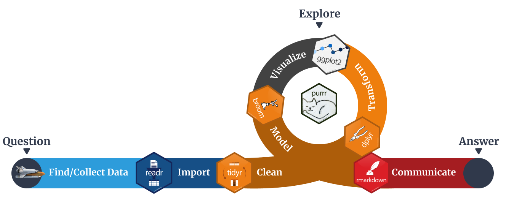

# (PART) Fundamentos {-} 

# Fundamentos del lenguaje R {#Fund}

<!-- https://www.youtube.com/watch?v=SWxoJqTqo08 -->

<!-- Ilustración ciclo de vida de la ciencia de los datos -->

<!--  -->

En esta sección, se presentan los fundamentos del lenguaje de programación R. Estos están constituidos por los principales tipos de datos existentes en R, las operaciones aritméticas, la creación de variables, las expresiones lógicas, las estructuras de datos, la indexación o creación de subconjuntos de datos en R así como las principales rutinas de programación que hacen parte de este lenguaje.

## Primeros pasos {#introR}

R, como los demás lenguajes de programación, se ejecuta a través de un conjunto de instrucciones que se alojan dentro de un documento llamado programa, script o código conformado por líneas de código y comentarios. Para que un scrip o código pueda ser entendido por nuestras computadoras, estos imponenen algunas reglas básicas. A lo largo de este libro se presentarán, con títulos en color rojo, las reglas básicas del lenguaje de programación R; estas, como toda regla, nunca deben ser violadas ^[A lo largo de los capítulos que conforman este documento se presentarán algunos casos en los cuales estas reglas pueden ser obviadas o ajustadas. Las reglas que permiten estas acciones pueden ser consideradas como *reglas débiles*.].

La primera regla de R está relacionada con los comentarios. Es decir, la forma como se documenta un código o programa y que el contenido de estos no sean tenidos en cuenta a la hora de la ejecución/compilación de los mismos. Los comentarios son de suma importancia para entender/explicar el contenido o las acciones adelantadas dentro de un programa. Estos son de suma utilidad para nosotros mismos, al momento de olvidar  los porqués del contenido que construimos en un código en el pasado o, para otra u otras personas,  al momento de intendar comprender/entender el contenido de nuestros programas.

<br>
<blockquote>
<p><strong><p style="color:red;">Regla: Comentarios </p></strong><br>
En R, los comentarios; es decir, las partes que nos permiten documentar un código se anteceden de la letra numeral **#**. Los comentarios, en el momento de ejecutar un código, no son tenidos en cuenta por nuestras computadoras.
</p>
</blockquote>
<br>

A continuación, se presenta un ejemplo de un comentario en R.
```r
# Este es un comentario en R 
```

R, como se mencionó al inicio de esta sección, se ejecuta a través de un programa o script el cual está confomado por un conjunto de instrucciones y comentarios que nos permiten obtener los resultados deseados. A continuación, se presenta un ejemplo de un script, programa o código en R.^[En adelante, haremos uso de la palabra **programa ** para hacer referencia a un script o código de R.] 

<p style="color:#e6550d";><i>Ejemplo. Script, programa o código en R</i></p>

```r
# Ejemplo de un script, programa o código en R.
x <- 1  # Esta es una línea de código
y <- 2 
x + y # Esta es otra línea de código
```
El programa de R que se acaba de presentar está conformado por tres líneas de código: la primera, conformada por una variable x, a la que se le asigna el valor 1; la segunda, conformada por una variable y, a la que se le asigna el valor 2 y, finalmente, la tercera línea de código, arroja el resultado de sumar los valores contenidos en la variables x e y.

Cada una de las líneas de un programa, como se mencionó previamente se conoce como _línea de código_ y solo puede existir _una_ instrucción por línea de código. Esta condición deriva en la siguiente regla en R.

<br>
<blockquote>
<p><strong><p style="color:red;">Regla: Instrucciones por línea </p></strong><br>
R solo permite una instrucción por cada una de las líneas que conforman un código o script. En consecuencia, si se ingresan dos o más instrucciones en una misma línea de un código, este genera un error.
</p>
</blockquote>
<br>

A continuación, se presentan dos ejemplos de programas en R. El primero con una instrucción por línea de código (*programa correcto*) y el segundo con más de una instrucción po línea de código (*programa incorrecto*). Al ejecutar el programa incorrecto, el que viola la regla de más de una instrucción por línea de código (*el segundo*), el programa retornará un error.

<p style="color:#e6550d";><i>Ejemplos. Programas correctos e incorrectos en R</i></p>

```r
# Ejemplo 1. Código o script correcto (una instrucción por línea)
x <- 1  
y <- 2 
x + y 

# Ejemplo 2. Código o script incorrecto (más de una instrucción por línea)
x <- 1 y <- 2  
x + y 
```

El lenguaje de programación R, a diferencia de otros lenguajes, diferencia entre letras mayúsculas y minúsculas (*Case Sensitive*). Este hecho, implica la siguiente regla en este lenguaje.

<br>
<blockquote>
<p><strong><p style="color:red;">Regla: Mayúsculas y Minúsculas - (Case Sensitive)</p></strong><br>
R, a diferencia de otros lenguajes de programación, distingue/diferencia entre letras mayúsculas y minúsculas (Case Sensitive). Es decir, una letrá mayúscula es diferente a su contraparte en minúscula.
</p>
</blockquote>
<br>

<p style="color:#e6550d";><i>Ejemplos. Letras mayúsculas y minúsculas</i></p>

A continuación, se presentan cuatro ejemplos en el que se refleja la importancia de diferenciar las letras mayúsculas y minúsculas en R. En el primero de ellos, el mismo programa expuesto con anterioridad, se presenta un programa con el uso de letras minúsculas. El segundo, el mismo programa con el uso de letras mayúsculas. El tercero, el mismo programa con una combinación correcta de letras mayúsculas y minúsculas. Finalmente, el ejemplo cuatro, presenta el mismo programa con una combinación/uso inorrecto de letras mayúsculas y minúsculas que implica un error en el mismo. En este último ejemplo, el valor 1 se asigna a la letra mayúscula X, el valor 2 a la letra mayúscula Y pero, la suma de los mismos -**tercera línea de código**-, se representa mediante las letras minúsculas x e y cuando se espera que allí se ubiquen sus contrapartes mayúsculas.

```r
# Ejemplo 1. Script con letras minúsculas.
x <- 1  
y <- 2 
x + y 

# Ejemplo 2. Script con letras mayúsculas.
x <- 1  
Y <- 2 
x + Y 

# Ejemplo 3. Scrip con letras mayúsculas y minúsculas.
X <- 1  
y <- 2 
X + y 

# Ejemplo 4. Error. Mal uso de letras mayúsculas y minúsculas.
X <- 1  
Y <- 2 
x + y 
```

## Tipos de datos {#Tdatos}

Esta sección contiene los principales tipos de datos utilizados en R. Aunque existen otros tipos de datos los cuales no serán objeto del presente documento, estos se caracterizan por conformar la base del lenguaje.

### Tipos de datos en R {#Tdatos1}

En R existen 5 tipos de datos básicos: *lógicos*, *numéricos*, *numéricos - enteros*, *cadena/caracter* y *complejos*^[En este documento no haremos referencia a los números complejos. Estos, de amplio uso y estudio en el contexto de las matemáticas, se caracterízan por tener una parte entera y una imaginaria]. A continuación se presenta una breve descripción y se ejemplifican cada uno de estos tipos de datos.


1. _**Lógicos**_

Los tipos de datos *lógicos*, también conocidos como *booleanos*, representan en R _falso_ o _verdadero_ y se representan mediante las letras o palabras mayúsculas **F** o **FALSE** para el caso de _falso_ y __T__ o  __TRUE__ para el caso de _verdadero_. 

_**NOTA**: En los ejemplos que se presentan a continuación y en muchos de los que se presentarán en adelante, el contenido de los mismos tiene dos componentes: el texto del programa el cual está acompañado de colores en su texto y el resultado u output que arroja R al ejecutar/compilar el programa el cual, además de presentarse en letras de color negro, está precedido de un doble numeral (**##**)._

A continuación se ejemplifican los resultados de compilar tipos de datos lógicos o booleanos en R.

<p style="color:#e6550d";><i>Ejemplo. Datos lógicos</i></p>

```{r, eval=TRUE, warning=FALSE, message=FALSE}
# Opciones para verdadero (T o TRUE)
# Con T
T
# Con TRUE
TRUE

# Opciones para falso (F o FALSE)
# Con F
F
# Con FALSE
FALSE
```

Auque es correcto y más corto el uso de las letras T o F para representar las condiciones de falso o verdadero en R, se recomienda siempre usar las versiones TRUE o FALSE por ser estas más consistentes.

2. _**Numéricos **_

Los tipos de datos *numéricos*, también conocidos como numéros, datos _decimales_ o _dobles_, hacen referencia a aquellos números (positivos o negativos) que se caracterizan por estar conformados por una parte entera y una decimal.En R, el punto **(.)** es el encargado de separar la parte entera de la parte decimal de un número. Por ejemplo, 3.14, 30.48, 2.05, son representaciones de números en R.

Cuando un número es muy grande o muy pequeño, por defecto, el programa los representa mediante notación científica haciendo uso de la letra (**e**). Por ejemplo, _1e-11_ es la representación notación/científica^[El número de decimales a partir del cual R representa a los números reales en notación científica se da por defecto y el mismo, si se considera necesario, puede ser modificado] del número real _0.00000000001_.

A continuación, se presentan algunos ejemplos en R de datos numéricos o decimales.

<p style="color:#e6550d";><i>Ejemplo. Datos numéricos/decimales</i></p>

```{r}
# numéros reales convencionales
3
3.14
30.48
2.05
# numéros reales grandes - notación científica
1234567891011
# número reales pequeños - notación científica
0.00000000001
```

<br>
<blockquote>
<p><strong><p style="color:red;">Regla: Números por defecto en R </p></strong><br>
En R, a menos que se diga lo contrario, todo número, por defecto, es considerado numérico.
</p>
</blockquote>
<br>

3. _**Enteros - numéricos**_

Los tipos de datos enteros en R, también conocidos como números enteros, son aquellos que a diferencia de los numéricos, carecen de una parte decimal. Los número enteros en R están acompañados de la letra mayúscula __(L)__. Por ejemplo, 3L representa el número entero _3_ y -10L el número entero _-10_. 

<p style="color:#e6550d";><i>Ejemplo. Datos enteros</i></p>

A continuación, se presentan algunos ejemplos de números enteros en R.

```{r}
# Enteros positivos
5L
3L
# Enteros negativos
-20L
-1L
```

4. _**Cadena o caracter**_

En R, los datos de tipo *cadena* o *caracter* hacen referencia a aquellos datos que contienen texto en su contenido. Los tipos de dato *caracter* o de *texto* en R se representan/encierran mediante comillas dobles " o sencillas ' pero **núnca** a través de una mezcla o combinación entre los dos tipos de comillas. "Hola mundo", "Este es un dato de tipo texto", 'dato entre comillas sencillas', "dato entre comillas dobles" son algunos ejemplos de datos de tipo *cadena*, *texto* o *caracter* en R.

<p style="color:#e6550d";><i>Ejemplo. Datos cadena/caracter</i></p>

A continuación, se presentan algunos ejemplos de datos de tipo *cadena* o *caracter* en R. Así mismo, el segundo de los ejemplos, presenta dos ejemplos que combinan comillas dobles y simples hecho que, como ya se mencionó, conducen a un error en R.

```{r}
# Ejemplo 1
# Con comillas dobles
"Hola"
"Este es otro dato de tipo texto"
"TRUE"
# Con comillas sencillas
'dato entre comillas sencillas'
'FALSE'
'2.35'
```

```r
# Ejemplo 2
# Con comillas mezcladas (dobles y simples)

"Hola' 
'Hola mundo" 

# Las anteriores dos líneas de código producen errores en R
```

### Constantes integradas en R {#Constantes}

R, por defecto y de manera especial trae incluido un pequeño número de variables/palabras (5) que permiten la visualización de ciertos datos de tipo *numérico* o *caracter* de alto uso entre los usuarios, en especial, los de habla inglesa. A continuación, se presentan los cinco nombres especiales que trae incluido este software así como sus correspondientes significados. 

* **LETTERS**: las 26 letras mayúsculas del alfabeto romano
* **letters**: las 26 letras minúsculas del alfabeto romano
* **month.abb**: abreviaturas de tres letras para los nombres de los meses en inglés
* **month.name**: los nombres en inglés de los meses del año
* **pi**: la relación entre la circunferencia de un círculo y su diámetro. También conocido como número _pi_.

<p style="color:#e6550d";><i>Ejemplo. Constantes integradas en R</i></p>

A continuación, se presenta el resultado de las constantes o palabras integradas y utilizadas por R.

```{r}
# Letras del abecedario en mayúsculas.
LETTERS
# Letras del abecedario en minúsculas.
letters
# Primeras tres letras de los nombres de los meses - en inglés.
month.abb
# Nombre de los meses - en inglés.
month.name
# Número pi
pi
```

## Operaciones aritméticas {#Aritmet}

En esta sección se presentan las principales operaciones aritméticas empleadas en R. 

### Operaciones aritméticas en R

R, en sentido estricto, puede ser considerado como una calculadora avanzada. A través de él es posible implementar las operaciones simples de la aritmética (básicas y complementarias) así como algunas operaciones avanzadas que van desde la combinación de las operaciones simples (compuestas) hasta su uso para otro tipo de operaciones (funciones trigonométricas, operaciones logarítmicas, potenciación, uso de radicales, etc.). En este texto, dado su caracter introductorio, se presentan las operaciones aritméticas simples (básicas o complementarias) así como algunas operaciones compuestas derivadas de la aplicación/combinación de dos o más operaciones simples.

 1. **Operaciones aritméticas simples**: Las operaciones aritméticas básicas o simples empleadas por R son *la suma* (+), *la resta* (-), _la multiplicación_ (*) y _la división_ (/).

<p style="color:#e6550d";><i>Ejemplos. Operaciones aritméticas básicas</i></p>

A continuación, se presentan algunos ejemplos con las principales operaciones simples empleadas por R.

```{r}
# Suma
3.5 + 7.7 
3L + 10L 
1 + 8
```


```{r}
# Resta

7.7 - 3.7
3L - 10L
8 - pi
```

```{r}
# Multiplicación
7.71 * 3.73
-3L * 10L
1 * 8
```

```{r}
# División
7.7 / 3.7
12L / 4L
-1 / 4

```
 
2. **Operaciones aritméticas simples complementarias**: Las operaciones aritméticas simples y complementarias empleadas por R son los *exponentes* (^), *la división entera* (%/%) y *los módulos* (%%). A continuación, se presenta una breve descripción de estos tres subtipos de operaciones simples complementarias.
 
 * _Exponentes_: Consiste en elevar un número x a una potencia n. Es decir, multiplicar x por sí mismo tantas veces como se defina en n (ver siguiente fórmula).
 
 **\begin{equation}  x^n \end{equation}**
 
Por ejemplo, **\begin{equation}  2^3 \end{equation}** consiste en multiplicar el número 2 por sí mismo 3 veces; es decir, _2x2x2_ cuyo resultado es igual a 8.
 
 
 * _Divisón Entera_: La *división entera* de x%/%n devuelve el número máximo de veces que se encuentra un núemro *n* contenido dentro de un número *x*.
 
 * _Módulo_: El *módulo* de una división x%%n devuelve el *residuo* o *resto* de la división entera de un número x por un número n.
 
<p style="color:#e6550d";><i>Ejemplos. Operaciones aritméticas complementarias</i></p>

A continuación, se presentan algunos ejemplos de operaciones aritméticas simples y complementarias en R.
 
```{r}
# Exponenciales
2^3
3^2
5^3
```

```{r}
# Divisiones enteras
15%/%3
17%/%3
9%/%4
```

```{r}
# Módulos
15%%3
17%%3
9%%4
``` 
 
3. **Operaciones compuestas**

Una operación aritmética *compuesta* está conformada por la combinación de varias operaciones simples (sumas, restas, multiplicaciones, divisiones, exponentes, etc.).

<p style="color:#e6550d";><i>Ejemplos. Operaciones complejas</i></p>

A continuación, se presentan algunos ejemplos de operaciones aritméticas compuestas.
 
```{r}
2 + 2 + 3*2
2*5 - 6/2
6/2*10/2 + 3
6/2*(2+1 + 2^3)
```
 
Al observar detenidamente Los ejemplos de las operaciones aritméticas compuestas que se acaban de ilustrar, nos podemos dar cuenta que estas contienen sumas, restas, multiplicaciones y hacen uso de exponentes y paréntesis. Una pregunta que podría surgir de este hecho es ¿cuál es el orden en el que R calcula estas operaciones?. La respuesta a esta pregunta está contenida en una regla llamada de priorización o precedencia.

<br>
<blockquote>
<p><strong><p style="color:red;">Regla: Precedencia o priorización en operaciones aritméticas compuestas</p></strong><br>
En una operación aritmética compuesta de R, los paréntesis se calculan primero, luego los exponentes, luego la división y multiplicación y, finalmente, la suma y la resta. Esta regla se conoce popularmente como PEMDAS^[La sigla PEMDAS se derivada del inglés para Parentheses (Paréntesis), Exponents (Exponentes), Multiplication-Division (Multiplicación-División), Addition-Subtraction (Suma y resta).]
</p>
</blockquote>
<br> 
 
En la siguiente ilustración se presenta un ejemplo de la importancia del conocimiento de la regla de priorización o precedencia en R. En esta ilustración las dos operaciones están compuestas de los mismos números, no obstante, los resultados obtenidos son diferentes (17 y 25). En la operación de la parte izquierda (Order by default), la regla PEMDAS indica que primero debemos realizar la multiplicación y luego la suma; en contraste, en la operación de la parte derecha (Using parentheses), la regla de precedencia nos dice que primero dedemos realizar las operaciones contenidas dentro de los paréntesis -la suma- y luego la multiplicación. 


 
 En el siguiente ejemplo se presentan los resultados obtenidos en R al desarrollar las dos operaciones contenidas en la anterior ilustración.

<p style="color:#e6550d";><i>Ejemplo. Ilustración de aplicación de regla de precedencia o priorización en operaciones aritméticas compuestas</i></p>

```{r}
# por defecto
2 + 3*5

# usando paréntesis
(2 + 3)*5
```

El conocimiento y uso de la regla de priorización o precencia PEMDAS tiene importantes implicaciones prácticas y técnicas las cuales han generado debate en la comunidad científica y se han convertido en una de las principales fuentes de  error a la hora de enfrentarnos al desarrollo de operaciones artitméticas compuestas. 

El siguiente artículo, publicado en el diario el Espectador por el profesor Ignacio Mantilla, exrector de la Universidad Nacional de Colombia, muestra la importancia del tema el cual, como puede allí leerse, tiene implicaciones de alcance a nivel tecnológico. Invitamos al lector a explorar y analizar detenidamente el contenido de este artículo.

<br>

<iframe width="100%" height="500px" frameborder="0" mozallowfullscreen="true" webkitallowfullscreen="true" allowfullscreen="true" src="https://blogs.elespectador.com/actualidad/ecuaciones-de-opinion/una-polemica-aritmetica"></iframe>

Ver artículo directamente en: [Ecuaciones de opinión](https://blogs.elespectador.com/actualidad/ecuaciones-de-opinion/una-polemica-aritmetica)

<br>

4. **Tipos de datos de expresiones numéricas**

El resultado de una operación aritmética (simple o compuesta) es un número. No obstante, como se acaba de presentar, los tipos de datos numéricos en R pueden ser de dos tipos: numéricos -en sentido estricto- o enteros. En este orden de ideas, una pregunta que surge al desarrollar una operación aritmética es: ¿cuál es el tipo de dato que resulta al implementar una operación aritmética en R? La respuesta a esta inquietud se presenta en la siguiente regla de este lenguaje.

<br>
<blockquote>
<p><strong><p style="color:red;">Regla: Tipos de datos resultantes de operaciones aritméticas</p></strong><br>
En R, operaciones entre datos del mismo tipo, producen el mismo tipo de datos. En contraste, operaciones entre diferentes tipos de datos, producen el tipo de dato más elevado de acuerdo al siguiente ordenamiento (Numérico > Entero > Lógico)
</p>
</blockquote>
<br>

Al observar la segunda parte de la anterior regla llama la atención la inclusión de los tipos de datos lógicos o booleanos como un tipo de dato numérico en R. Pues bien, en este lenguaje de programación, el tipo de dato lógico FALSE es equivalente a 0 y el tipo de dato lógico TRUE es equivalente al valor 1. Este hecho, conlleva a la definición de la siguiente regla del lenguaje.

<br>
<blockquote>
<p><strong><p style="color:red;">Regla: Comportamiento numérico de los datos lógicos o booleanos </p></strong><br>
En R, los tipos de datos booleanos (FALSE y TRUE), además de representar las condiciones de falso y verdadero, en términos numéricos, presentan las siguiente equivalencias: TRUE = 1 y FALSE = 0
</p>
</blockquote>
<br>

Como consecuencia de la anterior regla, en R y aunque **no se recomienda su uso**, una operación aritmética (simple o compuesta), puede incluir datos de tipo booleano y el tipo de dato resultante sigue la regla del dato más elevado según el criterio antes presentado (Numérico > Entero > Lógico). A continuación, se presentan algunos ejemplos de operaciones aritméticas que involucran diversos tipos de datos. Invitamos al lector, de acuerdo a las dos reglas antes expuestas, a responder ¿cuál es el tipo de dato que resulta al desarrollar dichas operaciones?


<p style="color:#e6550d";><i>Ejemplo. Tipos de datos resultantes de expresiones numéricas</i></p>

```{r}
1L + 2L + 2L
3L + 2
3L + 3*3 + 5/2
FALSE + 4
TRUE + FALSE
FALSE + TRUE
FALSE + FALSE
TRUE + TRUE
```

## Variables {#Variables}

Una de las funcionalidades y de las partes más importantes en el aprendizaje de R es la creación de variables. Una variable en R es un espacio reservado en memoria el cual está compuesto por un nombre y un contenido definido o asignado a este nombre. A continuación, se presenta un ejemplo de una variable en R.

```{r, eval=FALSE}
# ejemplo de una variable en R
x <- 5L
```

En el ejemplo, hemos creado una variable llamada x y a esta se le ha asignado el valor/número entero 5. En R, el simbolo de asignación^[También pueden ser empleados, como símbolos de asignación, las expresiones = o ->. Para el último de estos casos las partes contenidas dentro de una variable deben ser invertidas (5 -> x). Aunque las tres formas de asignación (<- , = , ->) son válidas, se recomienda el uso de la primera (<-) para evitar confusiones, en el caso de la igualdad, cuando este sea usado en el contexto de las funciones y en, en el otro caso (->), por ser contraintuitivo al pensamiento humano] es **<-**. 


El uso de variables en R es altamente frecuente pues a través de estas podemos reservar contenidos de nuestros procesos que serán usados en fases posteriores de nuestros análisis. Para mostrar el contenido de una variable en R, además de definir la variable, se debe adicionar una nueva línea de código a nuestros programas con el nombre de la variable o las variables cuyo contenido deseamos conocer. Por ejemplo, si deseamos conocer el contenido de la variable x definida en el ejemplo anterior, debemos adicionar una nueva línea de código con dicho nombre como se presenta a continuación.

<p style="color:#e6550d";><i>Ejemplo. Visualización del contenido de una variable en R</i></p>

```{r}
# Visualización del contenido de una variable en R
x <- 5L
x
```
A continuación, se presentan otros ejemplos de visualización de variables en R.

<p style="color:#e6550d";><i>Ejemplo. Visualización del contenido de otras variables en R</i></p>

```r
# Visualización del contenido de variables en R
```

```{r}

# Ejemplo 1
y <- 5 + 3.2
y

# Ejemplo 2
y <- 1 + pi
y

# Ejemplo 3
z <- 5 + 3*(1 + 2^2)
z

# Ejemplo 4
x <- 3 + 5
y <- 4
x + y
```

### Nombre de variables 

Una vez que tenemos claro el objetivo con la creación de variables en R, el paso a seguir consiste en presentar algunas recomendaciones y restricciones a la hora de crear variables en R. Para ello, haremos uso de la siguiente regla en la que se presentan los criterios con las recomendaciones y las restricciones que deben ser tenidas en cuenta a la hora de crear nombres asociados a variables en R.

 <br>
<blockquote>
<p><strong><p style="color:red;">Regla: Nombres de variables en R (recomendaciones y restricciones)</p></strong><br>
En R, para nombrar una variable, existen 5 criterios o reglas que deben ser tenidas en cuenta:
<br><br>
<ol>
  <li> Los nombres de las variables consisten en letras (mayúsculas o minúsculas), números, un punto (.) o un guión bajo (_). </li>
  <li>Podemos comenzar un nombre de variable con una letra o un punto, pero los puntos no pueden ser seguidos por un número. </li>
  <li>No podemos comenzar un nombre de variable con un número.</li>
  <li>No se permiten caracteres especiales, por ejemplo, espacios, símbolos de operadores, paréntesis.</li>
  <li>No podemos usar una palabra clave ya utilizada e interpretada por R como un nombre de variable (Palabras Reservadas). Por ejemplo, if, else, for, while, break, next, repeat, NA, NULL y NaN</li>
</ol>  
</p>
</blockquote>
<br>

El contenido de los criterios presentados en la anterior regla se ilustra, con algunos ejemplos de nombres válidos y no válidos para variables en R, a través de la figura que se presenta a continuación.


Además de los criterios presentados en la regla para la asignación de nombres de variables en R, se recomienda que el nombre que se asigne a estas se corresponda con el contenido de las mismas. Por ejemplo, si en una variable se aloja la _edad_ de una persona, sería conveniente que esta variable se llame o nombre como _edad_. De la misma manera, aunque R permite que los nombres de las variable sean grandes (alta cantidad de caractéres), se recomienda que los mismos no sean demasiado largos. Finalmente, aunque no se recomienda, es normal encontrar en la práctica interesados en nombrar variables con nombres compuestos separados por espacios. Si este es el caso, los nombres compuestos de estas variables deben estar contenidos dentro de comillas a la izquierda. A continuación, se presentan tres ejemplos con nombres de variables compuestos.

```r
# Ejemplo 1
`Nombre variable` <- 4.5

# Ejemplo 2
`Nombre compuesto` <- 0

# Ejemplo 3
`Este es otro nombre para mi variable` <- -10L
```

### Tipos de variables 

El trabajo con variables en R, como ya se mencionó, es altamente frecuente hecho que conlleva a que en algunos casos olvidemos el tipo de elementos que estas contienen. Para ello, en R existe una función^[Esta es la primera vez que hacemos uso, dentro de este documento, de una función. R, en sentido estricto, es un lenguaje de tipo funcional; es decir, altamente/totalmente soportado en funciones. Más adelante se contará con una sección dedicada al uso y construcción de funciones en R] llamada `class()` que nos permite conocer la tipología de los elementos que hacen parte de una variable. A continuación, a modo de ejemplo, se definen 5 variables, se expone su contenido y se indaga, haciendo uso de la función `class`, por los tipos de datos que estas variables contienen. 

<p style="color:#e6550d";><i>Ejemplo. Tipos de variables en R</i></p>

```{r}
# Ejemplo 1
var_1 <- TRUE
var_1 
class(var_1)

# Ejemplo 2
var_2 <- 2L
var_2
class(var_2)

# Ejemplo 3
var_3 <- 0.14
var_3
class(var_3)

# Ejemplo 4
var_4 <- var_1 + var_2 + var_3
var_4
class(var_4)

# Ejemplo 4
var_5 <- LETTERS
var_5
class(var_5)
```

El tipo de dato contenido en la variable del ejemplo 1 (var_1) es de tipo lógico, el de la variable 2 (var_2) es de tipo entero, el de las variable 3 y 4 (var_3 y var_4) es de tipo numérico y, finalmente, el tipo de dato contenido en la variable del ejemplo 5 (var_5) es de tipo cadena o caracter.

## Expresiones lógicas {#Elogicas}

Una expresión lógica en R está compúesta por dos componentes mediados por operadores que pueden ser de dos tipos: relacionales o lógicos. A continuación, se presenta un ejemplo con una operación lógica en R. Esta, como se mencionó, está compuesto de dos partes (_izquierda y derecha_) y es mediada por un operador lógico (**>=**). En específico, la expresión lógica del siguiente ejemplo indaga si el número 5 (_parte izquierda_) es mayor o igual **>=** (operador relacional) que el número 4 (_parte derecha_). 

```r
# Ejemplo de una expresión lógica
5 >= 4
```

El resultado de una operación lógica es un dato de tipo booleano (TRUE o FALSE)^[En el ejemplo de la expresión lógica 5 >= 4, el resultado es igual a TRUE dado que 5 es mayor o igual que 4]. Este hecho, implica la siguiente regla aplicable a este lenguaje de programación.

<br>
<blockquote>
<p><strong><p style="color:red;">Regla: Resultado de expresiones lógicas </p></strong><br>
En R, el resultado de una operación lógica, es un dato o literal de tipo booleano (TRUE o FALSE)
</p>
</blockquote>
<br>

### Operadores Relacionales

Como se mencionó previamente, en R existen dos tipos de operadores asociados a las expresiones lógicas: relacionales y lógicos. Los _operadores relacionales_ disponibles en R son:

 * _**Menor que ( < )**_
 * _**Mayor que ( > )**_
 * _**Menor o igual que ( <= )**_
 * _**Mayor o igual que ( >= )**_
 * _**Igual a ( == )**_
 * _**No es igual a (diferente) ( != )**_

A continuación, se presentan algunos ejemplos de expresiones lógicas en R haciendo uso de operadores relacionales con sus respectivos resultados (TRUE o FALSE). 

<p style="color:#e6550d";><i>Ejemplo. Expresiones lógicas con operadores relacionales</i></p>

```{r}
# Ejemplo 1
1 < 3
# Ejemplo 2
3 > 3
# Ejemplo 3
4 <= 4
# Ejemplo 4
3 >= 2
# Ejemplo 5
3 == 3
# Ejemplo 6
TRUE == FALSE
# Ejemplo 7
TRUE == 1
# Ejemplo 8
FALSE == 0
# Ejemplo 9
3 != 3
# Ejemplo 10
FALSE != 0
# Ejemplo 11
"Uno" != "1"
# Ejemplo 12
"Uno" == "Uno"
```

1. **Operaciones lógicas con operaciones aritméticas**: 

Una expresión lógica, además de operadores relacionales, puede involucrar operaciones aritméticas simples, complementarias o compuestas. El ejemplo, que se presenta a continuación, ilustra una expresión lógica que involucra operaciones ariméticas compuestas.

<p style="color:#e6550d";><i>Ejemplo. Expresiones lógicas con operadores relacionales y operaciones ariméticas</i></p>

```{r}
12.10 - 10.50 < 24.90 * 21.15
```

Una pregunta que surge, al momento de disponer de una operación lógica que involucra operaciones arirméticas y lógicas es qué evalúa R primero, ¿la operación aritmética o la expresión lógica? La respuesta a esta inquietud conduce a la siguiente regla del lenguaje.

<br>
<blockquote>
<p><strong><p style="color:red;">Regla: Precedencia en expresiones lógicas</p></strong><br>
En R, al evaluar una expresión lógica que hace uso de operadores relacionales y operaciones aritméticas, primero se evalúan las expresiones aritméticas y luego las expresiones lógicas
</p>
</blockquote>
<br>

2. **Operaciones lógicas haciendo uso de variables**: 

El resultado de las operaciones aritméticas, así como de las expresiones lógicas, pueden ser almacenados a través del uso de variables. Es decir, en lugar de evaluar de manera directa una expresión lógica y sus componentes, estos pueden ser evaluados previamente a través del uso de variables. A continuación, se presentan 2 ejemplos de expresiones lógicas en las que se hace uso  de variables.

<p style="color:#e6550d";><i>Ejemplo. Expresiones lógicas con operadores relacionales y variables</i></p>

```{r}
# Ejemplo 1
Var_1 <- 12.10 - 10.50 
Var_2 <- 24.90 - 21.15

Var_1 < Var_2

# Ejemplo 2
Var_3 <- 12.10 * 12L
Var_4<- 4.99 * 24L
Var_5 <- Var_3 == Var_4
Var_5
```

En el ejemplo 1, se crean las variables Var_1 y Var_2 que contienen el resultado de aplicar dos operaciones aritméticas compuestas y, en la tercera línea del código (Var_1 < Var_2), se evalúa la expresión lógica propuesta entre estas dos variables (Var_1 < Var_2). En el ejemplo 2, las variables Var_3 y Var_4 contienen los resultados de dos operaciones aritméticas simples y la variable Var_5 el resultado de la operación lógica definida entre estas dos variables (Var_3 == Var_4). En este ejemplo, la  última línea del código (la 4) nos permite visualizar el resultado de la operación lógica implementada a través del uso de variables.

```{r}
12.10 * 12L == 4.99 * 24L
```

### Operadores Lógicos

Los _operadores lógicos_ en R permiten evaluar la condiciones de verdad o de falsedad^[Estos operadores hacen parte de lo que en lógica matemática se conoce como tablas de verdad. En R, en el contexto de los operadores se hace uso de las tablas de verdad asociadas a la conjunción (∧), la disyunción (∨) y la  negación (¬)]  al comparar los resultados entre  dos operaciones lógicas relacionales.

Los _operadores lógicos_ disponibles en R son:


 * _**Y lógico ( & )**_
 * _**O lógico ( | )**_
 * _**No lógico ( ! )**_
 

Los resultados obtenidos a la hora de la aplicación de los tres operadores lógicos disponibles en R se presentan en el gráfico que se dispone a continuación. El resultado de una operación lógica que involucra el operador lógico & (Y) solamente será cierta (TRUE) cuando las dos condiciones evaluadas sean ciertas. El resultado de una operación lógica que involucra el operador lógico | (O) solamente será falsa (FALSE) cuando las dos condiciones evaluadas sean falsas y, finalmente, el operador de negación (NO) cambia el resultado obtenido (TRUE por FALSE y viceversa).


A continuación, se presnetan los resultados en R de los operadores lógicos expuestos en la anterior imagen.

<p style="color:#e6550d";><i>Ejemplo. Resultados expresiones lógicas con operadores lógicos</i></p>

```{r}
# Con el operador lógico &
TRUE & TRUE
TRUE & FALSE
FALSE & TRUE
FALSE & FALSE
# Con el operador lógico |
TRUE | TRUE
TRUE | FALSE
FALSE | TRUE
FALSE | FALSE
# Con el operador lógico de negación
!TRUE
!FALSE
```

### Combinando operadores

En buena parte de esta sección hemos explorado las posibilidades que nos ofrece R para construir operaciones aritméticas simples o compuestas, disponer los resultados obtenidos dentro de variables así como crear expresiones de tipo lógico las cuales pueden estar asociadas a operadores relacionales o lógicos. Para finalizar esta sección, exploraremos la forma como R evalúa operaciones lógicas que hacen uso de los múltiples conceptos vistos hasta ahora. Para ello, se presenta a modo de ejemplo, la siguiente expresión lógica. 

```r
# Ejemplo de una expresión lógica compleja
(40/2^3) + 2 >= 7 | 5*5  - 5 < 20
```
Al explorar el contenido de la anterior expresión lógica podemos observar que esta contiene operaciones aritméticas compuestas conformadas por exponentes, sumas, restas, divisiones, multiplicaciones y paréntesis. Así mismo, el ejemplo hace uso de expresiones lógicas asociadas a operadores relacionales y lógicos. La pregunta que surje ahora es: ¿cuál es el resultado de esta operación y cómo R procede para su desarrollo o evaluación? Para dara respuesta a ello, se presenta la siguiente regla del lenguaje la cual puede ser considerada de alcance general ya que incluye otras reglas presentadas hasta ahora.

<br>
<blockquote>
<p><strong><p style="color:red;">Regla: Precedencia o priorización general en R </p></strong><br>
En R, teniendo en cuenta los operadores vistos hasta ahora y que conforman las operaciones aritméticas y las expresiones lógicas, la regla de priorización general que gobierna la evaluación de dichas expresiones es:
<br><br>
<ol>

<li>Paréntesis</li>
<li>Exponentes</li>
<li>División y multiplicación</li>
<li>Adición y sustracción</li>
<li>Operadores relacionales</li>
<li>Operadores logicos</li>

</ol>  
</p>
</blockquote>
<br>

Es decir, en el ejemplo expuesto anteriormente, en el proceso de evaluación/compilación, el lenguaje primero realiza las operaciones que están dentro de los paréntesis, paso seguido calcula las multiplicaciones, luego las sumas y las restas y, finalmente, evalúa las expresiones lógicas asociadas a operadores relacionales para culminar con la evaluación resultante que involucra a los operadores de tipo lógico. A continuación, se presenta el resultado en R al evaluar la expresión lógica de nuestro ejemplo así como un ejemplo complementario a este.

<p style="color:#e6550d";><i>Ejemplo. Resultados expresiones lógicas compuestas </i></p>

```{r}
# Ejemplo 1
(40/2^3) + 2 >= 7 | 5*5  - 5 < 20

# Ejemplo 2
(40/2^3) + 2 >= 7 & 5*5  - 5 < 20

```

### Coerción en expresiones lógicas

El último componente que abordaremos a la hora de interactuar con expresiones lógicas en R es el principio de coerción que este lenguaje implementa a la hora de evaluar este tipo de expresiones. Para explicar este principio, nos valdremos del siguiente ejemplo.

<p style="color:#e6550d";><i>Ejemplo. Filosofía de la coerción en expresiones lógicas </i></p>

```{r, eval=FALSE}
# Ejemplo. Coerción en expresiones lógicas
"1" == 1
```
La expresión lógica del ejemplo, que hace uso del operador relacional ___Igual a:___, indaga si el dato de tipo caracter ___"1"___ es igual al dato de tipo numérico ___1___. De manera ligera, es natural pensar que un dato de tipo caracter o textual es diferente a un dato de tipo numérico y que R, para el caso de la igualdad evaluada en el ejemplo, debería retornar como respuesta FALSE. No obstante, la respuesta que retorna el lenguaje al evaluar la operación lógica del ejemplo es TRUE y la pregunta que surge es, ¿por qué? La repuesta a esta inquietud, radica en la siguiente regla que implementa el lenguaje a la hora de evaluar expresiones lógicas conocida como regla de coerción.

<br>
<br>
<blockquote>
<p><strong><p style="color:red;">Regla:Coerción en expresiones lógicas</p></strong>
Para que una expresión lógica pueda ser evaluada en R, los componentes de la expresión (_partes izquierda y derecha_) deben de ser del **mismo tipo** y para ello hace uso de la siguiente **jerarquía** según los tipos de datos involucrados en estas.

<p><strong><p style="color:black;">caracter > numérico > entero > lógico</p></strong>
</blockquote>
<br>
<br>

Es decir, en la igualdad del ejemplo propuesto `"1" == 1` R, al detectar que los tipos de datos involucrados en la igualdad son de diferentes tipologías, lo primero que hace es igualarlos según la jereraquía propuesta. Según la regla, un dato de tipo textual o caracter tiene mayor jerarquía que un dato de tipo numérico (_caracter > numérico_) hecho que conduce a R a convertir el dato de tipo numérico **1** en un dato de tipo textual **"1"** para garantizar que los tipos de datos involucrados en la expresión lógica sean del mismo tipo. En conclusión, al evaluar la operación lógica `"1" == 1` en R, por la regla de coherción, lo que el lenguaje efectivamente evaluará es la operación `"1" == "1"` cuyo resultado es TRUE. A continuación, se presentan otros ejemplos en lo que se invita al lector a reflexionar sobre la forma como R está aplicando en ellos la regla de coerción.

<p style="color:#e6550d";><i>Ejemplo. Coerción en expresiones lógicas </i></p>

```{r}
# Ejemplo 1. Coerción entre datos de tipo numérico y lógico
TRUE == 1
# Ejemplo 2. Coerción entre datos de tipo entero y lógico
1L == TRUE
# Ejemplo 3. Coerción entre datos de tipo numérico y entero
1 >= 1L
# Ejemplo 4. Coerción entre datos de tipo caracter y entero
"1" != 1L
# Ejemplo 5. Coerción entre datos de tipo caracter y lógico
"0" == FALSE
```

## Estructuras de datos {#Edatos}

En las secciones anteriores se presentaron, principalmente, los tipos de datos de mayor uso en R; la posibilidad de implementar en este expresiones aritméticas a través del uso de operaciones simples y compuestas; la creación y el nombramiento de variables así como la implementación de expresiones lógicas haciendo uso de operadores relacionales y de tipo lógico. En esta sección del documento, nos concentraremos en el estudio de las principales estructuras de datos existentes en R.

Una estructura de datos en R, es un _**artefacto**_ conformado o no por datos del mismo tipo. En este lenguaje, existen 5 estructuras de datos, principalmente: _vectores_, _matrices_, _arreglos_, _marcos de datos o data frame_ y _listas_^[Al final de esta sección, se presenta una "estructura" especial de datos la cual,en sentido estricto, no presenta las mismas características que las demás estructuras presentadas en este documento]. 

A continuación, el diagrama, presenta una representación/esquematización gráfica de la arquitectura que hace parte de cada una de las estructuras de datos que serán presentadas en este apartado.


### Vectores

La primera estructura de datos empleda por R son los _**vectores**_. Estos, como se ilustra en la siguiente imagen, están conformados por "filas/columnas" de tipo unidimensional en cuyo interior existen datos de una misma tipología. 


A continuación, se presenta la regla general para la construcción de vectores en R.

<br>
<blockquote>
<p><strong><p style="color:red;">Regla: Construcción de vectores en R</p></strong><br>
En R, los vectores se construyen haciendo uso de paréntesis precedidos de la letra  minuscula _c_ `c()`. Así mismo, los elementos o tipos de datos que conforman un vector están separados por **comas** y estos deben ser en su totalidad de la **misma tipología**.
</p>
</blockquote>
<br>

A continuación, se presentan y evalúan dos ejemplos de vectores en R. El primero, está conformado por los números del 1 al 5 (datos de tipo numérico) y el segundo, está conformado por los números enteros del 6 al 10 cuyo resultado es almacenado a través de la conformación/definición de una variable llamada y.

<p style="color:#e6550d";><i>Ejemplo. Vectores en R </i></p>

```{r}
# Ejemplo 1. Ilustración de un vector en R
c(1, 2, 3, 4, 5)
# Ejemplo 2. Ilustración de un vector en R dentro de una variable
y <- c(6L, 7L, 8L, 9L, 10L)
y
```
En R, a diferencia de lo que pasa en otros lenguajes de programación, no existe una estructura de datos que haga referencia a los escalares^[Un número escalar hace referencia a una estructura conformada por un único número. Por ejemplo, 3, 4 -5 o 7, son ejemplos de escalares en otros lenguajes de programación]. Los escalares en R son entendidos como vectores de longitud 1. Este hecho, implica la siguiente regla del lenguaje.

<br>
<blockquote>
<p><strong><p style="color:red;">Regla: Escalares en R</p></strong><br>
En R, a diferencia de otros lenguajes de programación, no existen datos de tipo escalar. Estos son considerados vectores de longitud 1.
</p>
</blockquote>
<br>

A continuación, se presentan algunos ejemplos en donde se ilustra el uso de los escalares en R como vectores de longitud 1.

<p style="color:#e6550d";><i>Ejemplo. Escalares como vectores en R </i></p>

```{r}
# Ejemplo 1. Escalares en R
1L
2.23
# Ejemplo 2. Escalares como vectores en R
c(1L)
c(2.23)
# Ejemplo 3. Variables y escalares en R
Var_1 <- 1L
Var_1
var_2 <- c(1L)
var_2
```

#### _Tipos de vectores_

Los elementos que conforman un vector en R, como se mencionó en la regla anterior, deben ser del mismo tipo. Este hecho implica que, en este lenguaje podemos construir vectores los cuales, dependiendo del tipo de datos que contienen, pueden ser clasificados en una de cuatro categorías: _lógicos_, _enteros_, _numéricos_ y de _cadena o caracter_. A continuación, se presenta una breve descripción así como algunos ejemplos de los diferentes tipos de vectores existentes en R.  

1. _**Lógicos**_

Los vectores _**lógicos**_ en R, como su nombre lo indica, están conformados por elementos de tipo lógico (TRUE o FALSE). A continuación, se presentan algunos ejemplos de vectores de tipo lógico en R.

<p style="color:#e6550d";><i>Ejemplo. Vectores lógicos en R </i></p>
```{r}
# Ejemplo 1. Mi primer vector Lógico
c(TRUE, FALSE, FALSE, TRUE)
# Ejemplo 2. Otro vector lógico en R
c(TRUE, FALSE)
# Ejemplo 3. Un vector lógico dentro de una variable en R
x <- c(TRUE, FALSE, FALSE)
x
```

2. _**Enteros**_

Los vectores de tipo _**entero**_ en R, como su nombre lo indica, están conformados por elementos de que se corresponden con los número enteros. A continuación, se presentan algunos ejemplos de vectores de tipo entero en R.

<p style="color:#e6550d";><i>Ejemplo. Vectores enteros en R </i></p>
```{r}
# Ejemplo 1. Mi primer vector entero
c(12L, 3L, 24L, 8L)
# Ejemplo 2. Otro vector entero en R
c(1L, 2L)
# Ejemplo 3. Un vector entero dentro de una variable en R
y <- c(1L, -3L, 5L)
y
```

3. _**Numéricos**_

Los vectores de tipo _**numérico**_ en R, como su nombre lo indica, están conformados por elementos de que se corresponden con los números reales. A continuación, se presentan algunos ejemplos de vectores de tipo numérico en R.

<p style="color:#e6550d";><i>Ejemplo. Vectores numéricos en R </i></p>
```{r}
# Ejemplo 1. Mi primer vector numérico (real)
c(12.10, 24.90, 4.99)
# Ejemplo 2. Otro vector numérico en R
c(1, 2.5, pi)
# Ejemplo 3. Un vector mumérico dentro de una variable en R
z <- c(2.3, -2.5, 7, 4)
z
```

4. _**Cadena o caracter**_

Los vectores de tipo _**cadena**_ o _**caracter**_ en R, como su nombre lo indica, están conformados por elementos en cuyo interior encontramos textos. A continuación, se presentan algunos ejemplos de vectores de tipo caracter en R.

<p style="color:#e6550d";><i>Ejemplo. Vectores cadena o caracter en R </i></p>
```{r}
# Ejemplo 1. Mi primer vector de tipo caracter
c("Lunes", "Martes", "Miércoles","Jueves", "Viernes", "Sábado","Domingo")
# Ejemplo 2. Otro vector de tipo caracter
c("a", "b", "c")
# Ejemplo 3. Un vector de tipo carcater dentro de una variable en R
w <- letters
w
```

#### _Coerción en vectores_

Los vectores en R, como se ha mencionado, deben contener elementos del mismo tipo. Para que esta condición se cumpla, el lenguaje aplica la siguiente regla al momento de disponer de vectores en cuyo interior conviven elementos de diversas tipologías^[En R, la presencia de vectores en cuyo interior se presentan elementos de diversas tipologías se debe, principalmente, a la presencia de probables errores en la creación/inserción de estos que, por ejemplo, a una característica recurrente y propia del análisis de datos.].

<br>
<br>
<blockquote>
<p><strong><p style="color:red;">Regla:Coerción de vectores en R</p></strong>
R, al detectar la presencia de un vector con elementos de diversos tipos, convierte/coerciona la totalidad de los elementos del vector en una única tipología siguendo la siguiente jerarquía. 
<p><strong><p style="color:black;">caracter > numérico > entero > lógico</p></strong>
</blockquote>
<br>
<br>

Es decir, en R, si existe un vector con elementos de tipo lógico y de tipo entero, el resultado es un vector con la totalidad de elementos de tipo entero (*entero > lógico*). Si existe un vector con elementos de tipo lógico, entero y numérico, el resultado es un vector con la totalidad de elementos de tipo numérico o real (*numérico > entero > lógico*). Finalmente, si existe un vector con elementos de tipo lógico, entero, numérico y caracter o cadena, el resultado es un vector con la totalidad de elementos de tipo caracter (*caracter > numérico > entero > lógico*).

A continuación, se presentan algunos ejemplos de aplicación de la regla de **coerción** de elementos de un vector en R.

<p style="color:#e6550d";><i>Ejemplo. Coerción de elementos de un vector en R </i></p>

```{r}
# Ejemplo 1. Vector con elementos enteros y lógicos
c(TRUE, FALSE, 2L, -10L)
# Ejemplo 2. Vector con elementos lógicos, enteros y numéricos
c(FALSE, 5L, 10.2)
# Ejemplo 3. Vector con elementos lógicos, enteros, numéricos y de tipo caracter
c(TRUE, -2L, 3.1415, "Lunes")
# Ejemplo 4. Vector con elementos lógicos y de tipo caracter dentro de una variable
m <- c(TRUE, FALSE, "Junio")
m
```

#### _¿Cómo crear vectores rápidamente?_

Uno de las actividades más frecuentes a la hora de trabajar con R implica el uso, la creación y la manipulación de vectores. Por esta razón, este lenguaje ofrece algunas alternativas para la creación de vectores de una manera rápida. Entre las alternativas existentes, sobresalen las siguientes tres funciones útiles para la creación de diversos tipos de vectores en R.


1. _**Función :**_

La función `:`, permite la creación de una secuencia numérica que inicia en el número de la parte izquierda, se incrementa de uno en uno y finaliza en el valor de la parte derecha. Por ejemplo, la secuencia `1:20`, inicia en el valor 1 y se incrementa de uno en uno hasta alcanzar el valor 20; de igual manera, la secuencia `10:15`, inicia en el valor 10 y se incrementa de uno en uno hasta alcanzar el valor 15. A continuación, se presentan algunos ejemplos del uso de la función `:` en la creación de vectores en R. 

<p style="color:#e6550d";><i>Ejemplo. Creación de vectores haciendo uso de la función `:` </i></p>


```{r}
# Ejemplo 1. Secuencia ascendente
c(1:20)
# Ejemplo 2. Secuencia ascendente
c(10:15)
# Ejemplo 3. Secuencia descendente
c(10:1)
# Ejemplo 4. Secuencias dentro de variables
n <- c(1:5)
n
```

2. _**Función seq()**_

La función `seq()`, permite la creación de un vector con una secuencia de datos. No obstante, esta función, a diferencia de la función `:`, permite que el usuario defina el incremento o múltiplo que será tenido en cuenta dentro de la secuencia. Por ejemplo, la instrucción `seq(from = 0, to = 30, by = 2)`, permite la creación de una secuencia de números que inicia en 1 (_from_), va hasta 30 (_to_) y se incrementa de dos en dos (_by_).

En la función `seq(from = 0, to = 30, by = 2)`, las palabras _from_, _to_ y _by_, se conocen con el nombre de *parámetros* de la función `seq()`. Los parámetros de una función en R, como se verá en la sección de funciones, pueden ser o no incluidos^[hasta tanto el usuario no disponga de experiencia y conocimiento sobre ciertas funciones de R, se recomienta que al invocar estas siempre se coloque el nombre de cada uno de los parámetros utilizados] al momento de invocar una función dependiendo del orden en el que estos fueron definidos por dicha función. Por el momento, como se corrobora en los ejemplos que se presentan a continuación, la instrucción `seq(from = 0, to = 30, by = 2)` es equivalente en R a la instrucción `seq(0, 30, 2)`, sin el nombre de los parámetros.  


<p style="color:#e6550d";><i>Ejemplo. Creación de vectores haciendo uso de la función `seq()`</i></p>

```{r}
# Ejemplo 1. Secuencia ascendente
seq(from = 0, to = 30, by = 2)
seq(0, 30, 2)
# Ejemplo 2. Secuencia descendente
seq(from = 20, to = 0, by = -5)
seq(20, 0, -5)
# Ejemplo 3. Secuencias dentro de variables
p <- seq(1, 10, 2)
p
```

3. _**Función rep()**_

La función `rep()`, permite la creación de un vector cuyos elementos se repiten un número determinado de veces. Por ejemplo, la instrucción `rep(1, times = 5)`, crea un vector con el número 1 repetido 5 veces (_times_). De igual modo, la instrucción `rep(1:3, times = 2)`, crea un vector con la secuencia de números del 1 al 3 repetida dos veces. 

La función`rep()`, además de permitir la creación de vectores cuyos elementos se repiten un número determinado de veces _times_, dispone de un parámetro llamado _each_ a través del cual es posible definir cuántas veces deseamos que un elemento dentro de un vector se repita por sí mismo. Por ejemplo, la instrucción `rep(1:2, times = 2, each = 4)`, construye un vector en donde los números definidos en la secuencia `1:2` se repite cada uno cuatro veces `each = 4` y luego, el bloque con los elementos resultantes, se duplica `times = 2`. 

A continuación, se presentan algunos ejemplos de creación de vectores haciendo uso de la función `rep()`.

<p style="color:#e6550d";><i>Ejemplo. Creación de vectores haciendo uso de la función `rep()`</i></p>


```{r}
# Ejemplo 1. Repeticiones simples (con times)
rep(1, times = 5)
rep(1, 5)
rep(1:3, times = 2)
rep(1:3, 2)
# Ejemplo 2. Repeticiones simples (con each)
rep(1, each = 5)
rep(c(1:3), each = 2)
# Ejemplo 3. Repeticiones compuestas con times y each
rep(1, times = 2, each = 4)
rep(1:2, times = 2, each = 4)
# Ejemplo 4. Repeticiones compuestas con times y each
rep(c('a', 'b', 'c'), times = 3, each = 2)
# Ejemplo 5. Repeticiones compuestas con times y each
rep(c(TRUE, FALSE), times = 2, each = 3)
# Ejemplo 6. Repeticiones dentro de variables
s <- rep(10, 5)
s
```
#### _Operaciones con vectores_

En R, es posible implementar operaciones entre vectores las cuales, al igual que el escenario de tipos de datos presentados en las secciones [2.3](#Aritmet) y [2.5](#Elogicas), pueden ser de dos clases: _**aritméticas**_ y _**lógicas**_.

##### _Operaciones aritméticas con vectores_

1. _**Adición, sustracción, multiplicación y división**_

Al inicio de este capítulo, en la sección de [operaciones aritméticas](#Aritmet), se presentó la capacidad que tiene R para la evaluación de operaciones entre las que se destacan, desde luego, las basadas en los operadores aritméticos simples (`+`, `-`, `*`, `/`). En R, es posible implementar estas y otras operaciones entre vectores y para ello, este lenguaje, se vale de la siguiente regla.   

<br>
<blockquote>
<p><strong><p style="color:red;">Regla: Operaciones aritméticas simples entre vectores</p></strong><br>
En R, es posible implementar operaciones simples entre vectores; es decir, la suma, la resta, la multiplicación y la división. Al implementar estas operaciones, el lenguaje exige que los vectores involucrados tengan igual longitud -misma cantidad de elementos- y que estos sean del mismo tipo.
</p>
</blockquote>
<br>

En la figura de abajo, se ilustra una suma entre vectores asociados a dos variables *exam_grades y homework_grades* cuyo resultado es almacenado en una variable llamada *sum_grades*. Al observar la conformación de los vectores involucrados en la suma observamos que estos, además de tener elementos de una misma tipología, tienen igual longitud; es decir, cumplen con los requisitos exigidos para el desarrollo de esta operación.


A continuación, se evalúa en R la operación entre vectores propuesta en la anterior imagen. Así mismo, en el ejemplo 2, se evalúa una operación entre vectores^[Invitamos al lector a imaginar y entender lo que el lenguaje está haciendo al momento de evaluar las operaciones entre vectores existentes en este ejemplo] la cual incluye tres de los operadores aritméticos simples (`+`, `-` y `/`).

<p style="color:#e6550d";><i>Ejemplo. Ilustración de operaciones entre vectores en R</i></p>

```{r}
# Ejemplo 1. Suma de vectores en R haciendo uso de variables
exam_grades <- c(92, 90, 84, 95, 77, 92, 85)
homework_grades <- c(87, 81, 95, 86, 85, 90, 88)
sum_grades <- exam_grades + homework_grades
sum_grades 
```

```{r, eval=TRUE}
# Ejemplo 2. Operaciones entre vectores (suma, resta y división)
v1 <- c(1:5)
v2 <- seq(from = 5, to = 1, by = -1)
v3 <- rep(1, times = 5)
v4 <- c(6, 6, 6, 6, 6)
v5 <- rep(2, 5)
v6 <- v4 / v5
total <- v1 + v2 + v3 - v6
promedio <- total / 4
promedio
```

2. _**Reciclaje de elementos en operaciones aritméticas con vectores**_

Las operaciones entre vectores, como se presentó en la anterior regla, exige que  estos tengan igual longitud^[La longitud de un vector en R puede ser explorada/conocida a través de la función `length()`. Por ejemplo, al implementar la siguiente instrucción en R `length(c(1:5))`, el resultado será 5 que es equivalente a la cantidad de elementos que contienen el vector dado]; es decir, la misma cantidad de elementos. En este sentido, al observar el siguiente ejemplo que contiene una suma entre vectores de diferentes longitudes, la pregunta que surge es ¿qué hace R ante este escenario? y la respuesta es que este no genera un error; es decir, el lenguaje genera un resultado ante este escenario y para ello se vale de una regla conocida con el nombre de **reciclaje de elementos**.

<br>
<blockquote>
<p><strong><p style="color:red;">Regla: Reciclaje de elementos en operaciones entre vectores en R</p></strong><br>
En una operación aritmética entre vectores de diferentes longitudes, R iguala las longitudes de los vectores con longitud menor. Para ello, recicla/rellena las posiciones faltantes partiendo del primer elemento que conforma cada uno de los vectores -las veces que sea necesario-, hasta el elemento que permita igualar la cantidad de elementos que contiene el vector de mayor longitud involucrado en la operación.
</p>
</blockquote>
<br>

Al aplicar la regla de reciclaje de elementos al ejemplo antes expuesto, como se ilustra en la siguiente imagen y se evalúa en la parte baja, el vector de menor longitud (*variable homework_grades con dos elementos*) recicla los elementos disponibles partiendo del primero (87) y así sucesivamente hasta alcanzar la misma cantidad del vector de mayor longitud involucrado dentro de la suma de vectores propuesta (*variable exam_grades*).


<p style="color:#e6550d";><i>Ejemplo. Aplicación de la regla de reciclaje a operaciones entre vectores - caso suma</i></p>

```{r, eval=TRUE, warning=TRUE}
# Ejemplo. Reciclaje en operaciones entre vectores - caso suma
v1 <- c(92, 90, 84, 95, 77, 92, 85)
v2 <- c(87, 81)
suma <- v1 + v2
suma
```

Dado que la regla de reciclaje puede inducir a importantes errores para aquellos usuarios que desconozcan la forma como este lenguaje implementa operaciones entre vectores con diferentes longitudes, R, como se observa en los resultados del ejemplo anterior, genera un mensaje de alerta en la que se advierte sobre la presencia de vectores con longitudes disímiles en la operación evaluada. 

##### _Operaciones lógicas con vectores_

En R, como se presenta en la siguiente regla, es posible implementar operaciones de tipo lógico las cuales hacen uso de operadores de tipo relacional o lógico y cuyo resultado en un vector conformado por elementos de tipo lógico (TRUE o FALSE). 

<br>
<blockquote>
<p><strong><p style="color:red;">Regla: Operaciones lógicas entre vectores</p></strong><br>
En R, es posible implementar operaciones lógicas entre vectores de igual longitud haciendo uso de los operadores relacionales o de una combinación entre estos y los operadores lógicos. El resultado de una operación lógica entre vectores es un vector de tipo lógico.
</p>
</blockquote>
<br>

1. _**Operaciones lógicas con vectores - operadores relacionales**_

Las operaciones lógicas entre vectores, como se acaba de definir, pueden hacer uso de los operadores de tipo relacional `<`, `>`, `<=`, `>=`, `==` y `!=`. Por ejemplo, si deseamos conocer las posiciones en las que se ubican números negativos en el  vector `Vect_1 <- c(-2:4, 1, 2)`, implicaría en R la creación de la siguiente línea de código `Vect_1 < 0`; de la misma manera, si deseamos conocer las posiciones en las que se ubica el número 1, basta con implementar dentro de este lenguaje la instrucción `Vect_1 == 1`.

A continuación, en el ejemplo 1, se evalúan en R las operaciones lógicas discutidas en el párrafo anterior. Así mismo, en el ejemplo 2, se presentan otros ejemplos de operaciones lógicas con vectores haciendo uso de operadores relacionales. 

<p style="color:#e6550d";><i>Ejemplo. Operaciones lógicas con vectores haciendo uso de operadores relacionales</i></p>

```{r}
# Ejemplo 1. Operaciones lógicas con vectores haciendo uso de operadores relacionales
# Creación y evaluación del vector
Vect_1 <- c(-2:4, 1, 2)
Vect_1 
# Números negativos
Vect_1 < 0
# Posiciones en las que se ubica el número 1
Vect_1 == 1
```

```{r, eval=TRUE}
# Ejemplo 2. Operaciones lógicas con vectores haciendo uso de operadores relacionales
# Creación y evaluación del vector
Vect_2 <- c(10, 20, 15, 15, 20, 25, 30)
Vect_2 
# Posiciones en las que no se ubica el número 15
Vect_2 != 15
# Posiciones con números mayores o iguales a 20
Vect_2 >= 20
# Posiciones con números mayores a 20
Vect_2 > 20
# Posiciones con números menores a 10
Vect_2 < 10
```

2. _**Operaciones lógicas con vectores - operadores lógicos**_

En R, además de implementar operaciones lógicas con vectores haciendo uso de operadores relacionales, es posible implementar operaciones que involucran a estos tipos de operadores y a los tres de naturaleza lógica (`&`, `|` y `!`) que fueron discutidos en la sección [2.5](#Elogicas). La implementación de operaciones lógicas entre vectores en donde se involucra tanto los operadores de tipo relacional como los de tipo lógico, implica a su vez el uso de dos o más vectores.

Por ejemplo, si contamos con los vectores `x <- c(-3, 4, -5, 0, 1)` e `y <- c(-10, 2, 0, 1, 1)` y deseamos conocer las posiciones en las que ambos vectores disponen de números negativos, implica en R la construcción de la instrucción `x < 0 & y < 0 `^[Al implementar operaciones lógicas entre vectores que combinan operadores relacionales y lógicos, aplica la regla de precedencia o priorización para este tipo de operadores y que fue presentada en la sección [2.5](#Elogicas). Primero se evaluan las operaciones con vectores que implican operadores relacionales y luego las que implican operadores lógicos]. 

A continuación, en el ejemplo 1, se evalúan en R las operación lógica discutida en el párrafo anterior. Así mismo, en el ejemplo 2, se presentan otros ejemplos de operaciones lógicas con vectores haciendo uso de operadores relacionales y lógicos.

<p style="color:#e6550d";><i>Ejemplo. Operaciones lógicas con vectores haciendo uso de operadores relacionales y lógicos</i></p>

```{r}
# Ejemplo 1. Operaciones lógicas con vectores haciendo uso de operadores relacionales y lógicos
# Creación y evaluación de los vectores
x <- c(-3, 4, -5, 0, 1)
x 
y <- c(-10, 2, 0, 1, 1)
y
# Posiciones negativas en los dos vectores
x < 0 & y < 0
```

```{r}
# Ejemplo 2. Operaciones lógicas con vectores haciendo uso de operadores relacionales y lógicos
# Creación y evaluación de los vectores
m <- c(-3, 4, -5, 0, 1)
m
n <- c(-10, 2, 0, 1, 1)
n
# Posiciones positivas en los dos vectores
x > 0 & y > 0
# Al menos una posición positiva en los dos vectores
x > 0 | y > 0
# Al menos una posición negativa o cero en los dos vectores
!(x > 0 & y > 0)
```

En la regla sobre operaciones lógicas entre vectores se aludió a la necesiad de que los vectores involucrados en estas operaciones tengan la misma longitud; es decir, igual cantidad de elementos. Pero, que pasa si por ejemplo, nos enfrentamos a operaciones en donde esta condición no se cumpla. La respuesta del lenguaje R ante este escenario es la aplicación de la regla de reciclaje de elementos resultantes en los vectores lógicos de menor longitud con el fin de igualar su contenido al de mayor longitud y poder implementar la operación deseada. Esta característica del lenguaje, se presenta en la siguiente regla.


<br>
<blockquote>
<p><strong><p style="color:red;">Regla: Reciclaje de elementos en operaciones lógicas entre vectores en R</p></strong><br>
En una operación lógica entre vectores de diferente longitud R iguala, las longitudes de los vectores de menor tamaño^[El tamaño de un vector hace referencia a la cantidad de elementos que este contiene. Por ejemplo, el tamaño o longitud del vector `c(1, 3, 4, 5)` es igual a 4 (cantidad de elementos)], con la longitud del vector de mayor tamaño involucrado en la operación. 
</p>
</blockquote>
<br>

A continuación, se presenta un ejemplo de la aplicación de la regla de reciclaje de elementos en R en operaciones lógicas entre vectores.

<p style="color:#e6550d";><i>Ejemplo. Aplicación regla de reciclaje de elementos en operaciones lógicas entre vectores</i></p>

```{r}
# Ejemplo. Operaciones lógicas con vectores haciendo uso de operadores relacionales y lógicos
# Creación y evaluación vector de longitud 5
x <- c(-3, 4, -5, 0, 1)
x 
# Creación y evaluación vector de longitud 3
y <- c(-10, 2, 0)
y
# Operación lógica con operador relacional vector x
x < 0
# Operación lógica con operador relacional vector y
y < 0
# Operación lógica con operadores relacionales y lógicos 
# vectores x e y de diferente longitud 
# aplicación de la regla de reciclaje
x > 0 & y > 0
```

Dado que la regla de reciclaje puede inducir a importantes errores para aquellos usuarios que desconozcan la forma como este lenguaje implementa operaciones lógicas entre vectores con diferentes longitudes, R, como se observa en los resultados del ejemplo anterior, genera un mensaje de alerta (Warning) en el que se advierte sobre la presencia de vectores con longitudes disímiles en la operación evaluada.

#### _Indexación/subconjuntos de vectores_

Una de las acciones más frecuentes a la hora de trabajar con vectores o cualquier otra estructura de datos en R, como veremos en adelante, es la orientada a la extracción o indexación de un subconjunto de sus elementos. Para ello, hay que tener en cuenta que R es un lenguaje de programación **indexado en 1**; es decir, para el caso del trabajo con vectores, al primer elemento se le asigna la posición 1. 

Para extraer elementos de un vector, como se muestra en la figura de abajo, hay que comprender que cada uno de los elementos que conforman un vector tiene asociada una posición conocida como indíce. En el vector ilustrado en la figura, al número 92 le corresponde la posición 1, al 87 la posición 2 y al 85 la posición 3. 


Para extraer elementos o subconjuntos de un vector debemos tener en cuenta la siguiente regla asociada a este lenguaje.

<br>
<blockquote>
<p><strong><p style="color:red;">Regla: Subconjuntos de vectores en R</p></strong><br>
Para extraer elementos de un vector en R se usan corchetes **[ ]**
</p>
</blockquote>
<br>

Por ejemplo, si deseamos extraer el elemento 85 contenido en el vector ilustrado en la figura anterior bastaría con indicar, entre corchetes, la posición dentro del vector en la cual se encuentra ubicado dicho elemento; es decir, la tercera o 3. Una vez identificada la posición de dicho elemento, se procede a generar la instrucción dentro de R que nos permita extraer el o los elementos deseados la cual, para el caso de nuestro ejemplo, es `c(92, 87, 85)[3]`.

En R, no es común que la indexación o creación de subconjuntos de elementos de un vector o de otra estructura de datos se haga directamente sobre el vector -como se acaba de presentar-; lo común, es que esta se dé sobre el mombre de una variable que contiene los elementos de dicho vector. A continuación, se extrae el elemento 85 del vector de nuestro ejemplo haciendo uso de variables cuyo resultado, como se mostrará, es equivalente al haber aplicado la extracción sobre el vector puro u original.

<p style="color:#e6550d";><i>Ejemplo. Extracción de elementos de un vector</i></p>

```{r}
# Ejemplo 1. Extracción directa - no recomendada.
c(92, 87, 85)[3]
# Ejemplo 2. Extracción haciendo uso de nombres de vectores (variables) - recomendada
vector_1 <- c(92, 87, 85)
vector_1[3]
```

En R y en los entornos de análisis de datos, más que extraer un elemento de un vector, como se acaba de ilustrar en el ejemplo propuesto, el objetivo es obtener un subconjunto de elementos contenidos en ciertas posiciones que cumplen algunas características requeridas por los usuarios. Para ello, se acude al uso de vectores que contienen las posiciones que se  requieren extraer. Este hecho, implica la siguiente regla asociada a las posibilidades existentes en este lenguaje para  extraer elementos de un vector a partir de las posiciones contenidas en otro vector.

<br>
<blockquote>
<p><strong><p style="color:red;">Regla: Subconjuntos de vectores en R</p></strong><br>
En R, existen seis (6) posibilidades para extraer elementos de un vector: _vectores con enteros positivos_, _vectores con enteros negativos_, _vectores lógicos_, _vectores de tipo caracter_, _ninguno (nothing)_ y _cero (zero)_^[En este documento, dado su alcance, nos concentraremos en las primeras cuatro posibilidades; es decir, no serán tenidas en cuenta las opciones _ninguno (nothing)_ y _cero (zero)_, de poca utilidad o uso en el análisis de datos]. 
</p>
</blockquote>
<br>

A continuación, se presenta con mayor detalle, ***tres*** de las cuatro opciones que serán tenidas en cuenta en este documento para la extracción de elementos de un vector^[La cuarta opción, basada en _**vectores de tipo caracter**_, será presentada en la sección siguiente].

1. _**Vectores con enteros positivos**_

La extracción de elementos a partir de vectores conformados por _enteros positivos_ retorna los elementos disponibles en las **posiciones especificadas**. Por ejemplo, si se desea obtener los valores contenidos en las posiciones 1, 3 y 5 del vector `Vect_1 <- c(15, 17, 12, 45, 13, 18)` haciendo uso de enteros positivos, la instrucción en R sería `Vect_1[c(1, 3, 5)]`. A continuación, en el ejemplo 1, se presenta la implementación de esta instrucción en R; así mismo, en el ejemplo 2, se presentan otros subconjuntos de un vector en R haciendo uso de vectores conformados por enteros positivos. Invitamos al lector a analizar y entender la filosofía existente atrás de estos ejemplos.

<p style="color:#e6550d";><i>Ejemplo. Extracción de elementos de un vector con entero positivos</i></p>

```{r}
# Ejemplo 1. Selección de elementos de un vector en R haciendo uso de enteros positivos
Vect_1 <- c(15, 17, 12, 45, 13, 18)
Vect_1[c(1,3,5)]
```

```{r}
# Ejemplo 2. Selección de elementos de un vector en R haciendo uso de enteros positivos 
```
```{r}
#Creación y visualización del vector Vect_2 con las 26 letras mayúsculas del alfabeto romano
Vect_2 <- LETTERS
Vect_2 
# Selecionar las primeras 5 letras mayúsculas del alfabeto romano- alternativa 1
Vect_2[c(1, 2, 3, 4, 5)]
# Selecionar las primeras 5 letras mayúsculas del alfabeto romano- alternativa 2
Vect_2[c(1:5)]
# Selecionar las primeras 5 letras mayúsculas del alfabeto romano- alternativa 3
Vect_2[1:5]
# Selecionr las primeras 5 letras mayúsculas del alfabeto romano- alternativa 4
Vect_2[seq(from = 1, to = 5, by = 1)]
# Selecionar la primera y la última letra del alfabeto romano
Vect_2[c(1, 26)]
# Selecionar la vocales del alfabeto romano
Vect_2[c(1L, 5L, 9L, 15L, 21L)]
# Selecionar la letra c del alfabeto romano 5 veces
Vect_2[rep(3, times = 5)]
# Seleccionar las letras del alfabero romano ubicadas en las posiciones 1, 4, 7, 1, ... (de tres en tres)
Vect_2[seq(1, 26, 3)]
# Seleccionar últimas tres letras del alfabero romano y guardar el resultado en una variable (Vect_3)
Vect_3 <- Vect_2[c(24:26)]
Vect_3
```

2. _**Vectores con enteros negativos**_

La extracción de elementos de un vector a partir de vectores conformados por _enteros negativos_ **excluye** los elementos en las posiciones especificadas. Por ejemplo, si se desea obtener un vector que excluya las posiciones 1, 3 y 5 del vector `Vect_4 <- c(15, 17, 12, 45, 13, 18)` haciendo uso de enteros negativos, la instrucción en R sería `Vect_4[c(-1, -3, -5)]`. A continuación, en el ejemplo 1, se presenta la implementación de esta instrucción en R; así mismo, en el ejemplo 2, se presentan otros subconjuntos de un vector en R haciendo uso de vectores conformados por enteros negativos. Invitamos al lector a analizar y entender la filosofía existente atrás de estos ejemplos.

<p style="color:#e6550d";><i>Ejemplo. Extracción de elementos de un vector con enteros negativos</i></p>

```{r}
# Ejemplo 1. Selección de elementos de un vector en R haciendo uso de enteros negativos
Vect_4 <- c(15, 17, 12, 45, 13, 18)
Vect_4[c(-1, -3, -5)]
```

```{r}
# Ejemplo 2. Selección de elementos de un vector en R haciendo uso de enteros negativos0/
```

```{r}
# Crear  un vector de tipo numérico - primeros 10 números primos
Vect_5 <- c(2, 3, 5, 7, 11, 13, 17, 19, 23, 29)
# Excluir los primeros cinco números primos - alternativa 1
Vect_5[c(-1, -2, -3, -4, -5)]
# Excluir los primeros cinco números primos - alternativa 2
Vect_5[c(-1:-5)]
# Excluir los primeros cinco números primos - alternativa 3
Vect_5[-c(1:5)]
# Excluir los primeros cinco números primos - alternativa 4
Vect_5[seq(from = -1, to = -5, by = -1)]
# Excluir el primer número primo
Vect_5[c(-1)]
# Excluir el octavo, el noveno y el décimo número primo
Vect_5[c(-8L:-10L)]
# Excluir los primeros siete números primos y guardar el resultado en una variable (Vec_6)
Vect_6 <- Vect_5[-c(1:7)]
Vect_6
```

3. _**Vectores lógicos**_

La extracción de elementos de un vector a partir de vectores conformados por _elementos lógicos_ permite la selección de los elementos donde el valor lógico correspondiente es **verdadero** (TRUE). Esta es probablemente la alternativa más útil para seleccionar subconjuntos de vectores en R en razón a que, como veremos a continuación, permite el uso de expresiones lógicas.

La extracción de elementos de un vector a partir del uso de vectores conformados por _elementos lógicos_, puede implementarse de manera directa -haciendo uso del vector lógico requerido- o a través de un vector lógico derivado de la evaluación de una operación lógica. Filosóficamente, la extracción de elmentos de un vector haciendo uso d evectores de tipo lógico, presentan la siguiente estructura.

`Nombre_vector[c(LOGICO)]`

En la estructura anterior, el `Nombre_vector` hace referencia al vector del cual deseamos extraer algunos elementos; el operador `[ ]`, como se definió previamente, nos permite extraer elementos de un vector en R y, finalmente, el `c(LOGICO)` contiene un vector lógico en donde se definen las posiciones que contienen los elementos que serán extraidos.

3.1 _**Vectores lógicos - manera directa**_

La extracción de elementos de un vector a través del uso de vectores lógicos generados de manera directa exige que el usuario construya de manera manual, el vector lógico en cuyo interior se define, a través de datos de tipo TRUE, las posiciones que se desean extraer. Por ejemplo, si deseamos extraer la primera y la última posición del vector `Vect_1 <- c(1:5)` haciendo uso de un vector lógico construido de manera directa, debemos implementar en R la instrucción `Vect_1[c(TRUE, FALSE, FALSE, FALSE, TRUE)]`. A continuación, en el ejemplo 1, se presenta la implementación de esta instrucción en R; así mismo, en el ejemplo 2, se presentan otros subconjuntos de elementos de un vector en R haciendo uso de vectores conformados por datos de tipo lógico. 

<p style="color:#e6550d";><i>Ejemplo. Extracción de elementos de un vector con vectores lógicos</i></p>

```{r}
# Ejemplo 1. Extracción de elementos con vectores lógicos directos
# Creación y evaluación del vector
Vect_1 <- c(1:5)
Vect_1 
# Extracción del primero y del último elemento
Vect_1[c(TRUE, FALSE, FALSE, FALSE, TRUE)]
```

```{r, eval=TRUE}
# Ejemplo 2. Extracción de elementos con vectores lógicos directos
# Creación y evaluación del vector
Vect_2 <- seq(0, 6, 2)
Vect_2
# Extracción de los primeros dos elementos
Vect_2[c(TRUE, TRUE, FALSE, FALSE)]
# Extracción del último elemento
Vect_2[c(FALSE, FALSE, FALSE, TRUE)]
```

La extracción de elementos de un vector en R haciendo uso de vectores de tipo lógico construidos de manera manual, implica que el vector lógico debe tener la misma cantidad de elementos que el vector de donde se desean extraer los elementos de interés. En el caso de la presencia de un vector lógico de menor longitud, este **recicla** sus elementos con el fin de garantizarla igualdad de elementos entre los vectores involucrados en la selección^[Esta característica resulta útil al momento de extraer elementos de un vector con una gran cantidad de elementos siempre y cuando los elementos a ser seleccionados presenten una sucesión/ciclo útil en la práctica]. Por ejemplo, si deseamos extraer los números impares contenidos en el vector `Vect_2 <- c(1:50)` haciendo uso de un vector lógico construido de manera manual, resulta muy engorroso el proceso de construcción del vector lógico que nos garantice esta selección en razón a que este está compuesto por 50 elementos. En esta situación, resulta útil la construcción de un vector lógico de menor longitud y obligar al lenguaje a que aplique la regla de reciclaje al mismo para obtener el resultado deseado.

A continuación, se presenta el desarrollo del ejemplo contenido en el párrafo anterior así como otros ejemplos en donde resulta útil la construcción de vectores lógicos de menor tamaño para extraer elementos de vectores conformados por una alta cantidad de elementos. 

<p style="color:#e6550d";><i>Ejemplo. Extracción de elementos con vectores lógicos - regla de reciclaje</i></p>

```{r, eval=TRUE}
# Aplicación regla de reciclaje para extracción de elementos con vectores lógicos
# Creación y evaluación del vector
Vect_2 <- c(1:50)
Vect_2
# Ejemplo 1. Extracción de los números impares
Vect_2[c(TRUE, FALSE)]
# Ejemplo 2. Extracción de los números pares
Vect_2[c(FALSE, TRUE)]
# Ejemplo 2. Extracción de los múltiplos de 5
Vect_2[c(FALSE, FALSE, FALSE, FALSE, TRUE)]
```

3.2 _**Vectores lógicos - operaciones lógicas**_

La extración de elementos de un vector haciendo uso de vectores lógicos directos o contruidos de manera manual, es una actividad poco frecuente a la hora de gestionar vectores en R. En este lenguaje, el uso de vectores lógicos para la extracción de elementos es ampliamente usado cuando estos se disponen o construyen a partir del resultado de una operación lógica en la que se involucran operadores relacionales (`<`, `>`, `<=`, `>=`, `==` y `!=`), operadores lógicos (`&`, `|` y `!`) o una combinación de ambos. 

Por ejemplo, si deseamos extraer los números negativos del vector `Vect_3 <- c(-5, 10)`, bastaría implementar en R la instrucción `Vect_3[Vect_3 < 0]`. En la instrucción anterior, la operación aritmética contenida dentro de los corchetes `Vect_3 < 0`, arroja un vector lógico con valores TRUE para las posiciones (*index*) del vector `Vect_3` en donde existen números negativos y FALSE en donde existen ceros o números positivos; paso seguido, el software procede a extraer los elementos de interés del vector en cuestión haciendo uso del vector lógico resultante de la operación lógica. 

A continuación, se presenta en R el resultado del ejercicio ilustrado en el párrafo anterior así como otros ejemplos en donde se hace uso de operaciones lógicas con operadores relacionales y lógicos para la extracción de los elementos contenidos dentro de un vector. Invitamos al lector a  analizar y reflexionar sobre los pasos que implementa R al momento de extraer elementos de un vector a partir de operaciones lógicas y, en especial, a través de aquellas que combinan operadores relacionales y lógicos (*ver ejemplos 4, 5 y 6*).

<p style="color:#e6550d";><i>Ejemplo. Extracción de elementos con vectores lógicos derivados de operaciones lógicas</i></p>

```{r, eval=TRUE}
# Extracción de elementos con vectores lógicos derivados de operaciones lógicas
# Creación y evaluación del vector
Vect_3 <- c(-5:10)
Vect_3
# Ejemplo 1. Extracción de los números negativos - operadores relacionales
Vect_3[Vect_3 < 0]
# Ejemplo 2. Extracción de los números positivos - operadores relacionales
Vect_3[Vect_3 > 0]
# Ejemplo 3. Extracción de los ceros - operadores relacionales
Vect_3[Vect_3 == 0]
# Ejemplo 4. Extracción de los números negativos o de los mayores o iguales a 5
# operadores relacionales y lógicos
Vect_3[Vect_3 < 0 | Vect_3 >= 5]
# Ejemplo 5. Extracción de los números en el intervalo [0, 5)
# Alternativa 1
Vect_3[!(Vect_3 < 0 | Vect_3 >= 5)]
# Ejemplo 6. Extracción de los números en el intervalo [0, 5)
# Alternativa 2
# Guardar y evaluar resultados a partir de una variable
Vect_4 <- Vect_3[Vect_3 < 5 & Vect_3 >= 0]
Vect_4
```

### Matrices


