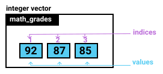
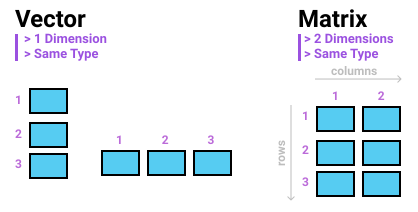

## Expresiones lógicas en R {#Elogicas}

Las expresiones lógicas se basan en los literales lógicos. Es decir, TRUE y FALSE o simplemente T y F. 

### Operadores Relacionales

Los _operadores relacionales_ disponibles en R son:

 * _**Menor que ( < )**_
 * _**Mayor que ( > )**_
 * _**Menor o igual que ( <= )**_
 * _**Mayor o igual que ( >= )**_
 * _**Igual a ( == )**_
 * _**No es igual a (diferente) ( != )**_


A continuación se presentan dos tipos de ejemplos con el uso de expresiones regulares: _simples_ y a través de _expresiones aritméticas_

<p style="color:#FF0000";><i>Ejemplo. Expresiones lógicas simples</i></p>

```{r}
3 >= 2
3 > 3
1 < 3
4 <= 4
3 == 3
3 != 3
TRUE == FALSE
TRUE == 1
FALSE == 0
FALSE != 0
```

**Regla 5.**

* _Al evaluar un operador lógico con expresiones aritméticas, primero se evaluan las expresiones aritméticas y luego las expresiones lógicas_

<p style="color:#FF0000";><i>Ejemplo. Operaciones lógicas entre expresiones aritméticas</i></p>

```{r}
12.10 - 10.50 < 24.90 - 21.15

apple_profit <- 12.10 - 10.50 
mango_profit <- 24.90 - 21.15

apple_profit < mango_profit
```

Finalmente, en R se puede almacenar el resultado de una comparación lógica dentro de una variable.

logical_var <- apple_profit < mango_profit

```{r}
apple_sold <- 12.10 * 12L
lemon_sold <- 4.99 * 24L
logical_var <- apple_sold == lemon_sold
logical_var
```

Los operadores relacionales se emplean para hacer comparaciones entre valores (expresiones). El resultado de la aplicación de los operadores relacionales es TRUE o FALSE

### Operadores Lógicos

Los _operadores lógicos_ disponibles en R son:


 * _**No lógico ( ! )**_
 * _** Y lógico ( & )**_
 * _** O lógico ( | )**_
 
Revisar los operadores (&& y ||), como se presenta en la siguiente ilustración.


### Combinando operadores

**Regla 5. Priorización o precedencia general**

Teniendo en cuenta todos los operadores vistos hasta ahora, la regla de priorización general es:

 * _Paréntesis_
 * _Exponentes_
 * _División y multiplicación_
 * _Adición y sustracción_
 * _Operadores relacionales_
 * _Operadores logicos_


_**Estudiarr el siguiente caso con vectores**_

a <- 3
b <- 15

a:b
a+1:b
a+(1:b)
(a+1):b

[Caso tomado de](https://twitter.com/necronet/status/1286129628718018560)


<p style="color:#FF0000";><i>Ejemplo. Combinando operadores</i></p>
 
```{r}
apple_profit <- 12.10 - 10.50
mango_profit <- 24.90 - 21.15
lemon_profit <- 4.99 - 3.20
logical_var <- apple_profit <= mango_profit || apple_profit > mango_profit
logical_var
```

## Estructuras de datos {#Edatos}


### Vectores

Importancia de la función c()


```{r}
vector1 <- 1
vector2 <- c(1)
# vector3 <- 1, 2
vector4 <- 1:2
vector5 <- c(1,2)
```


Mi primer vector.

```{r}
# Mi primer vector con 5 elementos
c(1, 2, 3, 4, 5)

# Matriz con tres filas y cuatro columnas
matrix(1:12, nrow = 3, ncol = 4) 
```

#### _Tipos de vectores_

1. _**Lógicos**_


```{r, eval=FALSE}
# Mi primer vector Lógico
c(TRUE, FALSE, FALSE, TRUE)
```


2. _**Enteros**_

```{r, eval=FALSE}
# Mi primer vector entero
c(12L, 3L, 24L, 8L)
```


3. _**Reales**_

```{r, eval=FALSE}
# Mi primer vector real
c(12.10, 24.90, 4.99)
```


4. _**Cadena**_

```{r, eval=FALSE}
# Mi primer vector cadena
c("Lunes", "Martes", "Miércoles","Jueves", "Viernes", "Sábado","Domingo")
```

#### _Cómo crear vectores rápidamente_

Funciones (seq() y rep())

#### _Indexación de vectores_

Fuente: [Manual R Base Indexación](https://cran.r-project.org/doc/manuals/r-release/R-lang.html#Indexing)

Cómo extraer elementos de un vector - R es un lenguaje de programación indexado en 1; es decir, al primer elemento de un vector se le asigna la posición 1. Para extraer elementos de un vector usamos corchetes []



##### _Por posición_

```{r,  eval=FALSE}
Nombre_vector[3]
Nombre_vector[c(3)]
Nombre_vector[1:4]
Nombre_vector[c(1:4)]
Nombre_vector[c(1,3,7)]
Nombre_vector[-c(1,3,7)]
```

##### _Por vectores lógicos_

```{r,  eval=FALSE}
Nombre_vector[c(LOGICO)]
```

#### _Modificar, anexar, remover elementos de un vector_

1. _**Modificar elementos de un vector**_

```{r, eval=TRUE}
vector <- c(1L:5L)
vector[5] <- 6L
vector

vector1 <- c(1L:5L)
vector1[c(3:5)] <- 6L
vector1

vector2 <- c(1L:5L)
vector2[c(TRUE, FALSE, FALSE, FALSE, TRUE)] <- 6L
vector2
```

2. _**Adicionar elementos a un vector**_

```{r, eval=TRUE}
vector1 <- c(1:3)
vector2 <- c(4:5)
# nuevo vector
vector3_1 <-  c(vector1, vector2)
vector3_1
# mismo vector
vector1[c(4:5)] <- c(4:5)
vector1
```

3. _**Remover elementos de un vector**_

Indexando negativamente  (OJO, para data.frames y listas se puede usar la opción NULL)

```{r, eval=TRUE}
# Ejemplo1
vector <- c(1:10)
vector <- vector[-c(6:10)]
vector

# Ejemplo2
vector <- c(1:10)
vector <- vector[c(-6, -7, -8, -9, -10)]
vector

# Ejemplo3
vector <- c(1:10)
vector <- vector[vector<6]
vector
```

#### _Operaciones aritméticas con vectores_

1. _**Adición, multiplicación y división**_


```{r, eval=TRUE}
v1 <- c(1:5)
v2 <- c(5:1)
v3 <- c(1:5)
v4 <- c(5:1)
suma <- v1 + v2 + v3 + v4
promedio <- suma/3
promedio
```


2. _**Reciclaje en operaciones con vectores**_

_Aritmética con vectores de diferentes longitudes_


```{r, eval=TRUE, warning=FALSE}
v1 <- c(92, 90, 84, 95, 77, 92, 85)
v2 <- c(87, 81)
suma <- v1 + v2
suma
```


#### _Usando nombres en vectores_


```{r, eval=TRUE, warning=FALSE}
# Alternativa 1
vector = c(a = 1, b = 2, c = 3, d = 4, e = 5)
vector
# Alternativa 2
vector1 <- c(1L:5L)
Nombres <- c('a', 'b', 'c', 'd', 'e') # letters[c(1:5)] # letters[seq(1,5)] 
names(vector1) <- Nombres
vector1
# Indexación
vector1[c('a', 'e')]
# Reemplazar valores
vector1[c('a', 'e')] <- 6L
vector1
# Revisar los nombres de un vector
names(vector1)
```


#### _Coerción en vectores_

<br>
<br>
<blockquote>
<p><strong><p style="color:red;">Regla:Coerción</p></strong>
<strong>character → double → integer → logical.</strong><br> 
<br>
Es decir, si existe un vector con elementos de tipo lógico y de tipo entero, el resultado es un vector con elemento de tipo entero. Si existe un vector elementos de tipo lógico, entero y real, el resultado es un vector de tipo real. Finalmente, si existe un vector con elementos de tipo lógico, entero, real y caracter o cadena, el resultado es un vector de tipo caracter.
</p>
</blockquote>
<br>
<br>

### Matrices

Las matrices,  como los vectores, son estructuras bidimensionales de datos con la totalidad de elementos del mismo tipo. Es decir, los elementos de las matrices pueden ser de tipo numérico (enteros y dobles), lógico y de tipo caractér (cadena). 




#### _Creando matrices_

Las matrices se crean a través de la función **matrix()**

1. _**Modificando vectores**_

Una foma de crear matrices es reestructurando un vector en matrices, como se observa en la siguiente figura.


```{r, eval=TRUE, warning=FALSE}
# Ejemplo 1 - Por defecto - columnas
matrix(c(1:5))
# Ejemplo 2 - Indicando filas y columnas
matrix(1:12, nrow = 4, ncol = 3)
# Ejemplo 3 - Por filas
matrix(1:12, nrow = 4, ncol = 3, byrow = TRUE)
# Ejemplo 4 - Sin definir columnas
matrix(1:12, nrow = 4)
# Ejemplo 5 - Sin definir filas
matrix(1:12, ncol = 4)
# Ejemplo 6 - Con secuencias
matrix(seq(from = 2, to = 8, by = 2), nrow = 2, ncol = 2)
# Ejemplo 7 - Con repeticiones
matrix(rep(1,4), nrow = 2, ncol = 2)
# Ejemplo 8 - Reciclando elementos
matrix(1:7, ncol = 3)
# Ejemplo 9 - Con elementos lógicos
matrix(c(TRUE, FALSE, FALSE, TRUE), nrow = 2, ncol = 2)
# Ejemplo 10 - Con elementos tipo caractér - cadena
matrix(c('Lunes', 'Martes', 'Miércoles', 'Jueves', 'Viernes', 'Sábado'), nrow = 3, ncol = 2)
```

2. _**Combinando vectores**_

A través de las funciones **rbind()** y **cbind()**

```{r, eval=TRUE, warning=FALSE}
v1 <- c(1, 2, 3)
v2 <- c(3, 2, 1)
v3 <- c(1, 2, 3)
# creación de matrices con vectores- por filas
fil_matriz <- rbind(v1, v2, v3)
fil_matriz
# creación de matrices con vectores- por columnas
col_matriz <- cbind(v1, v2, v3)
col_matriz
```

#### _Nombrando las dimensiones de una matriz_

Una matriz está conformada por dos dimensiones (filas y columnas). El nombre de las filas y de las columnas se da a través de las funciones **rownames()** y **colnames()**.

```{r, eval=TRUE, warning=FALSE}
# matriz básica
matriz <- matrix(c(1:4), nrow = 2, ncol = 2, byrow = TRUE)
matriz
# Matriz con nombres de filas y columnas
rownames(matriz) <- c('f_1', 'f_2')
colnames(matriz) <- c('c_1', 'c_2')
matriz
# Consultar los nombres de filas y columnas en una matriz
# Nombre de las filas
rownames(matriz)
# Nombre de las columnas
colnames(matriz)  
```


#### _Indexación en matrices_


A partir de una matriz podemos extraer/indexar con tres propósitos. 

* *Extraer un elemento [fila, columna]*
* *Extraer una fila o filas [fila, ]*
* *Extraer una columna o columnas [, columna]*

1. **Indexación básica**

```{r, eval=TRUE, warning=FALSE}
matriz <- matrix(c(1:4), nrow = 2, ncol = 2, byrow = TRUE)
rownames(matriz) <- c('f_1', 'f_2')
colnames(matriz) <- c('c_1', 'c_2')
matriz
# Extraer el elemento ubicado en la fila 2 y la columna 1
matriz[2,1]
# Extraer la fila 1
matriz[1, ]
# Extraer la columna 2
matriz[, 2]
```

2. **Indexación a través de vectores**

* *vectores numéricos (enteros)*
* *vectores lógicos*
* *vectores de caractéres (nombres de filas o columnas)*

```{r, eval=TRUE, warning=FALSE}
matriz <- matrix(c(1:9), nrow = 3, ncol = 3, byrow = FALSE)
rownames(matriz) <- c('f_1', 'f_2', 'f_3')
colnames(matriz) <- c('c_1', 'c_2', 'c_3')
# Con vectores numéricos - filas 1 y 2
matriz[c(1:2), ]
# Con vectores lógicos - columnas 1 y 3
# Igual a matriz[, c(TRUE, FALSE, TRUE, FALSE)]
matriz[, c(TRUE, FALSE)]
# Con vectores de caractéres - columnas 2 y 3 - filas 1 y 3
matriz[c(1,3), c('c_2', 'c_3')]
```

#### _Modificando elementos en matrices_

Se puede modificar un único elemento dentro de una matriz o bloques de elementos (más de un elementos). Veámos estas ídeas gráficamente


```{r, eval=TRUE, warning=FALSE}
# Ejemplo
matriz <- matrix(c(1:9), nrow = 3, ncol = 3, byrow = FALSE)
rownames(matriz) <- c('f_1', 'f_2', 'f_3')
colnames(matriz) <- c('c_1', 'c_2', 'c_3')
# Modificar elemento (3,3) por 20
matriz[3, 3] <- 30
matriz
```


```{r, eval=TRUE, warning=FALSE}
# Ejemplo
matriz <- matrix(c(1:9), nrow = 3, ncol = 3, byrow = FALSE)
rownames(matriz) <- c('f_1', 'f_2', 'f_3')
colnames(matriz) <- c('c_1', 'c_2', 'c_3')
# Modificar filas 1,2 y columnas 2 y 3
matriz[c(1,2), c('c_2', 'c_3')] <- 0
matriz
```

#### _Adicionando elementos en matrices_

En las matrices se pueden adicionar filas o columnas. A continuación se presenta una ilustración gráfica de estas dos ideas.


Para adicionar filas en una matriz se hace uso de la función **rbind()**; para adicionar columnas, se hace uso de la función **cbind**.

```{r, eval=TRUE, warning=FALSE}
matriz1 <- matrix(c(1:9), nrow = 3, ncol = 3, byrow = FALSE)
rownames(matriz1) <- c('f_1', 'f_2', 'f_3')
colnames(matriz1) <- c('c_1', 'c_2', 'c_3')
# Adicionar una fila
matriz1 <- rbind(matriz, 'c_4' = c(4, 7, 10))
matriz1
# Adicionar dos columnas
matriz2 <- matrix(c(1:9), nrow = 3, ncol = 3, byrow = FALSE)
rownames(matriz2) <- c('f_1', 'f_2', 'f_3')
colnames(matriz2) <- c('c_1', 'c_2', 'c_3')
# Adicionar una fila
matriz2 <- cbind(matriz2, matrix(c(7:12), nrow = 3, ncol = 2))
colnames(matriz2) <- c('c_1', 'c_2', 'c_3', 'c_4', 'c_5')
matriz2

```

#### _Removiendo elementos en matrices_

Se eliminan columnas o elementos de columnas haciendo uso del simbolo (-) entre corchetes. [-() , -c()]

<p style="color:#FF0000";><i>Ejemplo. Removiendo elementos de matrices</i></p>

```{r, eval=TRUE, warning=FALSE}
#Creando una matriz
matriz <- matrix(1:12, nrow = 4, ncol = 3)
rownames(matriz) <- c('f_1', 'f_2', 'f_3', 'f_4')
colnames(matriz) <- c('c_1', 'c_2', 'c_3')
matriz
# Eliminando primera fila
matriz[-1, ]
# Eliminando segunda columna
matriz[ ,-2]
# Eliminando haciendo uso de vectores - enteros
matriz[-c(1,4), -3]
# Eliminando haciendo uso de vectores lógicas - reciclando
matriz[c(TRUE, FALSE), c(-1)]
# Eliminando haciendo uso de vectores lógicas - sin reciclar
matriz[c(TRUE, FALSE, TRUE, FALSE), c(-1)]
# Eliminando haciendo uso de vectores lógicas - derivados de expresiones lógicas 
expl <- matriz[, 3] > 10
expl
matriz[expl, c(-1)]
```

#### _Marginales en matrices_

Ver las funciones **rowSums(), colSums(), rowMeans(), colMeans()*


<p style="color:#FF0000";><i>Ejemplo. Marginales en matrices</i></p>

```{r, eval=TRUE, warning=FALSE}
#Creando una matriz - haciendo uso de la función dimnames
matriz1 <- matrix(1:9, nrow = 3, ncol = 3, dimnames = list(c('f_1', 'f_2', 'f_3'), c('c_1', 'c_2', 'c_3')))
matriz1
# Suma de filas
rowSums(matriz1)
# Suma de columnas
colSums(matriz1)
# Promedio de filas
rowMeans(matriz1)
# Promedio de columnas
colMeans(matriz1)
```

#### _Operaciones con matrices_

Las operaciones con matrices son la suma, la resta, la multiplicación y la división.

### Arreglos


### Data frames


### Listas

Una lista es una estructura de datos multidimensional que permite, en su interior, la disposición de estructuras de datos y objetos de diversas tipologías.


¿Por qué querríamos crear listas de objetos en R? La respuesta es que almacenar objetos en listas nos permite utilizar algunas funciones R muy poderosas para realizar la misma operación en cada objeto de nuestra lista, lo que nos permite evitar escribir repetidamente la misma función.

#### Creando listas

Las listas se crean a través de la función **list()**. Los elementos que hacen parte de una lista se separan, como en el caso de los vectores, a través de comas **(,)** y pueden ser de cualquier tipo.

<p style="color:#FF0000";><i>Ejemplos. Diferentes listas</i></p>

```{r}
#Lista 1
list(1:3, "a", c(TRUE, FALSE, TRUE), c(2.3, 5.9))
#Lista 2
list("Hola mundo", 1, 1, 3, TRUE)
#Lista 3
list(país = "Colombia", matriz = matrix(c(1:9), ncol =3), vector = c(TRUE, FALSE))
```

Revisar las posiciones, en el output, en las que aparece cada uno de los elementos de una lista a través del numero contenidoen [[]]

#### Nombrando listas

La asignación de nombres a los elementos que conforman una lista,  al igual que en el caso de los vectores, se logra haciendo uso de la función **names()**.

```{r}
#Lista
mi_lista <- list(1, 2, 3, 4)
mi_lista
#Nombrando los elementos de la lista
names(mi_lista) <- c('a', "b", 'c', "d")
# El resultado
mi_lista
```

#### Indexación en listas

En las listas existen dos alternativas de indexación.

1. _**Paréntesis individuales**_: Retorna una _lista_ de elementos.
2. _**Doble paréntesis**_: Retorna un único elemento.

<p style="color:#FF0000";><i>Ejemplos. Indexación con listas</i></p>

```{r}
recurre <- list(1,list(2,3, list(4,5)))
#Extraer el número 5 - tres alternativas
recurre[[c(2, 3)]][[2]]
recurre[[2]][[3]][[2]]
recurre[2][[1]][[3]][[2]]
```

#### Modificar, adicionar y remover elementos de una lista

#### Combinando listas

## Indexación en R {#Indexa}

## Programación con R {#Progra}

Revisar [R para principiantes](https://bookdown.org/jboscomendoza/r-principiantes4/estructuras-de-control.html), en donde se presentan los principales tipos de estructuras de control existentes en R. Este documento también es util para ...  

### if y else
### for


Tomado de: https://twitter.com/allison_horst/status/1290774616038809600/photo/1

### while
### break y next
### repeat
### La familia apply


## Mejores prácticas en R {#Mpracticas}

Ver linemaientos sobre buena prácticas en R (Ortografía)
Hablar sobre comentario
c(1,2,3) en R produce el mismo resultado que c(1, 2, 3)

