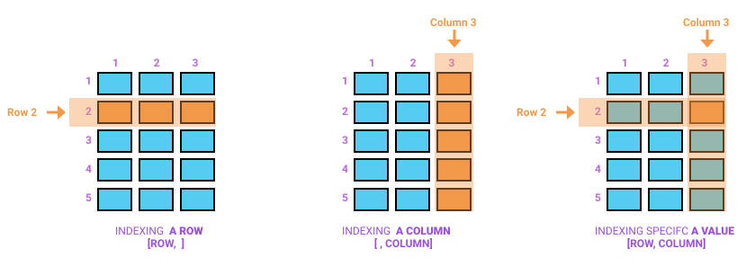
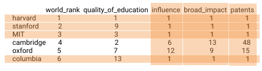

# Fundamentos del lenguaje R {#Fund}


https://www.youtube.com/watch?v=SWxoJqTqo08

Ilustración ciclo de vida de la ciencia de los datos


```{r}
# Compilar varias líneas de comando en una única línea (con ;)
x <- 1 y <- 2  
x <- 1 ; y <- 2  

# Mostrar resultados y generación de una variable dentro de una única línea
x <- c(1:5)
# vs
(x <- c(1:5))
```

1^x y x^0 es igual a 1 (para todo x). Entonces ...

```{r}
NA^0
0^0
```

NA es un objeto lógico válido en R. Entonces...

```{r}
NA == TRUE
NA == FALSE
NaN == NA
NA*0
NaN*0
NA + 7
```

x*0 no es cero para todo (x). Ver (NaN)x0


Valores Especiales en R

<!-- Valores Faltantes en R -->
NA: Not Available (No disponible)
NaN: Not a Number (No es un número)

<!-- Conceptos -->

Inf: Concepto de infinito positivo (+ infinito)
-Inf: Concepto de infinito negativo (- infinito)

Ver los siguientes resultados:

```{r}
12/0
Inf*(-1)
0/0
NA + 7
NA + NaN
Inf + 1
```


#### _Modificar, anexar y remover elementos de un vector_

1. _**Modificar elementos de un vector**_

```{r, eval=TRUE}
vector <- c(1L:5L)
vector[5] <- 6L
vector

vector1 <- c(1L:5L)
vector1[c(3:5)] <- 6L
vector1

vector2 <- c(1L:5L)
vector2[c(TRUE, FALSE, FALSE, FALSE, TRUE)] <- 6L
vector2
```

2. _**Anexar/adicionar elementos a un vector**_

```{r, eval=TRUE}
vector1 <- c(1:3)
vector2 <- c(4:5)
# nuevo vector
vector3_1 <-  c(vector1, vector2)
vector3_1
# mismo vector
vector1[c(4:5)] <- c(4:5)
vector1
```

3. _**Remover elementos de un vector**_

Indexando negativamente  (OJO, para data.frames y listas se puede usar la opción NULL)

```{r, eval=TRUE}
# Ejemplo1
vector <- c(1:10)
vector <- vector[-c(6:10)]
vector

# Ejemplo2
vector <- c(1:10)
vector <- vector[c(-6, -7, -8, -9, -10)]
vector

# Ejemplo3
vector <- c(1:10)
vector <- vector[vector<6]
vector
```


### Matrices

Las matrices,  como los vectores, son estructuras bidimensionales de datos con la totalidad de elementos del mismo tipo. Es decir, los elementos de las matrices pueden ser de tipo numérico (enteros y dobles), lógico y de tipo caractér (cadena). 


#### _Creando matrices_

Las matrices se crean a través de la función **matrix()**

1. _**Modificando vectores**_

Una foma de crear matrices es reestructurando un vector en matrices, como se observa en la siguiente figura.


```{r, eval=TRUE, warning=FALSE}
# Ejemplo 1 - Por defecto - columnas
matrix(c(1:5))
# Ejemplo 2 - Indicando filas y columnas
matrix(1:12, nrow = 4, ncol = 3)
# Ejemplo 3 - Por filas
matrix(1:12, nrow = 4, ncol = 3, byrow = TRUE)
# Ejemplo 4 - Sin definir columnas
matrix(1:12, nrow = 4)
# Ejemplo 5 - Sin definir filas
matrix(1:12, ncol = 4)
# Ejemplo 6 - Con secuencias
matrix(seq(from = 2, to = 8, by = 2), nrow = 2, ncol = 2)
# Ejemplo 7 - Con repeticiones
matrix(rep(1,4), nrow = 2, ncol = 2)
# Ejemplo 8 - Reciclando elementos
matrix(1:7, ncol = 3)
# Ejemplo 9 - Con elementos lógicos
matrix(c(TRUE, FALSE, FALSE, TRUE), nrow = 2, ncol = 2)
# Ejemplo 10 - Con elementos tipo caractér - cadena
matrix(c('Lunes', 'Martes', 'Miércoles', 'Jueves', 'Viernes', 'Sábado'), nrow = 3, ncol = 2)
```

2. _**Combinando vectores**_

A través de las funciones **rbind()** y **cbind()**

```{r, eval=TRUE, warning=FALSE}
v1 <- c(1, 2, 3)
v2 <- c(3, 2, 1)
v3 <- c(1, 2, 3)
# creación de matrices con vectores- por filas
fil_matriz <- rbind(v1, v2, v3)
fil_matriz
# creación de matrices con vectores- por columnas
col_matriz <- cbind(v1, v2, v3)
col_matriz
```

#### _Nombrando las dimensiones de una matriz_

Una matriz está conformada por dos dimensiones (filas y columnas). El nombre de las filas y de las columnas se da a través de las funciones **rownames()** y **colnames()**.

```{r, eval=TRUE, warning=FALSE}
# matriz básica
matriz <- matrix(c(1:4), nrow = 2, ncol = 2, byrow = TRUE)
matriz
# Matriz con nombres de filas y columnas
rownames(matriz) <- c('f_1', 'f_2')
colnames(matriz) <- c('c_1', 'c_2')
matriz
# Consultar los nombres de filas y columnas en una matriz
# Nombre de las filas
rownames(matriz)
# Nombre de las columnas
colnames(matriz)  
```

#### _Anexar filas/columnas en matrices_

En las matrices se pueden adicionar filas o columnas. A continuación se presenta una ilustración gráfica de estas dos ideas.


Para adicionar filas en una matriz se hace uso de la función **rbind()**; para adicionar columnas, se hace uso de la función **cbind**.

```{r, eval=TRUE, warning=FALSE}
matriz1 <- matrix(c(1:9), nrow = 3, ncol = 3, byrow = FALSE)
rownames(matriz1) <- c('f_1', 'f_2', 'f_3')
colnames(matriz1) <- c('c_1', 'c_2', 'c_3')
# Adicionar una fila
matriz1 <- rbind(matriz, 'c_4' = c(4, 7, 10))
matriz1
# Adicionar dos columnas
matriz2 <- matrix(c(1:9), nrow = 3, ncol = 3, byrow = FALSE)
rownames(matriz2) <- c('f_1', 'f_2', 'f_3')
colnames(matriz2) <- c('c_1', 'c_2', 'c_3')
# Adicionar una fila
matriz2 <- cbind(matriz2, matrix(c(7:12), nrow = 3, ncol = 2))
colnames(matriz2) <- c('c_1', 'c_2', 'c_3', 'c_4', 'c_5')
matriz2

```

#### _Indexación/subconjuntos en matrices_



A partir de una matriz podemos extraer/indexar con tres propósitos. 

* *Extraer un elemento o bloque de elementos [fila, columna]*
* *Extraer una fila o filas [fila, ]*
* *Extraer una columna o columnas [, columna]*

1. **Indexación básica**

```{r, eval=TRUE, warning=FALSE}
matriz <- matrix(c(1:4), nrow = 2, ncol = 2, byrow = TRUE)
rownames(matriz) <- c('f_1', 'f_2')
colnames(matriz) <- c('c_1', 'c_2')
matriz
# Extraer el elemento ubicado en la fila 2 y la columna 1
matriz[2,1]
# Extraer la fila 1
matriz[1, ]
# Extraer la columna 2
matriz[, 2]
```

2. **Indexación a través de vectores**

* *vectores numéricos (enteros)*
* *vectores lógicos*
* *vectores de caractéres (nombres de filas o columnas)*

```{r, eval=TRUE, warning=FALSE}
matriz <- matrix(c(1:9), nrow = 3, ncol = 3, byrow = FALSE)
rownames(matriz) <- c('f_1', 'f_2', 'f_3')
colnames(matriz) <- c('c_1', 'c_2', 'c_3')
# Con vectores numéricos - filas 1 y 2
matriz[c(1:2), ]
# Con vectores lógicos - columnas 1 y 3
# Igual a matriz[, c(TRUE, FALSE, TRUE, FALSE)]
matriz[, c(TRUE, FALSE)]
# Con vectores de caractéres - columnas 2 y 3 - filas 1 y 3
matriz[c(1,3), c('c_2', 'c_3')]
```


#### _Modificando elementos en matrices_

Se puede modificar un único elemento dentro de una matriz o bloques de elementos (más de un elementos). Veámos estas ídeas gráficamente


```{r, eval=TRUE, warning=FALSE}
# Ejemplo
matriz <- matrix(c(1:9), nrow = 3, ncol = 3, byrow = FALSE)
rownames(matriz) <- c('f_1', 'f_2', 'f_3')
colnames(matriz) <- c('c_1', 'c_2', 'c_3')
# Modificar elemento (3,3) por 20
matriz[3, 3] <- 30
matriz
```



```{r, eval=TRUE, warning=FALSE}
# Ejemplo
matriz <- matrix(c(1:9), nrow = 3, ncol = 3, byrow = FALSE)
rownames(matriz) <- c('f_1', 'f_2', 'f_3')
colnames(matriz) <- c('c_1', 'c_2', 'c_3')
# Modificar filas 1,2 y columnas 2 y 3
matriz[c(1,2), c('c_2', 'c_3')] <- 0
matriz
```


#### _Removiendo elementos en matrices_

Se eliminan columnas o elementos de columnas haciendo uso del simbolo (-) entre corchetes. [-() , -c()]

<p style="color:#FF0000";><i>Ejemplo. Removiendo elementos de matrices</i></p>

```{r, eval=TRUE, warning=FALSE}
#Creando una matriz
matriz <- matrix(1:12, nrow = 4, ncol = 3)
rownames(matriz) <- c('f_1', 'f_2', 'f_3', 'f_4')
colnames(matriz) <- c('c_1', 'c_2', 'c_3')
matriz
# Eliminando primera fila
matriz[-1, ]
# Eliminando segunda columna
matriz[ ,-2]
# Eliminando haciendo uso de vectores - enteros
matriz[-c(1,4), -3]
# Eliminando haciendo uso de vectores lógicas - reciclando
matriz[c(TRUE, FALSE), c(-1)]
# Eliminando haciendo uso de vectores lógicas - sin reciclar
matriz[c(TRUE, FALSE, TRUE, FALSE), c(-1)]
# Eliminando haciendo uso de vectores lógicas - derivados de expresiones lógicas 
expl <- matriz[, 3] > 10
expl
matriz[expl, c(-1)]
```

#### _Marginales en matrices_

Ver las funciones **rowSums(), colSums(), rowMeans(), colMeans()*


<p style="color:#FF0000";><i>Ejemplo. Marginales en matrices</i></p>

```{r, eval=TRUE, warning=FALSE}
#Creando una matriz - haciendo uso de la función dimnames
matriz1 <- matrix(1:9, nrow = 3, ncol = 3, dimnames = list(c('f_1', 'f_2', 'f_3'), c('c_1', 'c_2', 'c_3')))
matriz1
# Suma de filas
rowSums(matriz1)
# Suma de columnas
colSums(matriz1)
# Promedio de filas
rowMeans(matriz1)
# Promedio de columnas
colMeans(matriz1)
```

#### _Operaciones con matrices_

Las operaciones con matrices son la suma, la resta, la multiplicación y la división.

### Arreglos


### Data frames


#### _Nombres de variables en marcos de datos (data frame)_
#### _Indexación/subconjuntos en marcos de datos (data frame)_
1. _**Con [ ]**_
2. _**Con [[ ]]**_
3. _**$**_
#### _Modificar, anexar o remover elementos en marcos de datos (data frame)_
1. _**Modificar elementos**_
2. _**Anexar variables o filas**_
3. _**Remover variables o filas**_
#### _Coerción en marcos de datos (data frame)_

### Listas


Una lista es una estructura de datos multidimensional que permite, en su interior, la disposición de estructuras de datos +
mi_lista

```{r, eval=TRUE, warning=FALSE}
mi_lista <- list(1,2,3,4)
#Nombrando los elementos de la lista
names(mi_lista) <- c('a', "b", 'c', "d")
# El resultado
mi_lista
```

#### Indexación en listas

En las listas existen dos alternativas de indexación.

1. _**Paréntesis individuales**_: Retorna una _lista_ de elementos.
2. _**Doble paréntesis**_: Retorna un único elemento.

<p style="color:#FF0000";><i>Ejemplos. Indexación con listas</i></p>

```{r}
recurre <- list(1,list(2,3, list(4,5)))
#Extraer el número 5 - tres alternativas
recurre[[c(2, 3)]][[2]]
recurre[[2]][[3]][[2]]
recurre[2][[1]][[3]][[2]]
```

#### Modificar, adicionar y remover elementos de una lista

#### Combinando listas

### Una estructura especial: factores en R

_**Estudiarr el siguiente caso con vectores**_

a <- 3
b <- 15

a:b
a+1:b
a+(1:b)
(a+1):b

[Caso tomado de](https://twitter.com/necronet/status/1286129628718018560)


## Indexación en R {#Indexa}

Fuente: [Manual R Base Indexación](https://cran.r-project.org/doc/manuals/r-release/R-lang.html#Indexing)


## Programación con R {#Progra}

Revisar [R para principiantes](https://bookdown.org/jboscomendoza/r-principiantes4/estructuras-de-control.html), en donde se presentan los principales tipos de estructuras de control existentes en R. Este documento también es util para ...  

### if y else
### for


Tomado de: https://twitter.com/allison_horst/status/1290774616038809600/photo/1

### while
### break y next
### repeat
### La familia apply


## Mejores prácticas en R {#Mpracticas}

Ver linemaientos sobre buena prácticas en R (Ortografía)
Hablar sobre comentario
c(1,2,3) en R produce el mismo resultado que c(1, 2, 3)

