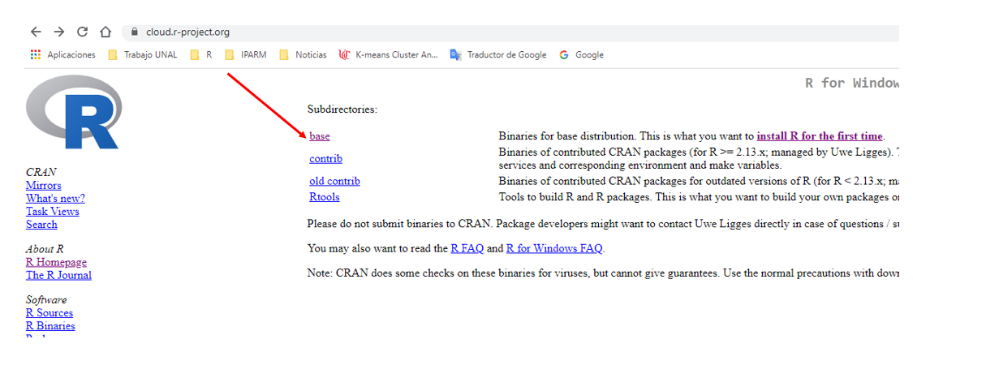

# Instalar R y Rstudio {#Instalar}

A continuación, se presentan los pasos requeridos para la instalación de **R**, **Rstudio** así como la **personalización** de este último si se considera pertinente por parte de los usuarios. La instalación de estos dos programas es requerida previo al inicio del presente curso. Para ello, primero se debe instalar en cada uno de nuestros equipos R y luego Rstudio.

## Instalar R

A continuación, se presentan los pasos para la instalación de R.

* _**Paso 1**_

El primer paso, como se ilustra en la Figura de abajo, consiste en buscar **R** en google. Para ello, en la barra de google se ingresa la siguiente palabra "R project".

* _**Paso 2**_

El segundo lugar, como se ilustra en la Figura de abajo, se debe dar clic en la opción "Download R"

* _**Paso 3**_

En tercer lugar, como se ilustra en la Figura de abajo, se abre una ventana con las diferentes opciones disponibles para descargar **R**

* _**Paso 4**_

En cuarto lugar, como se ilustra en la Figura de abajo, se debe seleccinar **R** de acuerdo al sistema operativo disponible en nuestros computadores. La gran mayoría de nuestros PCs tienen instalado Windows.

* _**Paso 5**_

El quinto lugar, como se ilustra en la Figura de abajo, se debe dar clic en la opción **base**.

* _**Paso 6**_

En sexto lugar, como se ilustra en la Figura de abajo, se debe dar clic en la opción **Download R 4.0.2 for Windows (32/64 bit)**

* _**Paso 7**_

En septimo lugar, como se ilustra en la Figura de abajo, se debe dar **sí** en la ventana emergente. Esta ventana, según los esquemas de seguridad instalados en nuestros computadores, puede o no emerger. Si no emerge, pasa directamente al paso 8.

* _**Paso 8**_

En octavo lugar, como se ilustra en la Figura de abajo, se debe seleccionar la opción instalar y luego dar clic en **Aceptar**.

* _**Paso 9**_

En noveno lugar, como se ilustra en la Figura de abajo, se debe dar clic en **Siguiente** en la totalidad de pestañas que aparecen a continuación.

* _**Paso 10**_

En decimo lugar, como se ilustra en la Figura de abajo, se debe esperar a que termine la instalación de **R**. Este paso puede tardar algunos minutos.

* _**Paso 11**_

En onceavo lugar, como se ilustra en la Figura de abajo, una vez se ha instalado el programa, se debe dar clic en la opción "Finalizar". 

* _**Paso 12**_

En doceavo lugar, como se ilustra en la Figura de abajo, se debe verificar que **R** quedó instalado en nuestros equipos. Esto se puede hacer a través de la barra de opciones de programas.

## Instalar Rstudio

Una vez hemos instalado R en nuestros computadores, el paso a seguir es instalar Rstudio. Para ello, procedemos a ejecutar los siguientes pasos.

* _**Paso 1**_

El primer paso, como se ilustra en la Figura de abajo, consiste en buscar **Rstudio** en google. Para ello, en la barra de google se ingresa la siguiente palabra "r studio".

* _**Paso 2**_

En segundo lugar, como se ilustra en la Figura de abajo, se deve dar clic en la opción **Download Rstudio - Rstudio**

* _**Paso 3**_

En tercer lugar, como se ilustra en la Figura de abajo, en la parte baja de la ventana se debe dar clic en la opción ***DOWNLOAD**; la que está debajo de la opción _**Free**_.

* _**Paso 4**_

En cuarto lugar, como se ilustra en la Figura de abajo, se debe dar clic en la opción **DOWNLOAD RSTUDIO FOR WINDOWS**.

* _**Paso 5**_

En quinto lugar, como se ilustra en la Figura de abajo, se debe dar **sí** en la ventana emergente. Esta ventana, según los esquemas de seguridad instalados en nuestros computadores, puede o no emerger. Si no emerge, pasa directamente al paso 6. 

* _**Paso 6**_

En sexto lugar, como se ilustra en la Figura de abajo, en la ventana emergente dar clic en la opción **Siguiente** y de allí, en adelante, dar siguiente a todas las ventanas que aparezcan hasta que inicie la descarga del programa.

* _**Paso 7**_

En septimo lugar, como se ilustra en la Figura de abajo, una vez el software es descargado en nuestros equipos, se debe dar clic al archivo descargado e iniciar su proceso de instalación. El proceso de instalación de Rstudio puede tardar algunos minutos.

* _**Paso 8**_

En octavo lugar, como se ilustra en la Figura de abajo, una vez a finalizado el proceso de instalación, se debe dar clic en la opción **Terminar**.

* _**Paso 9**_

En noveno lugar, como se ilustra en la Figura de abajo, se debe verificar que **Rstudio** quedó instalado en nuestros equipos. Esto se puede hacer a través de la barra de opciones de programas.

## Personalizar Rstudio

Una vez hemos instalado de manera correcta **R** y **Rstudio**, el último paso a seguir es el de la personalización de Rstudio de acuerdo a cada una de nuestras necesidades o preferencias (este paso es opcional). Para ello, iniciamos **Rstudio** desde nuestro equipos y una vez abra, vamos a la pestaña **Tools** y damos clic en la opción **Global Options** (ver figura de abajo).

* _**Paso 1**_

* _**Paso 2**_

En la ventana emergente, como se ilustra en la figura de abajo y, entre otras opciones, podemos personalizar el tamaño de la letra a usar **Rstudio** así como el color de fondo del mismo. Yo, por ejemplo, uso el tamaño de letra asignado por defecto (11) y como color de fondo uso la opción **Cobalt**.

