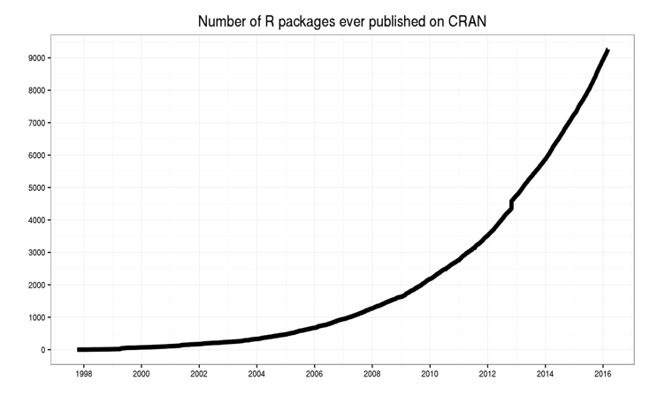
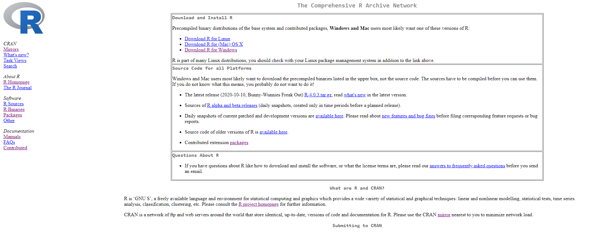
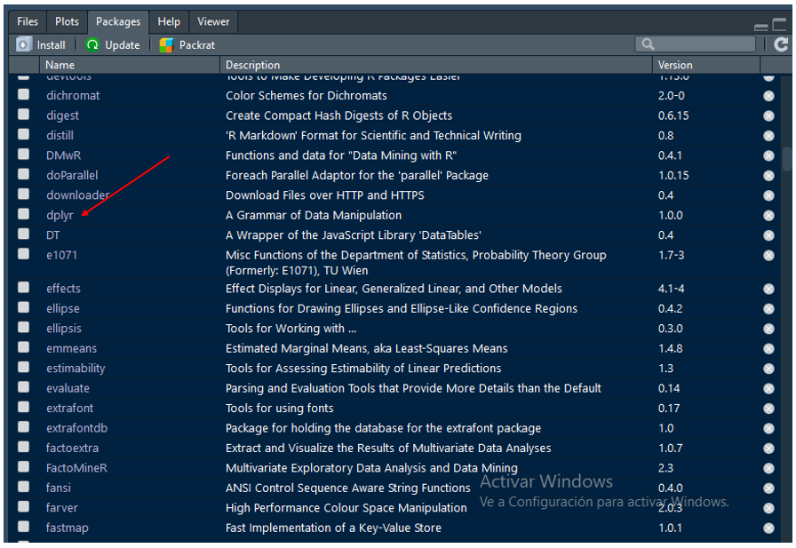
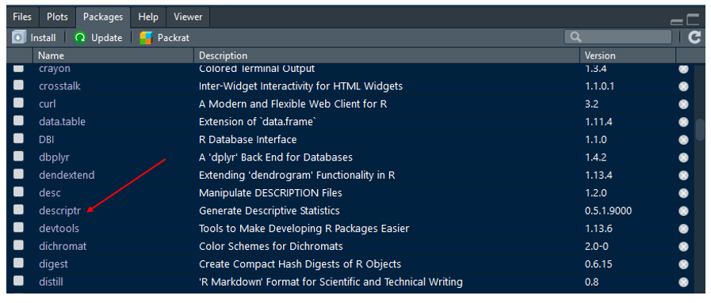
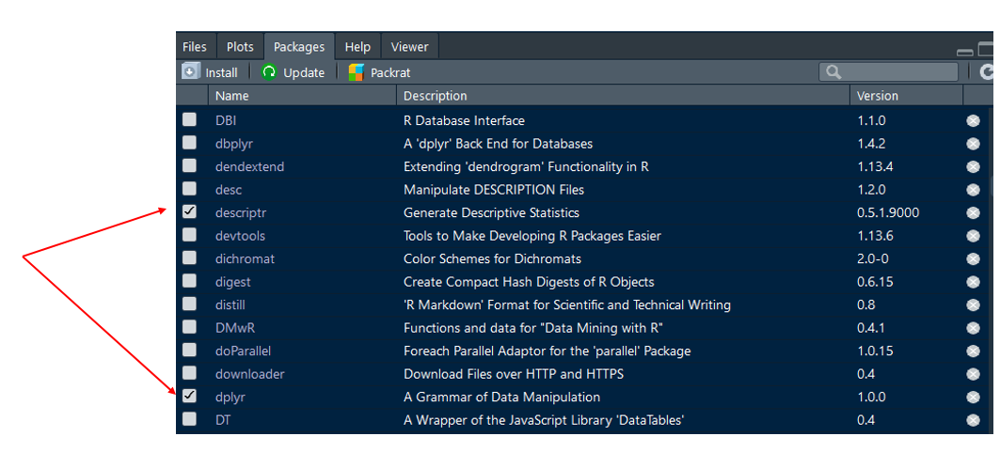

# (PART) Limpieza y Transformación {-} 

# Transformación de datos con R{#Trans}

La segunda parte del curso de **R básico** se concentra en la gestión de paquetes en R, la importación y exportación de archivos, el ordenamiento de los datos y la gestión  de estos a través del uso de un conjunto de paquetes/librerías que facilitan el trabajo con este lenguaje. Buena parte de este componente del curso se soporta en un universo llamado `tidyverse` el cual está conformado por un subconjunto de [paquetes en R](https://www.tidyverse.org/) que se complementan de manera eficiente a través de un enfoque conocido como **ciencia de datos**.

## Paquetes en R {#Paquetes}

Hasta ahora, a lo largo de este curso, hemos acudido al uso de un conjunto de funciones -cada vez con más frecuencia- que hacen parte del lenguaje desde el momento de su instalación. Estas librerías se les conoce como librerías básicas del lenguaje y su gestión y manipulación se encuentra a cargo del equipo que soporta R a nivel mundial; es decir, no pueden ser manipuldos por ninguno de nosostros. No obstante, a partir de estos paquetes y de otras herramientas disponibles, la comunidad de usuarios de R ha venido creando, desde inicios del año 2000, nuevos paquetes de R para diversos propósitos los cuales, en buena medida, han sido los grandes responsables del creciemiento y el auge que hoy ha alcanzado este lenguaje en el contexto mundial.

La cantidad de paquetes disponibles en R, como se ilustra en la siguiente figura extraída del blog **[Revolutions](https://blog.revolutionanalytics.com/2016/03/16-years-of-r-history.html)**, ha venido creciendo de manera exponencial. De ningún paquete disponible en el Repositorio CRAN^[Además de este reposirorio, como veremos más adelante, existen otros en donde se almacenan paquetes como, por ejemplo, GitHub.] en el año 1998 pasamos a disponer de alrrededor de 9.000 paquetes en el año 2016 y hoy a contar con cerca de 16.000 paquetes^[Con corte a 12 de octubre de 2020, existe un total de 16.396 paquetes disponibles en el repositorio [CRAN](https://cran.r-project.org/) -ver sección _Packages_-] en dicho repositorio.




### Filosofía de un paquete 

La primeras preguntas que pueden surgir al momento de hablar de paquetes en R es el por qué, el para qué, cómo están estos conformados y cómo podemos gestionarlos. Es decir, por qué es importante disponer de paquetes en R, para qué son úliles, qué características estos poseen y cómo debemos gestionarlos. Para dar un principio de respuesta rápido y ligero a estas inquietudes acudiremos a una analogía contenida en una de las escenas de la primera de las peliculas de la saga **Matrix**. La escena en mención se presenta en el siguiente video. 

<br/>

<iframe width="100%" height="400" src="https://www.youtube.com/embed/Yg3PEllMlyw" frameborder="0" allow="autoplay; encrypted-media" allowfullscreen></iframe>

<br/>

En esta escena de la película Matrix, la protagonista _Trinity_, requiere pilotear un helicoptero _B-212_  pero no cuenta con las competencias para hacerlo. Se comunica con el operador _Tank_ que se encuentra ubicado en la nave _Nabucodonosor_ y le pide que le cargue las competencias requeridas para poder pilotear este tipo de aeronave. Paso seguido, _Trinity_ acompañada de _Neo_, hace uso de las nuevas competencias adquiridas para pilotear el helicoptero y acuden al rescate de _Morfeo_ quien se encuentra bajo custodia del agente _Smith_ y dos de sus compañeros.

El contenido de esta escena de la película Matrix refleja una de las grandes aspiraciones de la humanidad -*adquirir nuevos conocimientos a través de la inserción en nuestros cuerpos de un artefacto externo*-; así mismo, refleja de menara precisa la filosofía existente atrás de un paquete disponible en R. En primer lugar, un paquete es importante porque nos permite disponer en su interior de un conjunto de funciones (_cómo están conformados_) útiles para un propósito requerido en el mundo de la gestión de datos (_para qué y por qué_) -*en la escena de la película el paquete requerido era aquel que permitia adquirir las funcionalidades necesarias para pilotear un helicoptero B-212*. Es decir, un paquete de R está conformado por un conjunto de funciones requeridas y útiles para analizar/abordar los datos desde una perspectiva deseada: descriptiva, correlacional, explicativa, predictiva, etc. En segundo lugar, la gestión de paquetes en R exige la disposición de tres elementos centrales: el nombre del paquete requerido, el lugar en donde este se encuentra disponible y el medio de comunicación que se empleará para disponer de dicho paquete en nuestros entornos de trabajo. 

El nombre del paquete requerido depende del objetivo buscado con los datos disponibles y no existe, en principio, un mecanismo estándar para su localización: la web, las redes sociales, los colegas, la popularidad, el prestigio del o los autores, la fuente de almacenamiento, su uso en artículos científicos, entre otros, hacen parte de algunos de los caminos a transitar a la hora de seleccionar y hacer uso de un paquete en R. En la escena de la película Matrix bajo estudio era claro el nombre o la intención del paquete requerido: _aquel que dipusiera de las funciones que permitan pilotear un helicoptero B-212_. El lugar donde un paquete se encuentra disponible, como veremos en el siguiente apartado, se reduce a tres contenedores principales: CRAN, GitHub y Bioconductor; _en la escena de nuestra película el lugar de almacenamiento del paquete requerido es la nave Nabucodonosor_. Finalmente, el medio de comunicación empleado para descargar paquetes en R, como se ilustrará en la siguiente sección, dependerá del repositorio en donde estos se encuentran almacenados; *en la escena de la película los medios de comunicación son el teléfono usado por Trinity y Tank como receptor de su llamada desde la nave Nabucodonosor*.

### Importar paquetes 

Los paquetes en R, como se anunció previamente, se encuentran almacenados fuera de nuestros equipos/computadoras en repositorios a los cuales podemos acceder si disponemos, como mínimo, de una conexión a internet o del archivo fuente de dichos paquetes. Aunque existen varios lugares en donde es posible almacenar paquetes de R, existen básicamente tres grandes fuentes/repositorios de almacenamiento de estos: **CRAN, GitHub y Bioconductor**. A continuación, se decribe la forma como podemos acceder y descargar a nuestras computadoras paquetes disponibles en CRAN Y GitHub^[En este documento, dado el alcance del mismo, no se presentan ejemplos sobre la forma de descargar paquetes disponibles en **Bioconductor** los cuales, para aquellos interesados, se centran principalmente en la gestión de datos de naturaleza biológica (bioestadística)].

para ilustrar la utilidad del trabajo con paquetes en R, supongamos que estamos interesados en encontrar una función que nos permita extraer el número de filas de un marco de datos `data.frame` en R así como explorar con mayor detalle el contenido de las variables que hacen parte de un marco de datos. Con lo avanzado hasta ahora en este documento, sabemos que las funciones `nrow()`, `str()` y `summary()` existentes en la base del lenguaje; es decir, disponibles al instalar el programa, cumplen con los propósitos deseados: la función `nrow()` permite conocer el número de individuos disponibles en un marco de datos `data.frame` y las funciones `str()` y `summary()` presentan algunas características de las variables que conforman un marco de datos. 

Por experiencia, supongamos que sabemos que la función `count()` disponible en el paquete **dplyr** y la función `ds_summary_stats()` diponible en el paquete **descriptr**, nos permiten cumplir con los objetivos buscados: encontrar una alternativa a las funciones `nrow()`, `str()` y `summary()` disponibles en la base del lenguaje. Así mismo, supongamos que el paquete **dplyr** se encuentra almacenado en **CRAN** y el paquete **descriptr** se encuentra almacenado en **GitHub**. En el siguiente apartado se presenta la forma como podemos descargar a nuestros computadores o lugares de almacenamiento de R, el contenido de un paquete disponible en los respositorios CRAN y GitHub.

#### Paquetes en CRAN

La **Red Integral de Archivos R** (The Comprehensive R Archive Network), conocida popularmente como CRAN, es la fuente **oficial** de almacenamiento de paquetes de R la cual cumple con los requisistos mínimos de calidad exigidos al momento de crear y disponer un paquete que puede ser usado por la comunidad de usuarios de este lenguaje. Este repositorio, que se encuentra disponible en el [sitio web oficial de  R](https://cran.r-project.org/) y cuyo _home_ se presenta en la imagen de abajo, es administrado por un número importante de expertos que velan, entre otros aspectos, por la integridad del lenguaje y por la exigencia, la revisión y el cumplimiento de un conjunto mínimo de requisitos que debe cumplir un paquete previo a su publicación/diposición y uso por parte de la comunidad desde CRAN. Por lo anterior, al instalar paquetes en R, la norma es que estos sean descargados desde CRAN. 

<br/>

<br/>

Para instalar un paquete desde CRAN se requieren dos elementos centrales: el nombre del paquete que será instalado y el mecanismo de comunicación. En el ejemplo que se propuso previamente, sabemos que el paquete de interés que deseamos instalar es **dplyr** en razón a que este dispone de la función `count()` útil para conocer el número de filas de un marco de datos `data.frame()`; es decir, ya conocemos el nombre del paquete que deseamos descargar/instalar desde CRAN. En segundo lugar, el mecanismo de comunicación requerido para instalar un paquete desde CRAN es la función `install.packages()`^[La función `install.packages()` es a CRAN como lo son el teléfono usado por **Trinity** y **Tank** como receptor de su llamada desde la nave Nabucodonosor en la escena de la película **Matrix** que se presentó al inicio de esta sesión]. Una vez que disponemos del nombre del paquete que será instalado desde CRAN y de la función que nos permite realizar la comunicación con dicho repositorio, se procede a usar estos elementos para poder descargar/instalar dicho paquete en nuestros equipos. Al usar la función `install.packages()` se recomienda, aunque no es estrictamente necesario, que esta esté acompañada del argumento `dependencies = TRUE`^[Este argumento es empleado por la función `install.packages()` para instalar aquellos paquetes empleados por el o los paquetes que deseamos instalar; en nuestro caso **dplyr**. En conclusión, un paquete en R puede hacer uso de funciones disponibles en otros paquetes hecho que exige que al momento de su instalación deban ser instalados también aquellos paquetes de los cuales este depende para su buen funcionamiento.]. Es decir, la instrucción (línea de comando) requerida en R para instalar desde CRAN el paquete **dplyr** en nuestros computadores es^[Invito a los lectores a complilar esta línea de comando en sus programas/scripts la cual, como podrán observar, tardará algunos segundos o incluso minutos en ejecutarse.]:

```r
install.packages("dplyr", dependencies = TRUE) 
```
Una vez que hemos compilado la anterior línea de comando y el proceso de instalación del paquete requerido se ha adelantado de manera satisfactoria, el paso a seguir es verificar que este efectivamente se encuentra disponible en nuestros equipos. Para ello, si nos encontramos trabajando desde la IDE de Rstudio^[Para aquellos usuarios que no hacen uso de Rstudio para el trabajo con R, la función `.libPaths()` les indicara las rutas de trabajo en donde se encuentran instalados los paquetes disponibles en nuestra sesiones de R. Al ingresar a estas rutas se puede verificar qué paquetes de R fueron instalados y se encuentran disponibles para ser empleados. Otra alternativa es usar la línea de comando `View(installed.packages())` y verificar que el paquete de interés se encuentra disponible en la lista de paquetes instalados], procedemos a ir a la pestaña llamada **Packages**^[El panel **Packages**, además de  presentar en su primera columna el listado de paquetes instalados en nuestros equipos presenta, para cada uno de estos, una breve descripción y la versión disponible.] ubicada generalmente en la parte inferior derecha (_entre las pestañas Plots y Help_) de esta IDE y verificar que efectivamente este se encuentra disponible. En la imagen que se presenta a continuación, se ilustra que el paquete **dplyr** fue efectivamente instalado en el equipo de trabajo (_ver parte final de la flecha roja_).

<br/>

<br/>

#### Paquetes en GitHub

Un repositorio alternativo a CRAN de almacenamiento y disposición de paquetes en R es GitHub^[Github es un [portal web](https://github.com/) creado para alojar el código de las aplicaciones de cualquier desarrollador. Esta plataforma, adquirida en el año 2018 por Microsoft permite, entre otras funcionalidades, administrar código, controlar las versiones del mismo, colaborar entre desarrolladores, almecanar paquetes y crear sitios web. Por ejemplo, el documento web de este curso se compila a través de uno de los servicios ofrecidos por GitHub llamado GitHub Pages]. GitHub es una alternativa a CRAN empleada por un número importante de autores de paquetes la cual se caracteriza por disponer de las últimas versiones disponibles de estos, de guardar copias de paquetes que se encuentran almacenados en CRAN, de paquetes que se encuentran en fase de desarrollo o pruebas o de paquetes que cumplen algunas funcionalidades particulares y que no han sido aún presentados ante CRAN para su disposición en dicho repositorio. 

Los paquetes de R disponibles en GitHub, a diferencia de los disponibles en CRAN, no han sido sometidos a pruebas y controles de calidad por lo que el uso de estos está sujeto a la verificación de este requisito por parte de los usuarios lo cual, en términos generales, se da a través del conocimiento y prestigio de los autores o el expresado por la comunidad. Por norma, se debe acudir a descargar paquetes desde GitHub siempre y cuando estos no estén disponibles en CRAN o cuando allí no se disponga de las versiones más recientes situación que es empleada por usuarios avanzados de estos paquetes o del lenguaje en general.

Para instalar un paquete desde GitHub, previamente debemos instalar desde CRAN el paquete llamado **devtools**, el cual dispone de la función `install_github(" ")` la cual cumple el rol de mecanismo de comunicación entre R y GitHub. Para instalar este paquete, procedemos a ejecutar/compilar en R la siguiente línea de comando^[Una vez se ha terminado el proceso de descarga e instalación del paquete **devtools** se debe verificar, al igual que en el caso de la instalación del paquete **dplyr**, que este se encuentra disponible dentro de la pestaña **Packages** de Rstudio]. 

```r
install.packages("devtools", dependencies = TRUE)
```
Una vez se ha instalado el paquete **devtools** en nuestro entorno de trabajo, se debe disponer de este en la memoria de nuestros equipos para que puedan ser usadas sus funciones. Esto se garantiza ejecutando/compilando la siguiente línea de comando^[En el siguiente apartado se desarrolla con mayor detalle este proceso.]. 

```r
library(devtools)
```

Después de haber instalado el paquete **devtools** y de haber dispuesto este en la memoria de nuestro equipos a través del uso de la función `library()`, estamos preparados para instalar cualquier paquete de R que se encuentre disponible en GitHub. Para ello, retornemos a nuestro ejemplo en donde deseamos hacer uso de la función `ds_summary_stats()` la cual se encuentra disponible en el paquete **descriptr** almacenado en GitHub^[Este paquete también se encuentra disponible en CRAN. No obstante, para propósitos académicos, vamos a suponer que este sólo se encuentra disponible en GitHub y que debemos acudir a este repositorio para su instalación.]. La función `ds_summary_stats()`, como se mencionó previamente, nos permite presentar un resumen con mayor detalle del contenido de una variable disponible en un marco de datos o `data.frame`. Para poder hacer uso de la función `ds_summary_stats()` debemos instalar, desde GitHub, el paquete **descriptr** lo cual se logra al compilar en R la siguiente línea de comando.

```r
devtools::install_github("rsquaredacademy/descriptr")
```
En la anterior línea de comando, el operador `::` indica que estamos haciendo uso de la función `install_github()` del paquete **devtools** y el texto _rsquaredacademy_ hace referencia al nombre del usuario en GitHub del autor^[El nombre del usuario de una persona en GitHub nos permite explorar los trabajos que este tiene disponible en dicha plataforma. Por ejemplo, los trabajos del autor del paquete **descriptr** pueden ser consultado en su [URL de GitHub](https://github.com/rsquaredacademy).] del paquete **descriptr**. Una vez ha finalizado el proceso de instalación desde GitHub del paquete **descriptr** en R, al igual que el caso del paquete **dplyr** instalado desde CRAN, procedemos a verificar, como se muestra en la figura de abajo, que este quedó efectivamente instalado dentro del panel **Packages** de Rstudio.

<br/>

<br/>


### Usar paquetes 

En el apartado anterior aprendimos a importar paquetes desde CRAN y GitHub y a verificar que estos se encuentran disponibles en el panel **Packages** de Rstudio. En esta sesión haremos uso de una de las funciones contenidas en cada uno de estos paquetes para cumplir con los propóitos deseados: extaer el número de filas de un `data.frame` y explorar con mayor detalle el contenido de sus variables. Para ello,  debemos explicar un paso adicional requerido en R para hacer uso de las funciones disponibles dentro de un paquete previamente descargado desde CRAN, GitHub o cualquier otro repositorio.

Al momento de descargar un paquete en R, como se mostró previamente, este queda almacenado en nuestros equipos (ver pestaña Packages de Rstudio) pero el mismo no queda disponible para ser usado en nuestros Scrips a menos que le digamos a R lo contrario. Para ello, debemos hacer uso de la función `library()` la cual nos permite dedirle al lenguaje que vamos a cargar en la memoría de nuestros equipos _sesiones de trabajo_ los paquetes que contienen las funciones de interés para nuestros trabajos. A continmuación, se presentan las líneas de código requeridas para cargar los paquetes **dplyr** y **descriptr**.

```r
library(dplyr)
library(descriptr)
```
Una vez se han compilado/ejecutado las anteriores dos líneas de comando, los paquetes en mención han sido cargados a la memoría de nuestros equipos y sus funciones pueden ser empleadas en los propósitos deseados. Para verificar que estos han sido fectivamente cargados, podemos acudir nuevamente al panel **Packages** de Rstudio y verificar que estos, además de estar allí almacenado, ahora aparecen marcados/seleccionados en el recuadro de su parte izquierda como se ilustra en la siguiente imagen.

<br/>

<br/>

Finalmente, después de haber descargado desde CRAN y GitHub los paquetes **dplyr** y **descriptr**, respectivamente y de haberlos cargado en la memoría de nuestros equipos a través de la función `library()`, podemos proceder a usar las funciones contenidas dentro de dichos paquetes. En primer lugar, procederemos a emplear la función `count()` del paquete **dplyr** con el fin de determinar el número de filas/individuos del marco de datos `iris`^[La función `count()` genera los mismos resultados que la función `nrwo()` disponible en los paquetes contenidos en la base de R.]. A continuación, haciendo uso del conjunto de datos `iris` y de la función `count()` del paquete **dplyr** , se determina el número de registros (individuos) de dicho conjunto de datos.


<p style="color:#e6550d";><i>Ejemplo. Haciendo uso de funciones de un paquete en R descargado desde CRAN</i></p> 

```{r, eval=TRUE, warning=FALSE, message=FALSE}
library(dplyr)
count(iris)
```

En número de filas/individuos del conjunto de datos `iris`, como se sabe y se acaba de presentar, es de 150 y para su cáculo hemos acudido a la función `count()` del paquete `dplyr()` cuyo resultado es equivalente a haber empleado la línea de comando `nrow(iris)` de la base de R. 

Además de conocer el número de registros del marco de datos `iris`, como se enunció previamente, estamos interesados en conocer con mayor detalle las características de una variable disponible en un marco de datos el cual, para propósitos académicos, hemos decidido que sea la variable `Sepal.Length` del conjunto de datos `iris`. A continuación, haciendo uso del conjunto de datos `iris` y de la función `ds_summary_stats()` del paquete **descriptr** , se describe con mayor detalle el contenido de la variable `Sepal.Length`^[Las funciones `str()` y `summary()` de la base de R presentadas en el capítulo 2 de este documento permiten describir, con un menor detalle, el contenido de esta y de otras variables disponibles dentro de un `data.frame`.]. 

<p style="color:#e6550d";><i>Ejemplo. Haciendo uso de funciones de un paquete en R descargado desde GitHub</i></p> 

```{r, eval=TRUE, warning=FALSE}
library(descriptr)
ds_summary_stats(iris, Sepal.Length)
```

Los resultados expuestos anteriormente, extraídos haciendo uso de la función `ds_summary_stats()` del paquete **descriptr**, nos permite describir con un alto grado de detalle el comportamiento de una variable. Por ejemplo, a partir de los resultados expuestos, podemos decir que la variable `Sepal.Length` no contiene datos faltantes, tiene una media (promedio) de 5.84, una mediana de 5.80, una moda de 5.0, un coeficiente de asimetría de 0.31, una curtosis de -0.55, una varianza de 0.69, un rando de 3.60, un valor máximo de 7.90, un valor mínimo de 4.30, un percentil 25 de 7.25, un percentil 5 de 4.60, entre otras medidas disponibles. Desde luego, con las funciones básicas del lenguaje R, no podemos extraer una caracterización con el nivel de detalle que nos ofrece la función `ds_summary_stats()` del paquete **descriptr**. 

En conclusión, las funciones disponibles en los paquetes que la comunidad de R ha venido creando de manera proactiva durante las últimas dos décadas y almacenando en los respositorios CRAN y GitHub, principalmente, nos permiten acceder a funcionalidades útiles para una gestión óptima y moderna a la hora de trabajar con datos.

### Explorar paquetes 

La gestión de paquetes en R cuenta, en la base del lenguaje, con un número importante de funciones que nos permiten explorar, entre otros aspectos, la lista de paquetes disponibles en CRAN, las rutas de ubicación de los paquetes instalados en nuestros espacios de trabajo, las librerías descargadas y las instaladas en la memoria de las sesiones de trabajo, la descripción de los paquetes instalados, los manuales disponibles en la web para cada uno de los paquetes disponibles, el versionamiento de los paquetes disponibles así como las funciones contenidas en cada uno de los paquetes instalados en los espacios de trabajo. A continuación, se presenta un listado preliminar y ligero de funciones útiles para la exploración de paquetes en R. Invitamos a los lectores a compilar estas líneas de comando y a explorar, analizar y realizar un ejercicio de entendimiento de los resultados derivados de la implementación de cada una de estas funciones _líneas de comando_.

```{r, eval=FALSE}
# Total de paquetes disponibles en CRAN
available.packages()

# Vista de tabla con la totalidad de paquetes disponibles en CRAN
View(available.packages())

# Total de paquetes disponibles en CRAN
nrow(available.packages())
```


```{r, eval=FALSE}
# Rutas de ubicación de los paquetes disponibles en el equipo
.libPaths() 
```


```{r, eval=FALSE}
# Librerías descargadas y disponibles para ser empleadas
library()
```


```{r, eval=FALSE}
# Librerías en memoria - instaladas mediante library()
search()
```


```{r, eval=FALSE}
# Descripción de librerías instaladas en el equipo
installed.packages()

# Total de librerías instaladas en el equipo
nrow(installed.packages())

# Primeras 5 librerías instaladas en el equipo
head(installed.packages())

# Últimas 5 librerías instaladas en el equipo
tail(installed.packages())

# Vista de tabla con librerías instaladas en el equipo
View(installed.packages())
```


```{r, eval=FALSE}
# Viñetas disponibles - tutoriales 
vignette()

# Tutoriales disponibles en la web para los paquetes descargados en el equipo
browseVignettes() 

# Tutoriales web disponibles para un paquete 
# Ejemplo. Paquete dplyr
browseVignettes(package = "dplyr")
```


```{r, eval=FALSE}
# Descripción detallada de un paquete
# Ejemplo. Paquete dplyr
packageDescription("dplyr")
```


```{r, eval=FALSE}
# Versiones descargadas vs disponibles en CRAN para nuestros paquetes
old.packages()
View(old.packages())
```


```{r, eval=FALSE}
# Listado de funciones que hacen parte de un paquete de R
# Ejemplo. Paquete dplyr
lsf.str("package:dplyr")
# Total de funciones que hacen parte de un paquete de R
# Ejemplo. Paquete dplyr
length(lsf.str("package:dplyr"))
```

## Importar/exportar datos

En esta sección del documento se presentan los procesos de importación a R de microdatos (bases de datos) almacenados en fuentes archivos externos, así como el ejercicio de exportación de resultados provenientes de la gestión de los datos o los análisis estadísticos hechos en este lenguaje de programación.

### Importar datos en R

La primera tarea a la hora de gestionar/analizar datos en R es el proceso de importación de los microdatos requeridos para los propósitos deseados. Las fuentes de disposición/almacenamiento/captura de los datos, en la actualidad, son diversas y con tendencia a crecer: datos provenientes de fuentes no estructuradas (**Big Data**); datos provenientes de fuentes semi-estructuradas en archivos **JSON** (JavaScript Object Notation) o **XML** (Extensible Markup Language); datos provenientes de fuentes estructuradas en archivos de texto simple, **CSV** (Comma Separated Values), **Excel** o provenientes de otros softwares estadísticos como **SAS**, **SPSS**, **MATLAB**, etc.; datos almacenados en **repositorios locales**, en **sitios web** (**Github**  o **GitLab**, por ejemplo) o en **Cloud** (DRIVE de google, Dropbox o Amazon, por ejemplo); datos almacenados en bases de datos relacionales tipo **SQL** (MySQL, Oracle, PosgreSQL, SAP, SQL server, IBM, etc.) o **NoSQL** (Mongo DB, Cassandra, Redis, CouchDB, Neo4j, etc.), hacen parte del abanico de fuentes de almacenamiento de microdatos las cuales requieren ser importadas a R y para las cuales existe una variedad importante de funciones y paquetes especializados para estos propósitos.

En este documento, dado el alcance y los propósitos buscados con el mismo, se abordará el proceso de importación de un pequeño número de fuentes de datos a R; aún así, como se ilustró en el párrafo anterior, es importante reiterar que estas son múltiples y diversas y que demandan el conocimiento y el dominio de procesos particulares requeridos en los ejercicios de importación de los datos allí almacenados al lenguaje bajo estudio^[Para aquellos interesados en profundizar sobre divresas alternativas de importación de datos en R, los invitamos a explorar el siguiente manual dando click en el enlace que se presenta a continuación https://www.datacamp.com/community/tutorials/r-data-import-tutorial#txt]. Las fuentes seleccionadas y trabajadas en este documento, en nuestro criterio, son las más populares a nivel general y de más amplio uso por parte de los investigadores de las ciencias sociales y humanas. A contionuación, se presenta una primera aproximación al proceso de importación de bases de datos a R provenientes de archivos de texto plano, separados por comas o disponibles en archivos de Excel.  

#### Archivos de texto simple

Una de las fuentes de datos más básica es aquella en donde los datos son almacenados o se encuentran disponibles en archivos de texto simple. "Un archivo de texto simple, texto sencillo o texto sin formato (también llamado texto llano o texto simple; en inglés «plain text»), es un archivo informático que contiene únicamente texto formado solo por caracteres que son legibles por humanos, careciendo de cualquier tipo de formato tipográfico."^[Extraído de  https://es.wikipedia.org/wiki/Archivo_de_texto]. Los datos almacenados en formatos de texto simple, en la práctica, se almacenan generalmente en archivos con formato *.txt. Para importar datos a R desde archivos en formato _txt_ podemos acudir al uso de la función  `read.table()` contenida en la base de R. A continuación, se presenta a través de un ejemplo, la forma como R permite importar datos contenidos en archivos de texto simple.

Para ello, supongamos que contamos con la información de 5 individuos para los cuales se cuenta con la información de 3 variables `ID`, `X` e `Y` separadas por espacios y que se encuentra contenida en un archivo llamado `Archivo1.txt`^[El contenido de este archivo puede ser explorado en el enlace https://raw.githubusercontent.com/estadisticaun/Rbasico/master/Datos/Archivo1.txt]. Este archivo, por ejemplo, puede estar almacenado en un repositorio en la web o en alguna carpeta dentro de cada uno de nuestros equipos. Para el presente documento, supongamos que este archivo se encuentra almacenado en una carpeta llamada **Datos** la cual hace parte integral del proyecto de Rstudio que contiene este libro web^[El ejercicio de importación de datos a R, desde archivos almacenados en nuestros equipos, exige el conocimiento y el diligenciamiento de la ruta en la cual estos se encuentran contenidos. Por ejemplo, si tenemos un archivo almacenado en nuestro disco D y este a su vez se encuentra contenido en una carpeta llamada Estudiantes, la ruta de almacenamiento de dicho archivo será: `D:/Cifras/Estudiantes`.]. A continuación, se presenta la forma como R permite importar el archivo `Archivo1.txt` haciendo uso de la función `read.table()`.

<p style="color:#e6550d";><i>Ejemplo. Importación de archivos de texto simple (*.txt) en R</i></p> 

```{r, eval=TRUE}
# Importar archivos txt
file_txt <- read.table(file = "Datos/Archivo1.txt", header = TRUE, sep = "")
file_txt
```

En el código anterior, la función `read.table()` nos permite importar un archivo simple en formato txt y para este caso particular, hemos hecho uso de tres de sus argumentos^[Esta función, como otras funciones de R, cuentan con argumentos adicionales los cuales invitamos a explorar haciendo uso de la línea de código `help(read.table)`]: `file = "Datos/Archivo1.txt"`, para indicar el lugar/ruta en donde se encuentra almacenado el archivo a importar ("Datos/Archivo1.txt"); `header = TRUE`, para indicar que nuestro archivo cuenta con un encabezado, es decir, que la primera fila contiene el nombre de las variables y `sep = ""`, para indicar que las columnas/variables del archivo a importar están separadas por un espacio.  Finalmente, el archivo `Archivo1.txt` es almacenado en un objeto llamado `file_txt` el cual, como podrá ser verificado por los lectores, es un `data.frame` el cual se encuentra cargado y disponible en el **Environment** de **Rstudio**.


#### Texto separado por comas (CSV)

Uno de las tipologías de archivos empleada para el almacenamiento/disposición de datos y de amplio uso en el contexto de la investigación, por ejemplo, son los archivos de texto separados por comas (CSV)^[Del inglés Comma Separated Values (CSV)]. A continuación, se presenta la alternativa general que emplea R para la importación de datos provenientes de archivos de tipo CSV haciendo uso de la función `read.table()` la cual se presentó y empleó previamente. Para ello, supondremos que el archivo a importar contiene la información del conjunto de datos `iris` el cual se trabajó de manera frecuente en el capítulo anterior de este documento. Así mismo, supondrémos que este archivo se encuentra almacenado en algún lugar de la web; es decir, fuera de nuestros ordenadores/computadores.

<p style="color:#e6550d";><i>Ejemplo. Importación de archivos de texto con valores separados por comas (CSV) en R - función read.table()</i></p> 

```{r, eval=TRUE}
# Importar archivos csv
# Forma general 
file1_csv <- read.table(file = "https://raw.githubusercontent.com/estadisticaun/Rbasico/master/Datos/Archivo2.csv", header = TRUE, sep = ",")
head(file1_csv)
```

Al hacer uso de la función `read.table()` para importar un archivo de tipo CSV, como se muestra en el ejemplo anterior, se hace uso de tres alrgumentos: `file`, `header` y `sep`. El argumento `file` nos permite indicarle a R la ruta en donde se encuentra disponible el archivo con los datos a importar; en nuestro caso este se encuentra en la web en la ruta previamente especificada la cual puede ser explorada dando click en el siguiente [link.](https://raw.githubusercontent.com/estadisticaun/Rbasico/master/Datos/Archivo2.csv)^[Las variables de los elementos/individuos contenidos en este archivo, como puede ser corroborado, están separadas por comas y la parte decimal de las variable numéricas está separada por puntos]. El argumento `header = TRUE` le indica al lenguage que la primera fila del conjunto de datos está conformada por los nombres de las variables y, por último, el argumento `sep = ","` nos indica que las variables del conjunto de datos `Archivo2.csv` se encuentran separadas por comas. Finalmente, el resultado del proceso de importación del archivo CSV en mención es almacenado en R dentro de un objeto llamado `file1_csv` el cual se encontrará disponible en el Environment de Rstudio una vez las anteriores líneas de código han sido compiladas en nuestros computadores.

la función `read.table()`, como se acaba de mostrar, exige el uso de los argumentos `header` y `sep`. No obatante, en la base de R existe una función alternativa de amplio uso para los procesos de importación de datos almacenados en archivos de tipo CSV llamada `read.csv` la cual permite omitir los anteriores dos argumentos y sólo exige que se le indique al lenguaje la ruta en donde se encuentra almacenado el archivo que deseamos importar. A continuación, se presenta un ejemplo de importación de datos almacenados en un archivo CSV el cual, al igual que en el ejemplo anterior, contiene la información del conjunto de datos `iris`; no obstante, esta vez, este conjunto de datos no se encuentra almacenado en la web sino en la carpeta llamada Datos la cual, como se ilustró al inicio de este apartado, hace parte integral del repositorio/proyecto de Rstudio que contiene la información que sirve de base para la construcción del presente documento.

El resultado del proceso de importación del conjunto de datos `iris` haciendo uso de la función `read.csv()`, como se muestra en este ejemplo, es almacenado en un objeto llamado `file2_csv` el cual se encontrará disponible en el Environment de Rstudio una vez se compilen las siguientes líneas de código en nuestros computadores. Una vez importados los datos a R, como se muestra en el ejemplo, podemos hacer uso de las funciones hasta ahora conocidas para explorar y conocer el contenido de los datos importados; en el ejemplo, se presentan las primeras 6 líneas del conjunto de datos importado desde un archivo CSV haciendo uso de la función `head()`.

<p style="color:#e6550d";><i>Ejemplo. Importación de archivos de texto con valores separados por comas (CSV) en R - función read.csv()</i></p> 

```{r, eval=TRUE}
# Importar archivos csv
# Haciendo uso de la función csv
file2_csv <- read.csv(file = "Datos/Archivo2.csv")
tail(file2_csv)
```

La característica central de un archivo tipo CSV, como lo indican sus siglas en inglés -*Comma Separated Values*-, es que las variables se encuentran separadas por comas y los números decimales por puntos, característica/estándar empleada por los países de habla inglesa. No obstante, en los países de habla hispana los softwares están configurados de tal manera que las cifras de los números que contienen decimales, a diferencia de los americanos, están separadas por comas y no por puntos^[Invitamos a los lectores a que, por ejemplo, habran una hoja de excel y escriban un número que contenga una parte decimal con el fin de corroborar que dicha cifra será separada por una coma y no por un punto como en el caso inglés.]. Esta característica, propia de la cultura latina, impide que pueda ser usada la función `read.csv()` a menos que configuremos nuestras fuentes de datos o que las mismas no contengan variables que hagan uso de cifras decimales. Ante esta situación, existe en R una función llamada `read.csv2()` la cual permite importar archivos de tipo CSV los cuales, en el contexto latino, se caracterizan porque las cifras decimales se encuentran separadas por comas (,) y las variables por punto y coma (;)^[En sentido estricto, en Latinoamérica un archivo CSV no debería llamarse separado por comas sino por puntos y comas]. 

A continuación, se persenta un ejemplo de importación de un archivo de tipo CSV haciendo uso de la función `read.csv2()`. Este archivo, además de almacenarse en un objeto llamado `file3_csv`, se encuentra disponible en una fuente externa ubicada en la web la cual puede ser explorada copiando la URL del ejemplo e ingresando la misma de manera directa en nuestros navegadores de internet.

<p style="color:#e6550d";><i>Ejemplo. Importación de archivos de texto con valores separados por comas (CSV) en R - función read.csv2()</i></p> 

```{r, eval=TRUE}
# Haciendo uso de la función csv2
file3_csv <- read.csv2(file = "https://raw.githubusercontent.com/estadisticaun/Rbasico/master/Datos/Archivo3.csv")
head(file3_csv)
```

#### Importar archivos desde Excel

El tercer y último tipo de archivo de almacenamiento de datos y que exploraremos en este documento, es la fuente más popular y de mayor uso a nivel mundial; esta es, los datos almacenados en archivos de Excel. Aunque no existen funciones populares en la base de R que permitan importar datos provenientes e incluidos en archivos de Excel, sí existe un número importante de paquetes/librerías orientadas a gestionar e importar datos contenidos en este tipo de estructuras. Entre los paquetes existentes y de mayor uso por parte de la comunidad para importar archivos de Excel, existe uno llamado `readxl` al cual acudiremos en este documento para presentar una de las formas a través de la cual podemos importar archivos de Excel a R.

Para ello, como se presentó en la sección de [Paquetes](#Paquetes), el primer paso que debemos garantizar/realizar es el proceso de importación del paquete desde CRAN a nuestros equipos haciendo uso de la función o línea de comando `install.packages("readxl", dependencies = TRUE) `. Una vez el paquete es importado a nuestros computadores, el mismo debe ser cargado a nuestros entornos de trabajo a través de la línea de comando `library(readxl)` para que podamos usar las fucniones que este contiene y que resultan de interés para los propósitos deseados: en nuestro caso, importar un archivo de Excel a R.

A continuación, se presenta un ejemplo de importación de un conjunto de datos contenido en un archivo de Excel llamado `Archivo4.xlsx`^[Para los lectores interesados, el archivo de Excel llamado `Archivo4.xlsx`, puede ser descargado dando click en el siguiente [link.](https://github.com/estadisticaun/Rbasico/raw/master/Datos/Archivo4.xlsx)] el cual se encuentra disponible en la carpera Datos del repositorio que contiene este documento web^[Como se mencionó previamente, cada uno de los lectores, a la hora de importar un conjunto de datos que se encuentra disponible de manera local, le debe indicar al lenguaje la ruta exacta en donde este se encuentra alojado.]. 

<p style="color:#e6550d";><i>Ejemplo. Importación de archivos de Excel en R - función read_excel() del paquete readxl</i></p> 

```{r, eval=TRUE}
# Importar archivos desde Excel
library(readxl)
file_xlsx <- read_excel(path ="Datos/Archivo4.xlsx", sheet = "Archivo")
file_xlsx
```

En el ejemplo anterior, hemos importado y almacenado en un objeto llamado `file_xlsx` un conjunto de datos proveniente de un archivo Excel^[Este conjunto de datos consta de una muestra de 15 individuo del conjunto de datos iris.] y para ello hemos tenido que realizar varios pasos. En primer lugar, disponer/conocer un paquete que nos permitiera importar archivos de Excel (`readxl`); en segundo lugar, descargar a nuestros equipos y cargar a nuetsros entrornos de trabajo el paquete requerido haciendo uso de la funciones `install.packages()` y `library()`, respectivamente. En tercer lugar, acudir a la función `read_excel()` que hace parte del paquete `readxl` para importar el archivo de Excel requerido. Finalmente, dentro de la función `read_excel()`, acudir a los argumentos `path` y `sheet`, para indicar respectivamente la ruta y el nombre de la hoja de cálculo en Excel en donde se encuentra almacenada la información que será importada a R. 

### Exportar datos en R

Una tarea frecuente a la hora de gestionar datos y realizar análisis a través de R es la necesidad de exportar los resultados de nuestros trabajos a formatos externos para su posterior gestión. Aunque R ofrece una importante diversidad/ecosistema de herramientas e instrumentos orientados a la entregra/divulgación de los resultados de nuestros trabajos (presentaciones, documentos pdf, documentos en word, documentos en html, libros web, aplicaciones, sitios web, etc.) y que ho hacen parte del contenido de este documento, una demanda frecuente es la necesidad de exportar parte de nuestros resultados en textos con formatos planos. Para ello, a continuación se presentan dos funciones (`write.csv` y `write.csv2`) que resultan de alta utilidad a la hora de exportar datos/resultados obtenidos en R a archivos externos para su posterior gestión.

El ejemplo que se presenta a continuación y que hace uso de la función `write.csv`, nos permite exportar los datos ubicados en las lineas/filas 100 a 109 del conjunto de datos `iris` a un archivo externo de tipo CSV el cual será almacenado en la carpera Datos del repositorio/proyecto de trabajo de este curso. La función `write.csv`, como se ilustra en el ejemplo, hace uso de dos argumentos: `x` para indicar el nombre del objeto que será exportado y `file` con la ruta del lugar en donde será almacenado el archivo de tipo CSV. Finalmente, al exportar un objeto de R haciendo uso de la función `write.csv`, el objeto resultante/exportado cumple con el estandar inglés: variables/valores separadas por comas y puntos para trabajar con números que presentan decimales. Invitamos a los lectores a explorar el contenido y las características del archivo resultante al hacer uso de la función `write.csv`.

<p style="color:#e6550d";><i>Ejemplo. Exportación de objetos de R haciendo uso de la función write.csv</i></p> 

```{r}
# Exportar datos a formato csv haciendo uso de la función write.csv
# Separado por comas y con puntos para separar decimales
iris_exp <- iris[100:109, ]
write.csv(x = iris_exp, file = "Datos/iris_exp.csv")
iris_exp
```

Finalmente, dado que el contexto de aplicación del presente texto se ubica en el ámbito de latinoamérica, resulta útil que los archivos exportados cumplan con los requisitos definidos en los softwares de uso en esta región. Para ello, R nos ofrece la función `write.csv2` la cual, además de hacer uso de los mismos argumentos de la función `write.csv`, nos permite generar un archivo externo de tipo plano con extensión CSV el cual cumple con los estándares de nuestra región: variables/valores separados por puntos y comas y número decimales separados por comas. Invitamos a los lectores a explorar el contenido y las características del archivo resultante al hacer uso de la función `write.csv2` y a contrastarlo contra el archivo generado al hacer uso de la función `write.csv`.

<p style="color:#e6550d";><i>Ejemplo. Exportación de objetos de R haciendo uso de la función write.csv2</i></p> 

```{r}
# Exportar datos a formato csv haciendo uso de la función write.csv2
# Separado por puntos y comas y con comas para separar decimales
iris_exp1 <- iris[50:55, ]
write.csv2(x = iris_exp, file = "Datos/iris_exp1.csv")
iris_exp1
```

<!-- ## Tibbles vs Data Frames -->
<!-- ## Datos ordenados - Tidy Data -->
<!-- ## Verbos: seleccionar, reubicar, mutar y filtrar -->
<!-- ## Verbos: agrupar, ordenar y cruzar. -->


